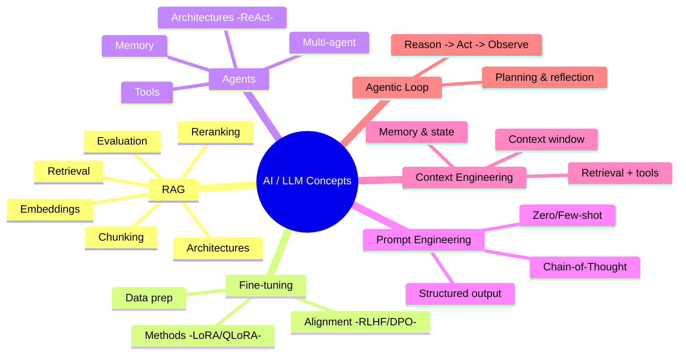

# 🧠 AI Concepts — The Buzzword Atlas

A structured, diagram-first reference for the AI/LLM terms everyone throws around.
Every concept lives in its own folder, and each folder goes **deeper and deeper** —
from the one-line "what is it" down to architectures, trade-offs, and "where it's used".

All diagrams are written in **[Mermaid](https://mermaid.js.org/)**, which GitHub renders
natively — so you get clear visuals with zero image files to maintain.

> 🔎 In a hurry? Jump to the **[GLOSSARY](./GLOSSARY.md)** for one-line definitions of every term.

---

## 🗺️ The Map



---

## 📚 The Pillars

| Pillar | One-liner | Go deeper |
|--------|-----------|-----------|
| **[RAG](./rag/)** | Give an LLM fresh, private knowledge by retrieving documents at query time. | [chunking](./rag/chunking.md) · [retrieval](./rag/retrieval.md) · [embeddings](./rag/embeddings.md) · [reranking](./rag/reranking.md) · [architectures](./rag/architectures/) · [evaluation](./rag/evaluation.md) |
| **[Fine-tuning](./fine-tuning/)** | Change the *weights* of a model to teach it new skills, style, or format. | [methods](./fine-tuning/methods.md) · [alignment](./fine-tuning/alignment.md) · [data prep](./fine-tuning/data-preparation.md) |
| **[Agents](./agents/)** | LLMs that decide, use tools, and act in a loop toward a goal. | [architectures](./agents/architectures.md) · [memory](./agents/memory.md) · [tools](./agents/tools.md) |
| **[Prompt Engineering](./prompt-engineering/)** | Shaping the *input text* to steer model behavior. | [techniques](./prompt-engineering/README.md) |
| **[Context Engineering](./context-engineering/)** | Managing *everything* in the context window: prompt + memory + data + tools. | [overview](./context-engineering/README.md) |
| **[Agentic Loop](./agentic-loop/)** | The reason → act → observe cycle that powers every agent. | [overview](./agentic-loop/README.md) |

---

## 🧱 Full concept index

The pillars above are the deep dives. Here's **every** concept in the repo, grouped.

### Foundations — how models work
| Concept | One-liner |
|---------|-----------|
| **[Large Language Models](./large-language-models/)** | Next-token predictors from which language & reasoning emerge. |
| **[Transformers](./transformers/)** | The self-attention architecture under every modern LLM. |
| **[Tokenization](./tokenization/)** | How text becomes the tokens models read (and how cost is counted). |
| **[Embeddings](./embeddings/)** | Turning anything into meaning-carrying vectors. |
| **[Vector Databases](./vector-databases/)** | Storing & searching embeddings fast (ANN: HNSW, IVF). |
| **[Knowledge Graphs](./knowledge-graphs/)** | Entities + relationships for multi-hop reasoning. |

### Model families & scaling
| Concept | One-liner |
|---------|-----------|
| **[Mixture of Experts](./mixture-of-experts/)** | Activate only a few experts per token — big capacity, low compute. |
| **[Reasoning Models](./reasoning-models/)** | Spend extra compute "thinking" before answering. |
| **[Diffusion Models](./diffusion-models/)** | Generate images/video by iteratively denoising. |
| **[Multimodal](./multimodal/)** | Text + images + audio + video in one model. |

### Efficiency — smaller, faster, cheaper
| Concept | One-liner |
|---------|-----------|
| **[Quantization](./quantization/)** | Fewer bits per weight → smaller, faster models. |
| **[Distillation](./distillation/)** | Small "student" imitates a large "teacher." |
| **[Inference Optimization](./inference-optimization/)** | KV cache, batching, speculative decoding, FlashAttention. |

### Tooling & protocols
| Concept | One-liner |
|---------|-----------|
| **[MCP](./mcp/)** | Open standard connecting AI apps to tools/data — "USB-C for AI." |

### Quality & safety
| Concept | One-liner |
|---------|-----------|
| **[Evaluation](./evaluation/)** | Measuring if a system is good — "the new unit tests." |
| **[Guardrails](./guardrails/)** | Safety checks on inputs & outputs (incl. prompt injection). |
| **[Hallucination](./hallucination/)** | Confident, plausible, but false output — and how to fight it. |

---

## 🧭 How these fit together


**The mental model:**
- **Fine-tuning** changes *what the model is*.
- **RAG** changes *what the model knows right now*.
- **Prompt / Context engineering** change *what the model sees*.
- **Agents** + the **agentic loop** change *what the model can do*.

---

## 📂 Repo structure

```
.
├── GLOSSARY.md             # one-line definitions of every term
│
├── rag/                    # Retrieval-Augmented Generation (deepest example)
│   ├── chunking.md · retrieval.md · embeddings.md · reranking.md · evaluation.md
│   └── architectures/      # naive → advanced → agentic → graph RAG
├── fine-tuning/            # methods · alignment · data-preparation
├── agents/                 # architectures · memory · tools
├── prompt-engineering/  ·  context-engineering/  ·  agentic-loop/
│
├── large-language-models/ · transformers/ · tokenization/
├── embeddings/ · vector-databases/ · knowledge-graphs/
├── mixture-of-experts/ · reasoning-models/ · diffusion-models/ · multimodal/
├── quantization/ · distillation/ · inference-optimization/
├── mcp/
└── evaluation/ · guardrails/ · hallucination/
```

## 🤝 Contributing / extending

Each concept folder follows the same pattern:
1. `README.md` — the overview, a diagram, and links to sub-topics.
2. One `.md` per sub-topic — going deeper, always with a diagram and a "where it's used" note.

Add a new buzzword → new folder → same pattern. That's it.
