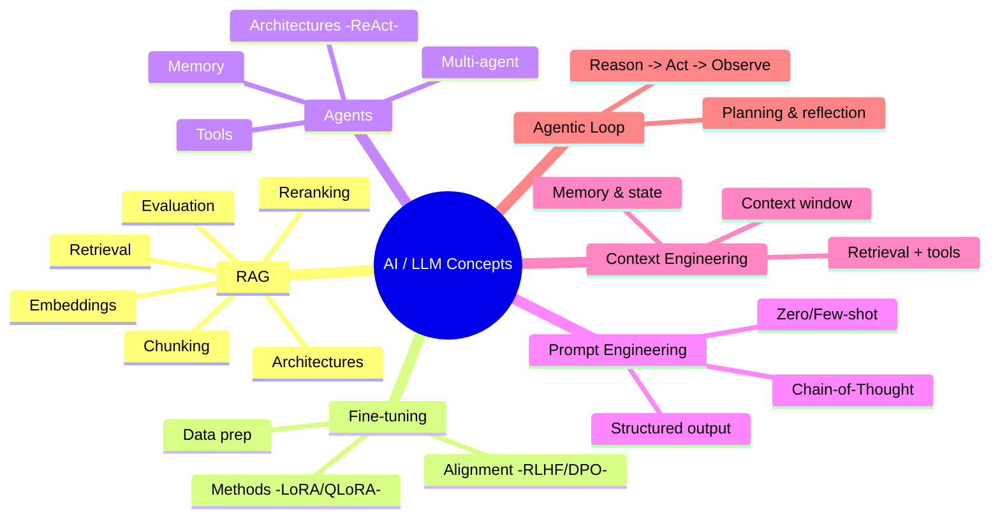
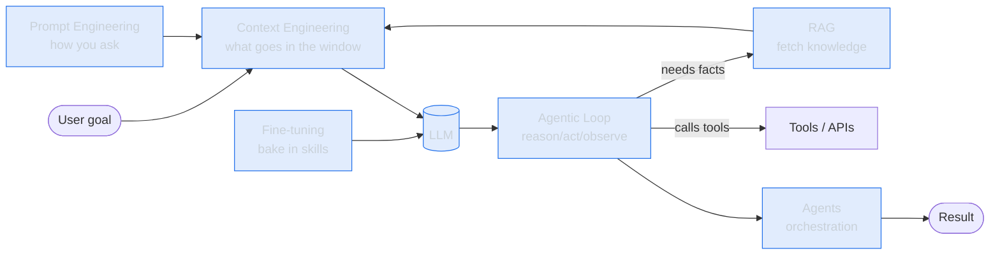

# 🧠 AI Concepts — The Buzzword Atlas

A structured, diagram-first reference for the AI/LLM terms everyone throws around.
Every concept lives in its own folder, and each folder goes **deeper and deeper** —
from the one-line "what is it" down to architectures, trade-offs, and "where it's used".

All diagrams are written in **[Mermaid](https://mermaid.js.org/)**, which GitHub renders
natively — so you get clear visuals with zero image files to maintain.

> 🔎 In a hurry? Jump to the **[GLOSSARY](./GLOSSARY.md)** for one-line definitions of every term.
> 📖 Want the guided route? Follow the **[Path to Forward Deployed Engineer](#-the-path-to-forward-deployed-engineer)** below.

---

## 📖 The Path to Forward Deployed Engineer

This repo doubles as a **book**. Read it in order and you go from *"I've heard these
buzzwords"* to *"I can build and ship AI solutions in the field like an
[FDE](./fde/)"* — someone who embeds with a customer and turns a messy problem into a
deployed, working system.


**How to use this book**
1. Read each chapter's page — skim the diagrams first, then the tables.
2. Note the **"where it's used"** section; that's the FDE lens (when to reach for it).
3. At the end of each Part, hit the ✅ **checkpoint** — if you can do it, move on.
4. Finish with the **[capstone projects](#-capstone-projects)** to prove you can do the job.

> 🧭 **New here?** Read **[what an FDE is](./fde/)** first, so you know what you're building toward.

---

### Part I — Foundations: how models work
| # | Chapter |
|---|---------|
| 1 | [Large Language Models](./large-language-models/) — next-token prediction & emergence |
| 2 | [Transformers](./transformers/) — self-attention, the engine |
| 3 | [Tokenization](./tokenization/) — how text becomes tokens (and cost) |
| 4 | [Embeddings](./embeddings/) — meaning as vectors |
| 5 | [Vector Databases](./vector-databases/) — storing & searching vectors |

> ✅ **Checkpoint:** explain how an LLM turns a prompt into an answer, and why context is finite.

### Part II — Talking to models
| # | Chapter |
|---|---------|
| 6 | [Prompt Engineering](./prompt-engineering/) — steer with words |
| 7 | [Context Engineering](./context-engineering/) — manage the whole window |
| 8 | [Structured Output](./structured-output/) — reliable JSON/schemas |
| 9 | [Long Context](./long-context/) — big windows & "lost in the middle" |

> ✅ **Checkpoint:** reliably get correct, well-formatted answers from a raw model.

### Part III — Grounding in knowledge (RAG)
| # | Chapter |
|---|---------|
| 10 | [RAG Overview](./rag/) — retrieve, then generate |
| 11 | [Chunking](./rag/chunking.md) — the #1 quality lever |
| 12 | [Retrieval](./rag/retrieval.md) — sparse, dense, hybrid |
| 13 | [Reranking](./rag/reranking.md) — best chunks on top |
| 14 | [RAG Evaluation](./rag/evaluation.md) — prove it works |
| 15 | [RAG Architectures](./rag/architectures/) — naive → agentic → [graph](./knowledge-graphs/) (+ [Self-RAG](./rag/architectures/self-rag.md), [CRAG](./rag/architectures/corrective-rag.md)) |
| 16 | [Knowledge Graphs](./knowledge-graphs/) — retrieve over relationships |

> ✅ **Checkpoint:** build a "chat with your docs" bot that cites its sources.

### Part IV — Customizing models
| # | Chapter |
|---|---------|
| 17 | [Fine-tuning Overview](./fine-tuning/) — change the weights |
| 18 | [Methods](./fine-tuning/methods.md) — LoRA / QLoRA / PEFT |
| 19 | [Alignment](./fine-tuning/alignment.md) — SFT, RLHF, DPO |
| 20 | [Data Preparation](./fine-tuning/data-preparation.md) — 90% of the work |
| 21 | [Distillation](./distillation/) — big teacher → small student |
| 22 | [Quantization](./quantization/) — fewer bits, smaller model |
| 23 | [Model Merging](./model-merging/) — combine models, no training |

> ✅ **Checkpoint:** decide RAG vs fine-tune for a task, and run a LoRA fine-tune.

### Part V — Building agents
| # | Chapter |
|---|---------|
| 24 | [Agents Overview](./agents/) — LLMs that act |
| 25 | [Agentic Loop](./agentic-loop/) — reason → act → observe |
| 26 | [Agent Architectures](./agents/architectures.md) — ReAct, plan, reflect, multi-agent |
| 27 | [Tools & Function Calling](./agents/tools.md) — acting on the world ([MCP](./mcp/)) |
| 28 | [Memory](./agents/memory.md) — short- & long-term state |

> ✅ **Checkpoint:** build a tool-using agent with proper stopping conditions.

### Part VI — Production-grade AI
| # | Chapter |
|---|---------|
| 29 | [Evaluation](./evaluation/) — the new unit tests |
| 30 | [Observability / LLMOps](./observability/) — see what it's doing |
| 31 | [Guardrails](./guardrails/) — safe in, safe out |
| 32 | [Hallucination](./hallucination/) — and how to fight it |
| 33 | [Red-Teaming](./red-teaming/) — break it before users do |
| 34 | [Inference Optimization](./inference-optimization/) — faster & cheaper |
| 35 | [Semantic Caching](./semantic-caching/) — reuse answers by meaning |
| 36 | [Model Routing](./model-routing/) — cheapest capable model |

> ✅ **Checkpoint:** ship a system that's evaluated, guarded, observable, and cost-aware.

### Part VII — The FDE craft
| # | Chapter |
|---|---------|
| 37 | [The FDE Role & Workflow](./fde/) — discover → scope → prototype → deploy → measure |
| 38 | [LLM System Design](./llm-system-design/) — snap the bricks into real architectures |
| 39 | [Capstone Projects](#-capstone-projects) — prove it on a real problem |

> ✅ **Checkpoint:** run discovery → POC → deploy → measure on a real (or realistic) problem.

### Appendix — Frontier & niche (optional deep cuts)
[Reasoning Models](./reasoning-models/) · [Mixture of Experts](./mixture-of-experts/) ·
[Diffusion Models](./diffusion-models/) · [Multimodal](./multimodal/) ·
[Constitutional AI / RLAIF](./constitutional-ai/) · [Synthetic Data](./synthetic-data/) ·
[Mechanistic Interpretability](./mechanistic-interpretability/) · [World Models](./world-models/) ·
[Federated Learning](./federated-learning/).

---

## 🎓 Capstone projects

Prove you can do the job — each project forces you to combine the parts.

| Level | Project | Concepts exercised |
|-------|---------|--------------------|
| 🟢 **Beginner** | "Chat with your docs" bot **with citations** and a 20-question eval set | Parts I–III |
| 🟡 **Intermediate** | Support **agent** with tools, guardrails, and an observability dashboard | Parts I–VI |
| 🔴 **Advanced** | **End-to-end FDE simulation:** pick a domain → write a discovery doc → scope the wedge → build a POC → design evals → plan cost/latency → write the deploy & handoff plan | All parts + [FDE](./fde/) + [system design](./llm-system-design/) |

> 💡 The advanced capstone is the real test: it's not "can you use RAG," it's "can you take a
> vague problem and ship value" — the actual FDE job.

---

## 🗺️ The Map



---

## 📚 The Pillars

| Pillar | One-liner | Go deeper |
|--------|-----------|-----------|
| **[RAG](./rag/)** | Give an LLM fresh, private knowledge by retrieving documents at query time. | [chunking](./rag/chunking.md) · [retrieval](./rag/retrieval.md) · [embeddings](./rag/embeddings.md) · [reranking](./rag/reranking.md) · [architectures](./rag/architectures/) · [evaluation](./rag/evaluation.md) |
| **[Fine-tuning](./fine-tuning/)** | Change the *weights* of a model to teach it new skills, style, or format. | [methods](./fine-tuning/methods.md) · [alignment](./fine-tuning/alignment.md) · [data prep](./fine-tuning/data-preparation.md) |
| **[Agents](./agents/)** | LLMs that decide, use tools, and act in a loop toward a goal. | [architectures](./agents/architectures.md) · [memory](./agents/memory.md) · [tools](./agents/tools.md) |
| **[Prompt Engineering](./prompt-engineering/)** | Shaping the *input text* to steer model behavior. | [techniques](./prompt-engineering/README.md) |
| **[Context Engineering](./context-engineering/)** | Managing *everything* in the context window: prompt + memory + data + tools. | [overview](./context-engineering/README.md) |
| **[Agentic Loop](./agentic-loop/)** | The reason → act → observe cycle that powers every agent. | [overview](./agentic-loop/README.md) |

---

## 🧱 Full concept index

The pillars above are the deep dives. Here's **every** concept in the repo, grouped.

### Foundations — how models work
| Concept | One-liner |
|---------|-----------|
| **[Large Language Models](./large-language-models/)** | Next-token predictors from which language & reasoning emerge. |
| **[Transformers](./transformers/)** | The self-attention architecture under every modern LLM. |
| **[Tokenization](./tokenization/)** | How text becomes the tokens models read (and how cost is counted). |
| **[Embeddings](./embeddings/)** | Turning anything into meaning-carrying vectors. |
| **[Vector Databases](./vector-databases/)** | Storing & searching embeddings fast (ANN: HNSW, IVF). |
| **[Knowledge Graphs](./knowledge-graphs/)** | Entities + relationships for multi-hop reasoning. |

### Model families & scaling
| Concept | One-liner |
|---------|-----------|
| **[Mixture of Experts](./mixture-of-experts/)** | Activate only a few experts per token — big capacity, low compute. |
| **[Reasoning Models](./reasoning-models/)** | Spend extra compute "thinking" before answering. |
| **[Diffusion Models](./diffusion-models/)** | Generate images/video by iteratively denoising. |
| **[Multimodal](./multimodal/)** | Text + images + audio + video in one model. |

### Efficiency — smaller, faster, cheaper
| Concept | One-liner |
|---------|-----------|
| **[Quantization](./quantization/)** | Fewer bits per weight → smaller, faster models. |
| **[Distillation](./distillation/)** | Small "student" imitates a large "teacher." |
| **[Inference Optimization](./inference-optimization/)** | KV cache, batching, speculative decoding, FlashAttention. |

### Tooling & protocols
| Concept | One-liner |
|---------|-----------|
| **[MCP](./mcp/)** | Open standard connecting AI apps to tools/data — "USB-C for AI." |

### Quality & safety
| Concept | One-liner |
|---------|-----------|
| **[Evaluation](./evaluation/)** | Measuring if a system is good — "the new unit tests." |
| **[Guardrails](./guardrails/)** | Safety checks on inputs & outputs (incl. prompt injection). |
| **[Hallucination](./hallucination/)** | Confident, plausible, but false output — and how to fight it. |
| **[Red-Teaming](./red-teaming/)** | Deliberately attacking your AI to find failures first. |
| **[Observability / LLMOps](./observability/)** | Tracing, monitoring & evals for live LLM apps. |

### Advanced & niche
| Concept | One-liner |
|---------|-----------|
| **[Synthetic Data](./synthetic-data/)** | Model-generated training/eval data. |
| **[Constitutional AI / RLAIF](./constitutional-ai/)** | Align using written principles + AI feedback. |
| **[Model Routing](./model-routing/)** | Send each query to the cheapest model that can handle it. |
| **[Structured Output](./structured-output/)** | Force valid JSON/schema via constrained decoding. |
| **[Long Context](./long-context/)** | Huge input windows — and "lost in the middle." |
| **[Semantic Caching](./semantic-caching/)** | Cache answers by *meaning*, not exact match. |
| **[Model Merging](./model-merging/)** | Blend fine-tuned models' weights — no training. |
| **[Mechanistic Interpretability](./mechanistic-interpretability/)** | Reverse-engineer what's happening inside a model. |
| **[World Models](./world-models/)** | An AI's internal simulation of an environment for planning. |
| **[Federated Learning](./federated-learning/)** | Train across sources without moving the raw data. |
| **Advanced RAG** | [Self-RAG](./rag/architectures/self-rag.md) · [Corrective RAG](./rag/architectures/corrective-rag.md) |

### The FDE craft
| Concept | One-liner |
|---------|-----------|
| **[Forward Deployed Engineer](./fde/)** | The role: embed with a customer and ship a working AI solution. |
| **[LLM System Design](./llm-system-design/)** | Reference architectures — snapping the concepts into real systems. |

---

## 🧭 How these fit together



**The mental model:**
- **Fine-tuning** changes *what the model is*.
- **RAG** changes *what the model knows right now*.
- **Prompt / Context engineering** change *what the model sees*.
- **Agents** + the **agentic loop** change *what the model can do*.

---

## 📂 Repo structure

```
.
├── GLOSSARY.md             # one-line definitions of every term
│
├── rag/                    # Retrieval-Augmented Generation (deepest example)
│   ├── chunking.md · retrieval.md · embeddings.md · reranking.md · evaluation.md
│   └── architectures/      # naive → advanced → agentic → graph RAG
├── fine-tuning/            # methods · alignment · data-preparation
├── agents/                 # architectures · memory · tools
├── prompt-engineering/  ·  context-engineering/  ·  agentic-loop/
│
├── large-language-models/ · transformers/ · tokenization/
├── embeddings/ · vector-databases/ · knowledge-graphs/
├── mixture-of-experts/ · reasoning-models/ · diffusion-models/ · multimodal/
├── quantization/ · distillation/ · inference-optimization/
├── mcp/
└── evaluation/ · guardrails/ · hallucination/
```

## 🤝 Contributing / extending

Each concept folder follows the same pattern:
1. `README.md` — the overview, a diagram, and links to sub-topics.
2. One `.md` per sub-topic — going deeper, always with a diagram and a "where it's used" note.

Add a new buzzword → new folder → same pattern. That's it.
