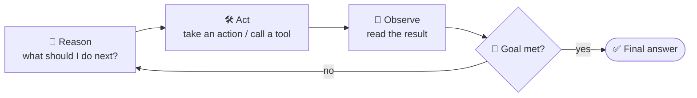
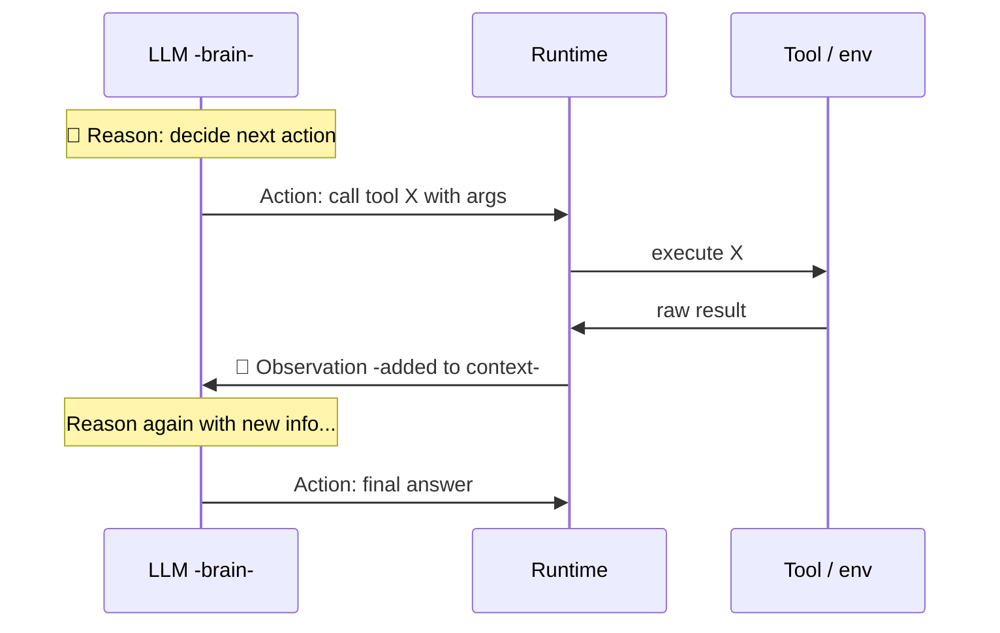
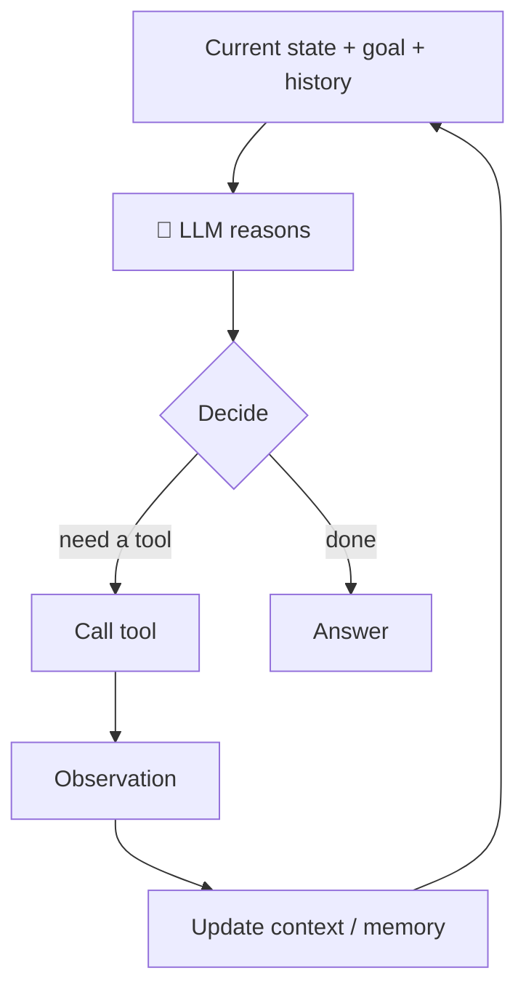
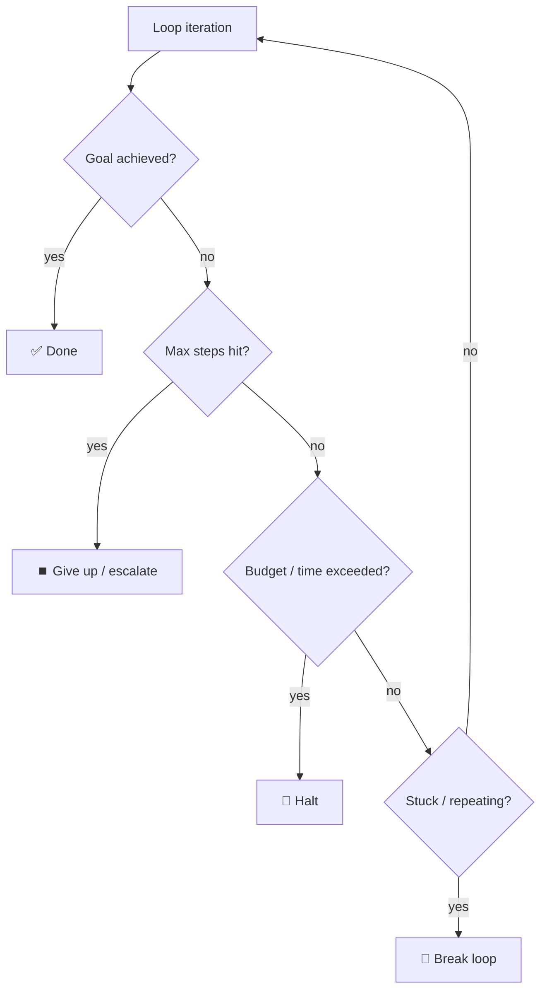
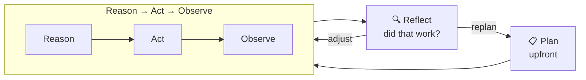
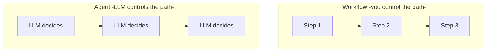

# 🔁 The Agentic Loop

> **One-liner:** The agentic loop is the engine inside every [agent](../agents/): a cycle
> of **Reason → Act → Observe** that repeats until the goal is met. It's what lets an LLM
> take *many* steps and adapt, instead of answering in one shot.

---

## 🔬 One turn of the loop, in detail

The **LLM proposes**, the **runtime executes**, the **result feeds back** into context.
Repeat. That feedback of *real-world results* into the next reasoning step is the whole point.

---

## 🧩 What's happening each iteration

Every loop draws on the other pillars:
- **Reason** uses [prompt engineering](../prompt-engineering/) (how it's asked to think).
- The state it reasons over is [context-engineered](../context-engineering/) (what's in the window).
- **Act** uses [tools](../agents/tools.md).
- **Observe** updates [memory](../agents/memory.md).

---

## 🛑 Loop control — stopping conditions

An unbounded loop is a bug (and a bill). Every agent needs **exit conditions**:

| Guard | Why |
|-------|-----|
| **Goal check** | The intended exit |
| **Max iterations** | Prevent infinite loops |
| **Token / cost / time budget** | Prevent runaway spend |
| **Loop / repetition detection** | Catch the agent doing the same thing over and over |
| **Human escalation** | Hand off when stuck or on risky actions |

---

## 🌀 Enriched loops: planning & reflection

The basic loop is reactive. Add cognition on top:

- **Planning** ([Plan-and-Execute](../agents/architectures.md)) — decide the steps before looping.
- **Reflection** ([Reflexion / Self-Refine](../agents/architectures.md)) — critique results and self-correct.
- These are just the loop with a **plan** in front and a **critic** at the end.

---

## ⚖️ Workflows vs Agents (know the difference)

- **Workflow:** predefined steps; the LLM fills in pieces. **Predictable, cheap, reliable.**
- **Agent:** the LLM dynamically decides the path and when to stop. **Flexible, but riskier.**

> 🧭 **Golden rule:** use the loop only when you need it. If a fixed workflow solves the
> task, prefer it — free-roaming loops are powerful but harder to make reliable. Give the
> LLM control of the loop only when the task genuinely requires open-ended decisions.

---

## 🗺️ Where you see the agentic loop

- **Coding agents** — reason → edit → run tests → read failures → fix → repeat.
- **Deep research** — search → read → decide what's missing → search again → synthesize.
- **[Agentic RAG](../rag/architectures/)** — retrieve → judge relevance → re-retrieve → answer.
- **Computer/browser use** — look at screen → act → observe → continue.

➡️ Back to [Agents](../agents/) · or the [full map](../README.md).
