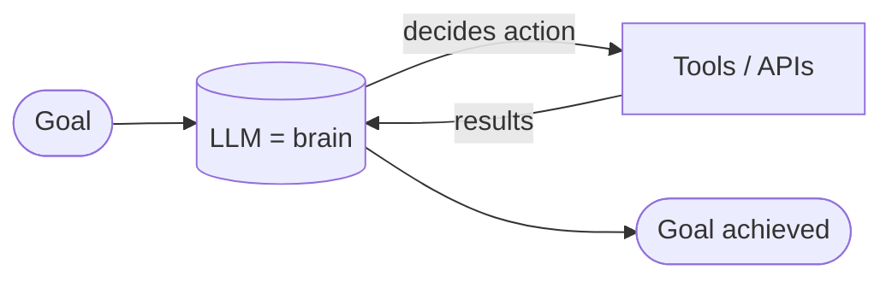
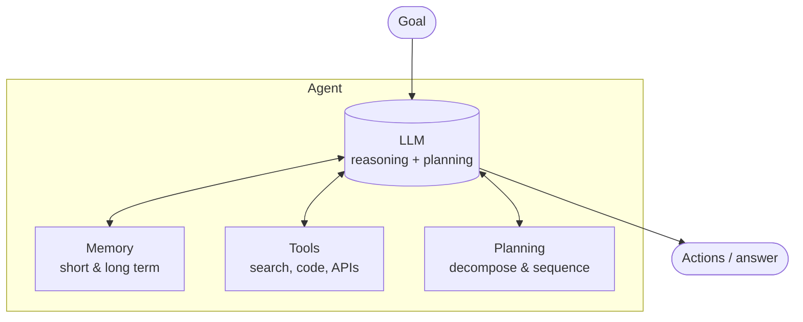
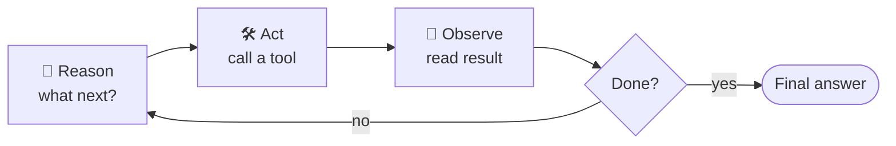
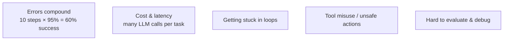

# 🤖 Agents

> **One-liner:** An **agent** is an LLM that doesn't just answer — it **decides what to do,
> uses tools, observes the results, and repeats** until a goal is met. The LLM becomes the
> *reasoning engine* driving a loop, not a one-shot text generator.

---

## 🧠 Anatomy of an agent

The four building blocks:
1. **Brain** — the LLM that reasons and chooses actions.
2. **[Tools](./tools.md)** — how it acts on the world (search, code exec, DB, APIs).
3. **[Memory](./memory.md)** — what it remembers within and across tasks.
4. **Planning** — breaking a goal into steps (and re-planning when things go wrong).

---

## 🔁 The core idea: the loop

Everything an agent does runs on the **[agentic loop](../agentic-loop/)** — reason → act → observe:

This loop is what separates an **agent** from a plain **[RAG](../rag/)** or chatbot call: it can take *many* steps, adapt, and recover from errors. (Full detail: **[agentic-loop](../agentic-loop/)**.)

---

## 🧩 Go deeper

| Topic | What's inside |
|-------|---------------|
| **[Architectures](./architectures.md)** | ReAct, Plan-and-Execute, Reflection, and **multi-agent** systems. |
| **[Memory](./memory.md)** | Short-term (context), long-term (vector), episodic, semantic. |
| **[Tools](./tools.md)** | Function calling, tool design, MCP, safety & sandboxing. |

---

## 🗺️ Where agents are used

| Use case | What the agent does |
|----------|---------------------|
| **Coding assistants** | Read repo, edit files, run tests, fix, repeat |
| **Deep research** | Search web, read, synthesize across many sources |
| **Customer ops** | Look up orders, issue refunds, update records via APIs |
| **Data analysis** | Write & run code, inspect results, iterate |
| **Workflow automation** | Multi-step business processes across systems |
| **Computer use** | Operate a browser / GUI to complete tasks |

---

## ⚠️ Why agents are hard

- **Compounding errors:** each step can fail; long chains are fragile.
- **Cost/latency:** every loop iteration is an LLM call.
- **Reliability:** they can loop forever, hallucinate tool calls, or take unsafe actions.

> 🧭 **Design principle:** use the *simplest* thing that works. A fixed [workflow](../agentic-loop/) (predefined steps) is more reliable than a free-roaming agent — only give the LLM control of the loop when the task genuinely needs open-ended decisions.

➡️ Start with **[architectures](./architectures.md)** to see the common agent patterns.
