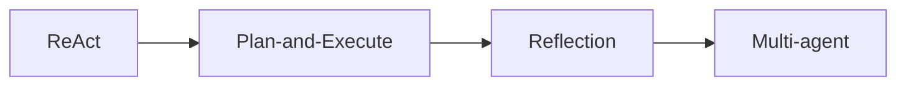
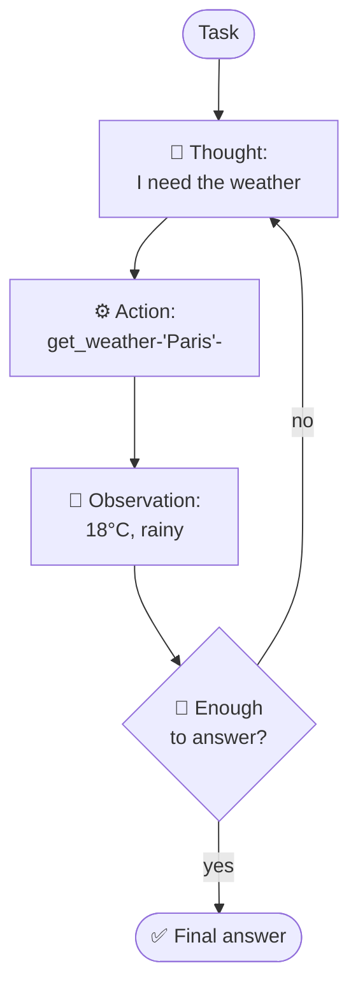
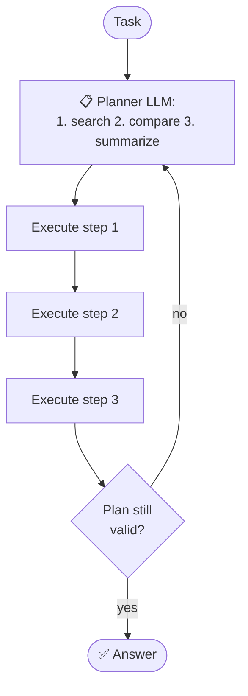
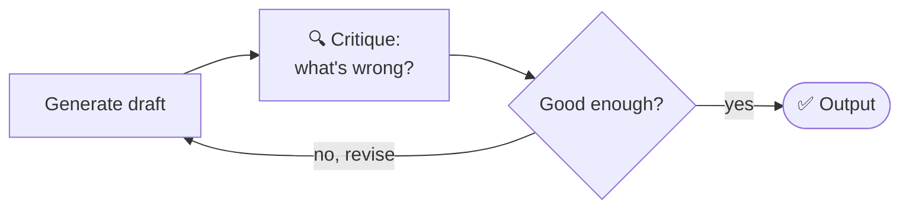
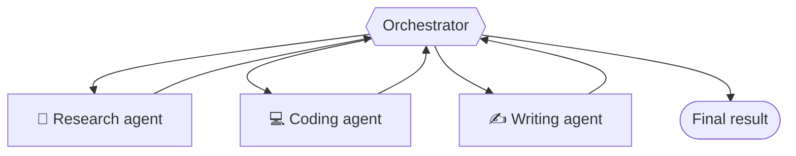
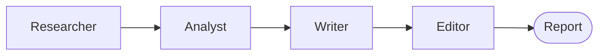
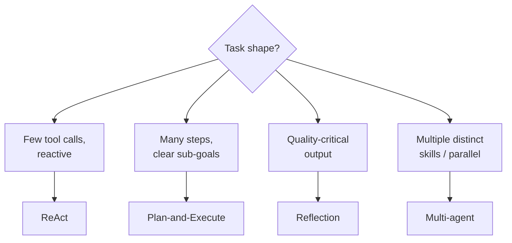

# 🏗️ Agent Architectures

From a single reasoning loop to teams of collaborating agents. Each pattern trades
**simplicity** for **capability**.

---

## 1️⃣ ReAct (Reason + Act) — the foundation

Interleave **thinking** and **doing**: the model writes a *thought*, picks an *action*
(tool call), sees the *observation*, and repeats.

- ✅ Simple, transparent (you can read its reasoning), flexible.
- ❌ Greedy/short-sighted — no big-picture plan; can wander on complex tasks.
- **Used for:** most general-purpose tool-using agents. The default starting point.

## 2️⃣ Plan-and-Execute

**Plan the whole thing first**, then execute the steps (optionally re-planning if a
step fails). Separates strategy from tactics.

- ✅ Better on **long, multi-step** tasks; fewer wasted steps; cheaper (plan once).
- ❌ A bad initial plan hurts; needs re-planning logic.
- **Used for:** research, multi-stage workflows, anything with clear sub-goals.

## 3️⃣ Reflection / Self-critique

The agent **reviews its own output**, finds flaws, and revises. A "generator" produces,
a "critic" (often the same model, different prompt) evaluates.

Patterns: **Reflexion** (learn from failed attempts), **Self-Refine** (iteratively improve).

- ✅ Big quality boost on reasoning, code, writing — catches its own mistakes.
- ❌ More LLM calls (cost/latency); can over-edit.
- **Used for:** code generation, complex reasoning, high-quality writing.

## 4️⃣ Multi-agent systems

Multiple specialized agents collaborate. Common shapes:

### Orchestrator–worker (supervisor)
A lead agent delegates subtasks to specialist workers and combines results.

### Sequential pipeline
Agents hand off in a fixed order (like an assembly line).

### Debate / collaboration
Agents argue or cross-check to reach a better answer.

- ✅ **Separation of concerns** — each agent has a focused role, tools, and context; parallelism; scales to complex problems.
- ❌ More complex, costly; coordination overhead; errors can cascade between agents.
- **Used for:** complex research, software teams-of-agents, simulations, tasks that split cleanly into roles.

---

## 🧭 Choosing an architecture

> 🪜 **Escalate deliberately.** Start with ReAct. Add planning when tasks get long,
> reflection when quality matters, multi-agent only when a single agent's context
> and toolset genuinely can't cope. Every layer adds cost and failure modes.

➡️ Agents need state → **[memory](./memory.md)** · and hands → **[tools](./tools.md)**.
