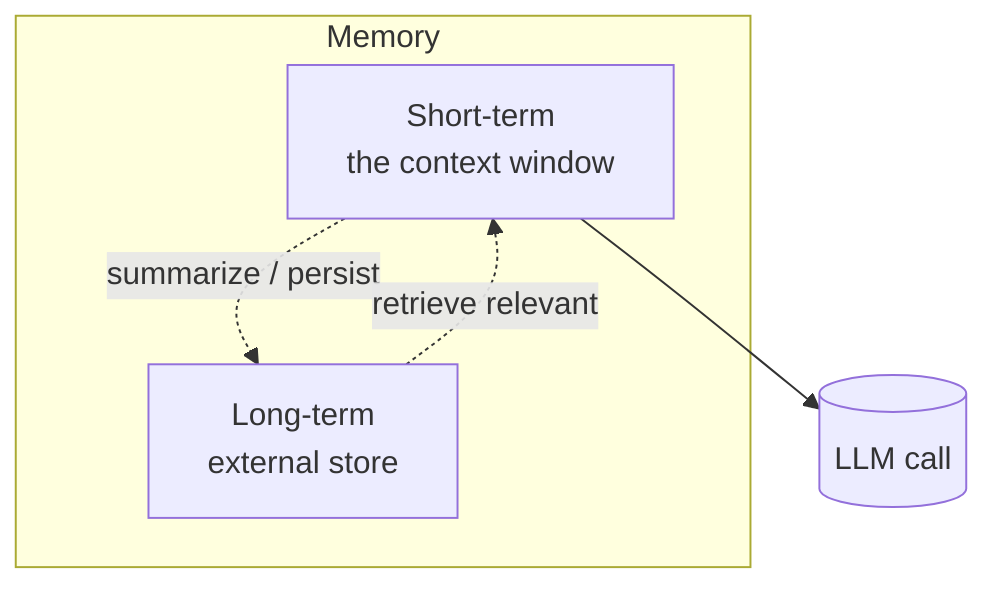
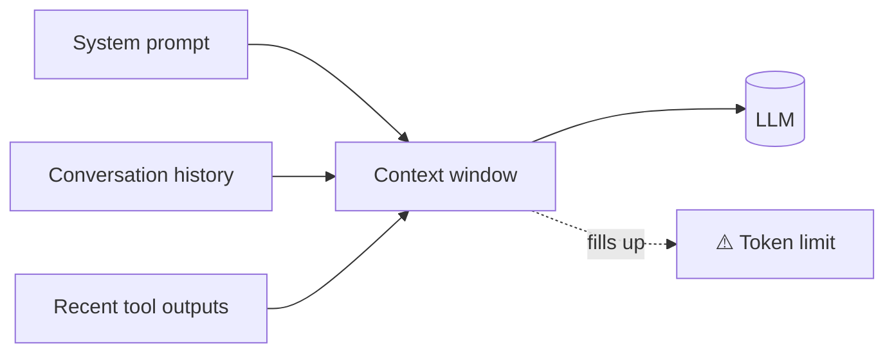
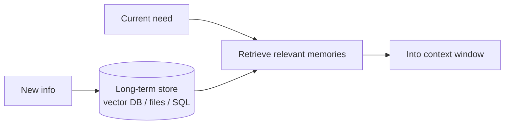
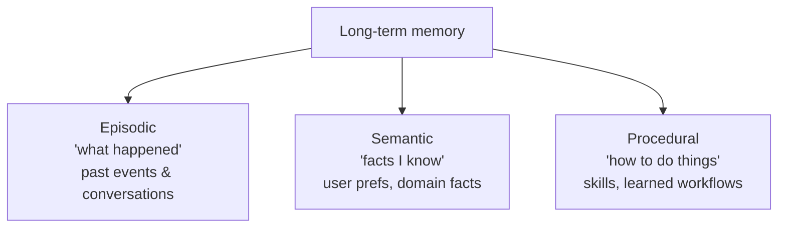
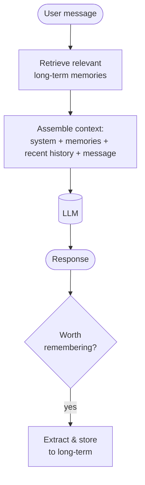

# 🧠 Agent Memory

> **One-liner:** LLMs are **stateless** — each call starts fresh. Memory is the machinery
> that lets an agent remember the current conversation, recall past facts, and carry
> knowledge across sessions.

---

## ⏱️ Short-term (working) memory

Everything currently **in the context window**: the system prompt, the conversation so
far, recent tool results. It's fast and always available — but **finite**.

When it fills up, you must manage it (see [context engineering](../context-engineering/)):
- **Truncate / sliding window** — keep the last N turns.
- **Summarize** — compress old turns into a running summary.
- **Offload** — push details to long-term memory and retrieve on demand.

## 🗄️ Long-term memory

Knowledge that outlives the context window, stored externally and **retrieved when
relevant** (usually via [embeddings + vector search](../rag/embeddings.md) — this is
RAG applied to the agent's own history).

---

## 🧩 Types of long-term memory (a useful taxonomy)

| Type | Holds | Example |
|------|-------|---------|
| **Episodic** | Specific past experiences | "Last week the user asked about refunds" |
| **Semantic** | General facts & knowledge | "The user prefers metric units" |
| **Procedural** | How to perform tasks | A learned multi-step workflow |

---

## 🔧 How memory gets used each turn

The two operations that define a memory system:
- **Read** — decide *what to pull in* to the limited context (relevance + recency).
- **Write** — decide *what's worth saving* (and summarizing) for later.

---

## 🎛️ Practical patterns

| Pattern | What it does |
|---------|--------------|
| **Conversation summary** | Rolling summary replaces old turns to save tokens |
| **Vector memory** | Embed & store messages; retrieve semantically |
| **Entity / profile memory** | Maintain structured facts about users/entities |
| **Scratchpad** | The agent's own notes within a task (chain-of-thought, TODOs) |
| **Memory consolidation** | Periodically merge/dedupe memories (like sleep) |

---

## ⚠️ Pitfalls

- **Context bloat** — stuffing too much memory in degrades reasoning ("lost in the middle") and costs tokens. Retrieve *selectively*.
- **Stale memory** — old facts contradict new ones; version or expire them.
- **Privacy** — long-term memory persists user data; handle deletion & consent.
- **Retrieval quality** — bad memory retrieval is a bad-RAG problem; all of [retrieval](../rag/retrieval.md) applies.

➡️ Memory decides *what the agent knows*; **[tools](./tools.md)** decide *what it can do*.
