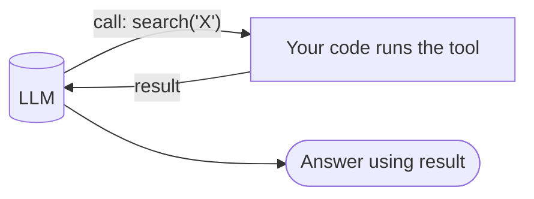
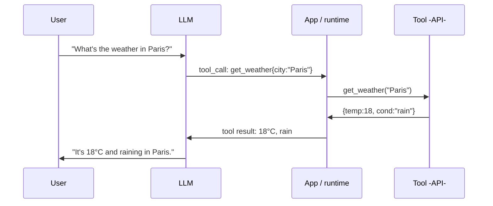
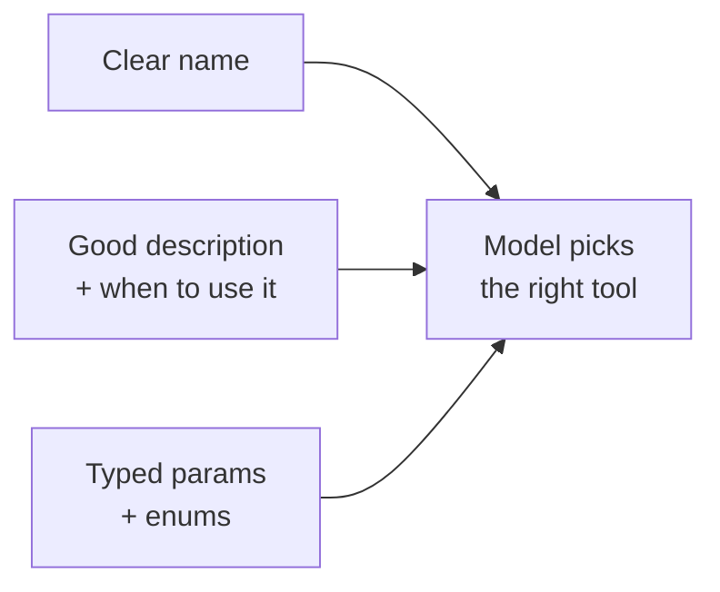
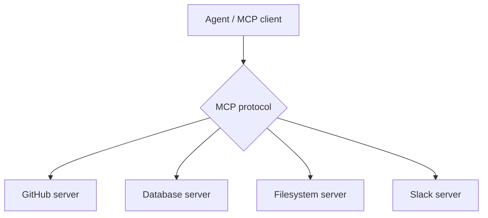
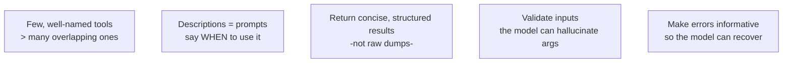
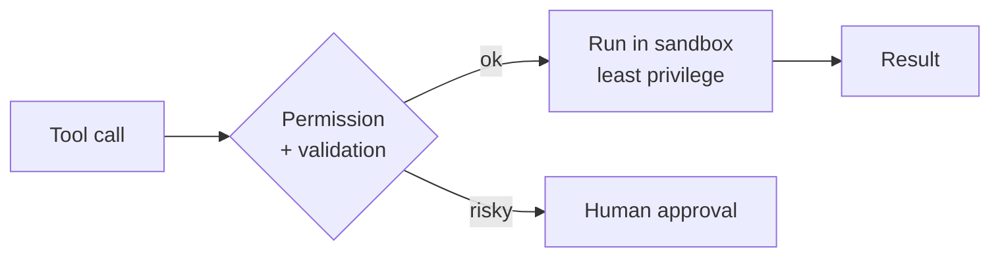

# 🛠️ Tools & Function Calling

> **One-liner:** Tools are how an agent **acts on the world** — search the web, run code,
> query a database, call an API. **Function calling** is the mechanism: the LLM outputs a
> structured request to run a tool, your code runs it, and the result goes back in.



---

## 🔩 How function calling works

The LLM doesn't run code — it **emits a structured call** (usually JSON) that *your*
program executes, then you feed the result back.



Key point: the model **decides** *which* tool and *what arguments*; the **runtime**
actually calls it. This is the security boundary — never blindly execute.

---

## 📝 Anatomy of a tool definition

You describe each tool with a **name, description, and typed parameters** (a JSON schema).
The description is a *prompt* — the model chooses tools based on it, so write it well.

```json
{
  "name": "search_orders",
  "description": "Find a customer's orders by email. Use when the user asks about their order history.",
  "parameters": {
    "type": "object",
    "properties": {
      "email":  {"type": "string", "description": "Customer email"},
      "status": {"type": "string", "enum": ["open", "shipped", "all"]}
    },
    "required": ["email"]
  }
}
```



---

## 🧰 Common tool categories

| Category | Examples |
|----------|----------|
| **Information** | Web search, [RAG](../rag/) retrieval, docs lookup |
| **Computation** | Code interpreter, calculator, data analysis |
| **Actions** | Send email, create ticket, update DB, place order |
| **Other models** | Image gen, transcription, another agent |
| **Environment** | File system, shell, browser / computer use |

---

## 🔌 MCP — Model Context Protocol

An **open standard** for connecting agents to tools and data sources. Instead of custom
integrations per app, tools live behind **MCP servers** that any MCP-compatible agent can use.



- ✅ "USB-C for AI tools" — write a tool server once, use it everywhere.
- ✅ Decouples tool-building from agent-building.

---

## 🎯 Tool design principles



- **Fewer, clearer tools** beat a giant menu — too many confuse the model.
- **Descriptions matter more than code** — that's how the model chooses.
- **Return clean results** — trim payloads so you don't blow the context window.
- **Expect bad arguments** — validate; return a helpful error the model can act on.

---

## 🔒 Safety & guardrails

Tools give an agent real power — treat them like an untrusted user with API access.



- **Least privilege** — scope credentials to exactly what's needed.
- **Human-in-the-loop** for destructive/irreversible actions (payments, deletes, emails).
- **Sandboxing** for code execution and file/shell access.
- **Prompt-injection awareness** — retrieved content or tool output can contain malicious instructions; don't let it silently trigger dangerous tools.
- **Rate limits & timeouts** — stop runaway loops burning money.

➡️ Tools + [memory](./memory.md) + reasoning all run inside the **[agentic loop](../agentic-loop/)**.
