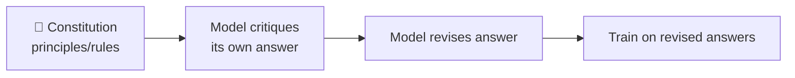
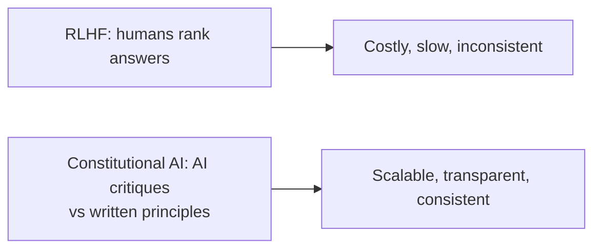
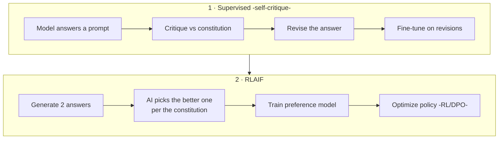

# 📜 Constitutional AI & RLAIF

> **One-liner:** Constitutional AI aligns a model using a written set of **principles (a
> "constitution")** and **AI-generated feedback** instead of relying only on human labels.
> The model learns to critique and revise its **own** outputs against the rules.

---

## 🧭 Why it exists

Standard [RLHF](../fine-tuning/alignment.md) needs humans to label huge amounts of data —
slow, expensive, and hard to keep consistent. Constitutional AI replaces much of that human
labeling with **AI feedback guided by explicit principles**.

---

## 🔁 The two phases

- **Phase 1 — Supervised:** the model critiques and **revises** its own responses against the constitution, then trains on those improved responses.
- **Phase 2 — RLAIF (RL from AI Feedback):** an AI (not humans) judges which of two responses better follows the principles; that becomes the preference signal.

---

## 🆚 RLHF vs RLAIF

| | RLHF | RLAIF (Constitutional AI) |
|---|------|---------------------------|
| Feedback from | Humans | An AI, guided by principles |
| Scale | Limited by labelers | Scales cheaply |
| Transparency | Preferences implicit | Rules written down explicitly |
| Consistency | Varies by rater | Consistent with the constitution |
| Still need humans? | Heavily | To write & audit the constitution |

---

## 📜 What's "in" a constitution?

Plain-language principles the model should follow, e.g. *"choose the response that is most
helpful and honest,"* *"avoid harmful, unethical, or deceptive content."* Editing the rules
changes behavior — alignment becomes **transparent and steerable**.

---

## ⚖️ Trade-offs

- ✅ Scalable, cheaper, transparent, easier to update than pure RLHF.
- ✅ Reduces reliance on humans viewing harmful content.
- ⚠️ Only as good as the principles and the judging model; can inherit the AI judge's biases.
- ⚠️ Humans still needed to author and audit the constitution.

---

## 🗺️ Where it's used

- **Safety [alignment](../fine-tuning/alignment.md)** of assistant models.
- Scaling preference data via **[synthetic feedback](../synthetic-data/)**.
- Any setting needing **auditable, rule-based** behavior.

➡️ Related: **[alignment (RLHF/DPO)](../fine-tuning/alignment.md)** · **[guardrails](../guardrails/)** · **[synthetic-data](../synthetic-data/)**.
