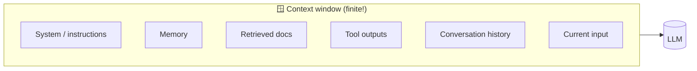
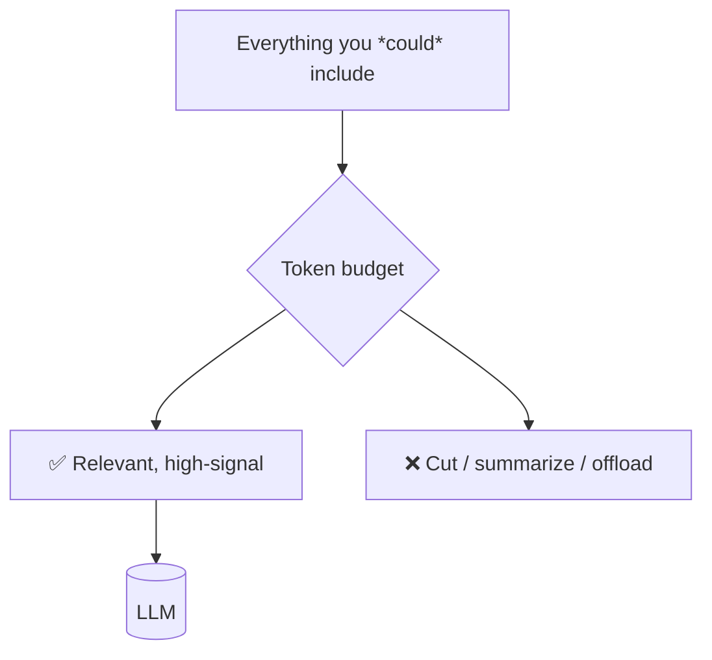
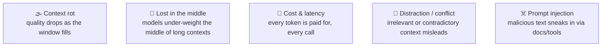
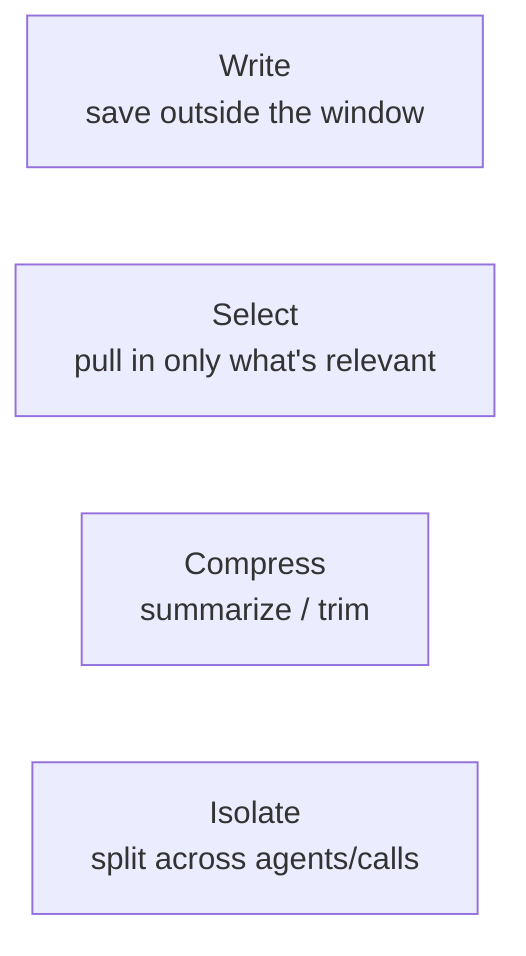
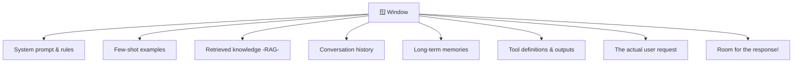
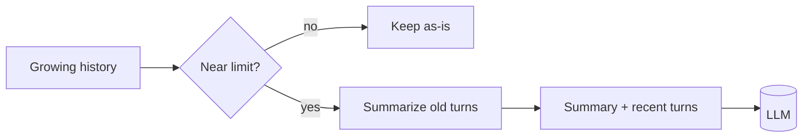
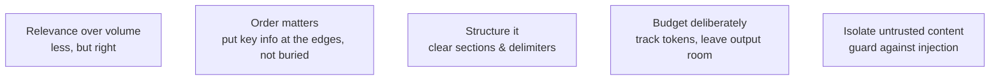

# 🪟 Context Engineering

> **One-liner:** Context engineering is the discipline of deciding **everything that goes
> into the context window** — instructions, memory, retrieved data, tool outputs, history —
> and doing it within a **finite token budget**. It's the superset of
> [prompt engineering](../prompt-engineering/) for real, agentic systems.

> 📌 *"Prompt engineering" is what you write once. "Context engineering" is what you assemble,
> dynamically, on every single call.*

---

## 🎯 Why it exists: the window is finite

Every model has a **context limit**. You're always making a budget decision: *what earns
its place in the window right now?* More is **not** better — irrelevant context hurts.

---

## ⚠️ The failure modes it fights

The whole job is getting the **right** information — and *only* the right information — in front of the model at the right time.

---

## 🧰 Core techniques

| Technique | What it means | Example |
|-----------|---------------|---------|
| **Write** | Persist info *outside* the window | Scratchpads, [long-term memory](../agents/memory.md) |
| **Select** | Retrieve only what's relevant | [RAG](../rag/), memory retrieval, tool-result filtering |
| **Compress** | Shrink what you keep | Summarize old turns, trim tool outputs |
| **Isolate** | Partition context | [Multi-agent](../agents/architectures.md) — each agent its own clean context |

---

## 📦 What competes for the window

> 🧮 Don't forget to leave headroom for the **output**. Filling the window to the brim leaves no room to answer.

---

## 🔁 Managing a long conversation

Strategies: **sliding window** (last N turns), **summarization** (compress the old),
**retrieval** (fetch only relevant past turns), **offloading** (store details, recall on demand).

---

## 🗺️ Where context engineering lives

- **Agentic systems** — the make-or-break skill; agents generate tons of tool output that must be curated.
- **RAG** — deciding *how many* chunks, in what order, with what instructions.
- **Long conversations** — chat assistants that must stay coherent for hours.
- **Multi-agent** — giving each agent a focused, isolated context.

---

## ✅ Principles

**The mantra:** *the smallest set of high-signal tokens that fully specifies the task.*

➡️ It all comes together in the loop → **[agentic loop](../agentic-loop/)**.
