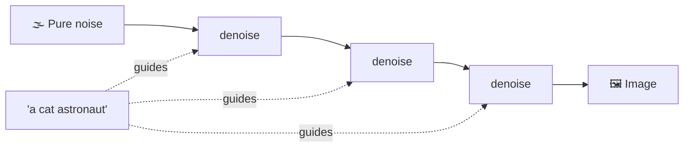
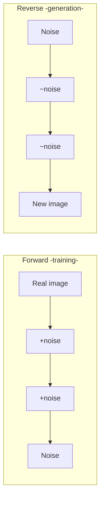
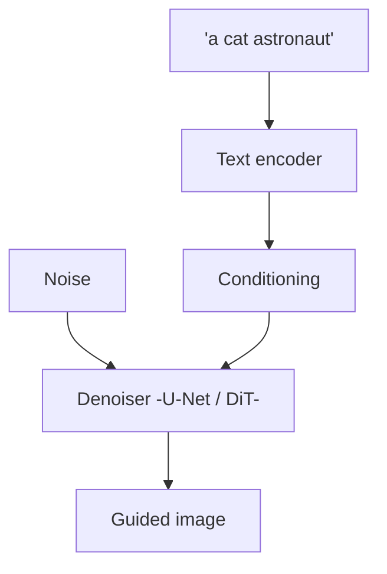
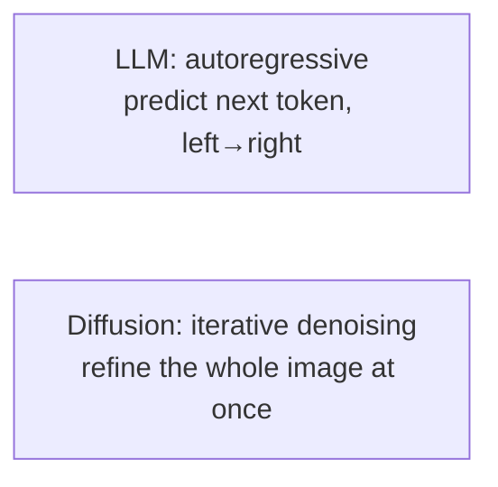

# 🎨 Diffusion Models

> **One-liner:** Diffusion models generate images (and audio/video) by learning to
> **reverse noise** — start from pure static and iteratively **denoise** it into a coherent
> picture, guided by your prompt. They power most modern text-to-image/video generation.

---

## 🔁 The core trick: forward vs reverse

- **Forward process:** take a real image and gradually add noise until it's pure static. Easy — no learning needed.
- **Training:** teach a network to **predict the noise** that was added at each step.
- **Reverse process (generation):** start from noise and repeatedly **subtract predicted noise** → a brand-new image emerges.

---

## 🧭 How your prompt steers it

- A **text encoder** turns your prompt into a conditioning signal.
- **Classifier-free guidance** controls how strongly the image follows the prompt (the "guidance scale").
- **Latent diffusion** (the efficient trick): run diffusion in a compressed **latent space** instead of full pixels → much faster. This is what made high-res generation practical.

---

## 🧩 Key terms

| Term | Meaning |
|------|---------|
| **Denoising steps** | More steps = higher quality, slower (e.g. 20–50) |
| **Latent diffusion** | Diffuse in compressed space, then decode to pixels |
| **U-Net / DiT** | The denoiser network (DiT = transformer-based) |
| **Guidance scale (CFG)** | Prompt-adherence vs creativity dial |
| **ControlNet** | Add structural control (pose, edges, depth) |
| **LoRA (for diffusion)** | Lightweight fine-tuning for a style/subject |
| **Inpainting / outpainting** | Edit/extend parts of an image |

---

## 🆚 Diffusion vs LLMs

Different generative paradigms: LLMs build output **token by token**; diffusion refines the
**entire output** over many steps. (Video/audio and even some text models use diffusion too.)

---

## 🗺️ Where diffusion is used

- **Text-to-image** (art, design, marketing assets)
- **Image editing** (inpainting, style transfer, upscaling)
- **Text-to-video** and **audio/music** generation
- **Synthetic data** generation

➡️ Combine image + text understanding → **[multimodal](../multimodal/)**.
