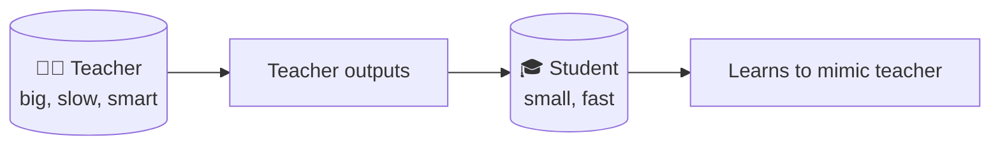
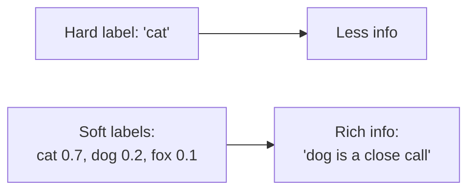
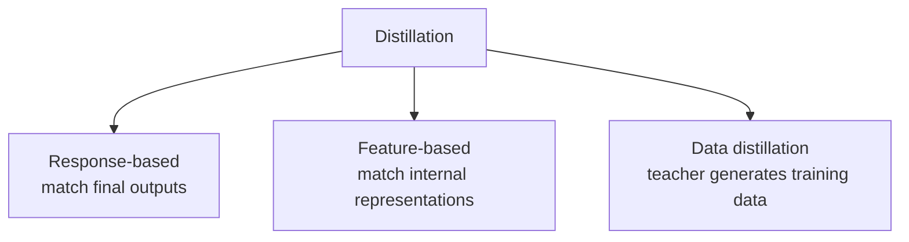
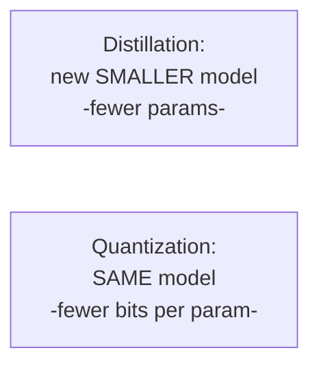

# 🧪 Knowledge Distillation

> **One-liner:** Distillation trains a small, fast **"student"** model to imitate a large,
> powerful **"teacher"** model — capturing most of the teacher's quality at a fraction of
> the size and cost.

---

## 🧠 Why imitate outputs instead of labels?

A teacher's **full probability distribution** ("soft labels") carries more information than
a single correct answer ("hard label") — it reveals *how* the teacher thinks about the
alternatives.

The student learns from these soft targets and matches the teacher's behavior more closely.

---

## 🔧 Flavors of distillation

| Type | Student learns to match… |
|------|--------------------------|
| **Response-based** | Teacher's output distribution |
| **Feature-based** | Teacher's hidden layers / features |
| **Data distillation** | A dataset the **teacher generated** (very common for LLMs) |

> 💡 For LLMs, a hugely popular pattern is **data distillation**: use a frontier model to
> generate high-quality training examples, then [fine-tune](../fine-tuning/) a smaller model
> on them.

---

## ⚖️ Distillation vs Quantization (both shrink models)

- **Distillation** → a genuinely smaller architecture (fewer parameters).
- **[Quantization](../quantization/)** → same architecture, lower precision.
- They **combine well**: distill *then* quantize for maximum efficiency.

---

## 🗺️ Where distillation is used

- **Cheaper, faster inference** — deploy a small model that acts like a big one.
- **On-device / edge** models.
- **Task-specialized small models** — distill a big model's skill for one job (classification, extraction).
- **Reasoning distillation** — teach a small model the reasoning traces of a big [reasoning model](../reasoning-models/).

---

## ⚠️ Caveats

- The student rarely **fully** matches the teacher — expect some quality gap.
- Quality depends heavily on the teacher and the coverage of the distillation data.
- Licensing: check whether a model's terms allow training on its outputs.

➡️ Pair with **[quantization](../quantization/)** and **[inference-optimization](../inference-optimization/)** for the smallest, fastest deployment.
