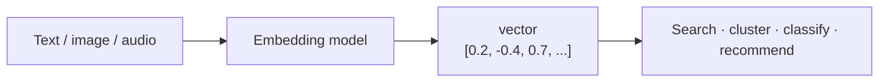
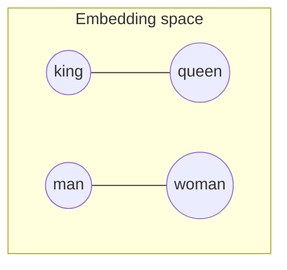
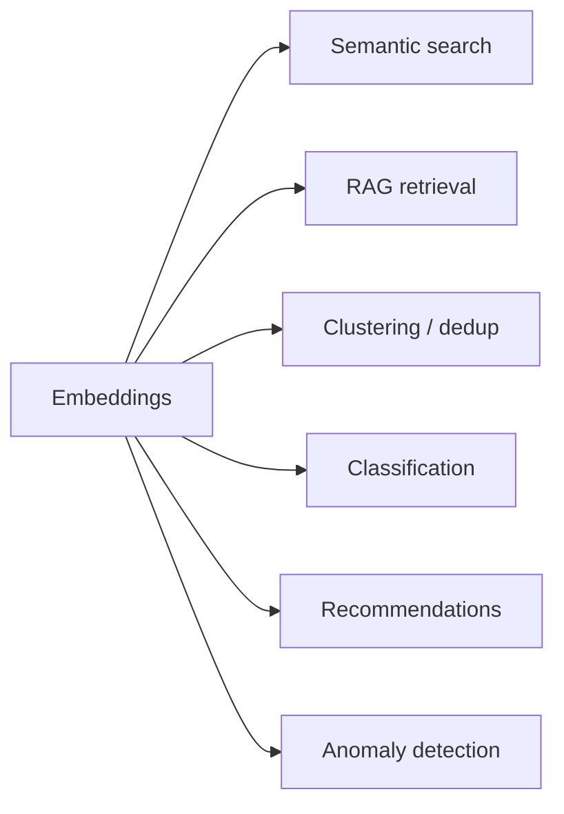
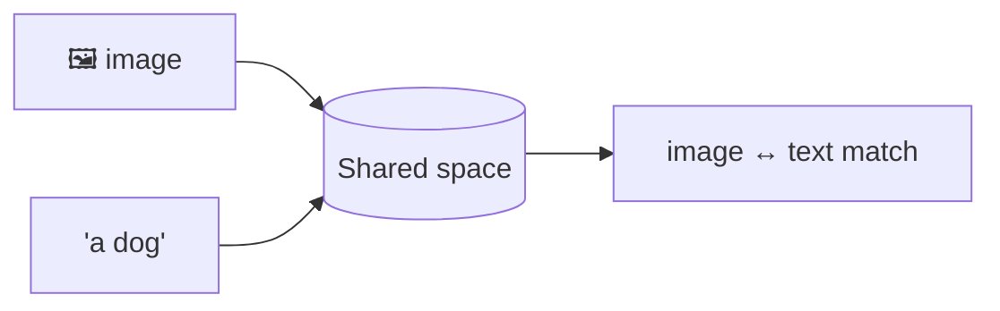

# 🧮 Embeddings (Vector Representations)

> **One-liner:** An embedding turns *anything* — text, images, audio, users, products —
> into a **vector** that captures meaning, so that "similar things sit close together."
> They're the backbone of semantic search, [RAG](../rag/), recommendations, and clustering.

> 📎 There's a RAG-specific take in **[rag/embeddings.md](../rag/embeddings.md)**. This page
> is the broader concept.

---

## 🌐 The big idea: meaning as geometry

Similar meanings → nearby vectors. Distance becomes a proxy for *semantic* difference,
so you can do "math on meaning."

The famous example: **king − man + woman ≈ queen**. Relationships become directions in the space.

---

## 📏 Similarity metrics

| Metric | Measures | Common for |
|--------|----------|-----------|
| **Cosine** | Angle between vectors | Text (most common) |
| **Dot product** | Angle + magnitude | Normalized vectors |
| **Euclidean (L2)** | Straight-line distance | Some vector DBs |

---

## 🧰 What embeddings power

| Use case | How |
|----------|-----|
| **Semantic search** | Find by meaning, not keywords |
| **[RAG](../rag/)** | Retrieve relevant chunks |
| **Recommendations** | "Items near this one" |
| **Clustering / dedup** | Group similar docs |
| **Classification** | Nearest labeled example |
| **Multimodal** | Put text & images in the **same** space → search images by text |

---

## 🖼️ Multimodal embeddings

Some models (CLIP-style) embed **images and text into one shared space**, so a photo of a
dog and the word "dog" land near each other — enabling cross-modal search.

---

## 🗄️ Storing & searching them

Millions of vectors need **[vector databases](../vector-databases/)** with **ANN** indexes
(HNSW, IVF) to search in milliseconds.

> ⚠️ **Golden rule:** embed queries and documents with the **same model** — different
> models = different spaces = broken search.

➡️ Where they live and how they're searched → **[vector-databases](../vector-databases/)**.
