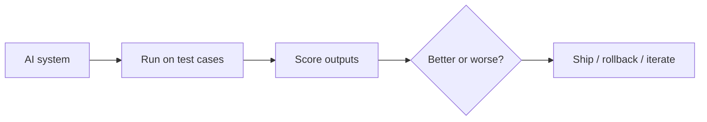
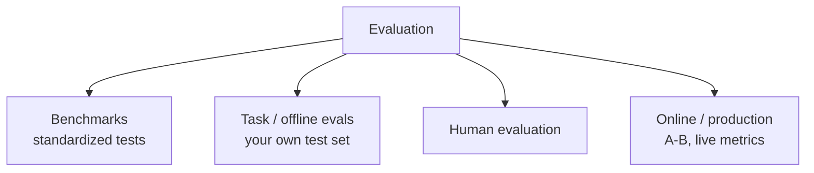
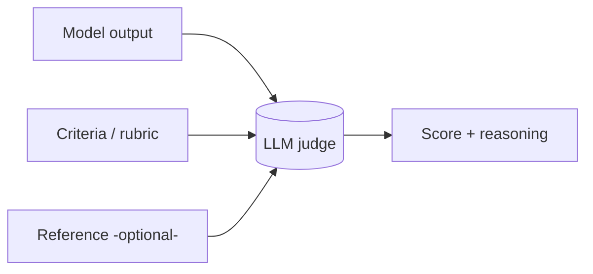
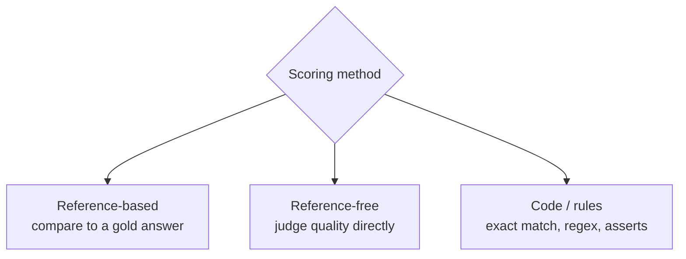
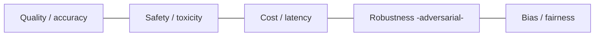
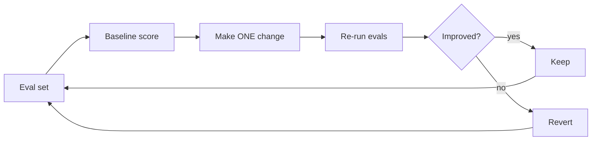

# 📊 Evaluation (Evals)

> **One-liner:** Evaluation is how you **measure** whether an AI system is good — and
> whether a change made it better or worse. Without evals you're tuning on vibes. "Evals are
> the new unit tests."

> 📎 RAG-specific metrics live in **[rag/evaluation.md](../rag/evaluation.md)**. This page is the general picture.

---

## 🧭 The evaluation landscape

| Kind | What | When |
|------|------|------|
| **Benchmarks** | Standard public tests (knowledge, reasoning, coding) | Compare models |
| **Task evals** | *Your* dataset for *your* use case | Before shipping changes |
| **Human eval** | People rate/compare outputs | Gold standard, doesn't scale |
| **Online eval** | Real traffic (A/B, thumbs, conversion) | After shipping |

> ⚠️ **Benchmarks ≠ your task.** A high leaderboard score doesn't guarantee it works for
> *your* users. Build a task-specific eval set.

---

## 🤖 LLM-as-a-Judge

Use a strong LLM to **score** another model's outputs against criteria (helpfulness,
correctness, tone). Scales far better than human review.

- ✅ Scalable, flexible, decent correlation with humans.
- ⚠️ Biases: position bias (favors first answer), verbosity bias, self-preference. Mitigate with rubrics, pairwise comparison, randomized order.

---

## 📏 How outputs get scored

| Method | Example |
|--------|---------|
| **Exact / rule-based** | Classification accuracy, JSON validity, unit tests for code |
| **Similarity** | Semantic similarity to a reference |
| **LLM judge** | Rubric-based scoring of open-ended text |
| **Human** | Ratings, rankings, pairwise preference |

---

## 🧪 Beyond quality: what else to measure

Also: **red-teaming** (actively trying to break it), **regression tests** (did an update
break old behavior?), and **hallucination** rate → see [hallucination](../hallucination/).

---

## 🔁 The eval-driven loop

**The discipline:** change one thing, re-run the same eval set, compare. This beats months
of guesswork — the same message as [RAG evaluation](../rag/evaluation.md) and [fine-tuning data](../fine-tuning/data-preparation.md).

---

## 🧰 Tooling

RAGAS, DeepEval, promptfoo, LangSmith, Phoenix (Arize), OpenAI Evals, lm-evaluation-harness.

## 🗺️ Where evaluation is critical

- **Choosing a model** for your task.
- **Shipping prompt / RAG / fine-tune changes** safely.
- **Monitoring production** quality drift.
- **Safety & compliance** sign-off.

➡️ Guard the outputs at runtime → **[guardrails](../guardrails/)**.
