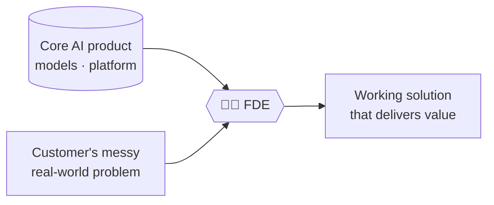
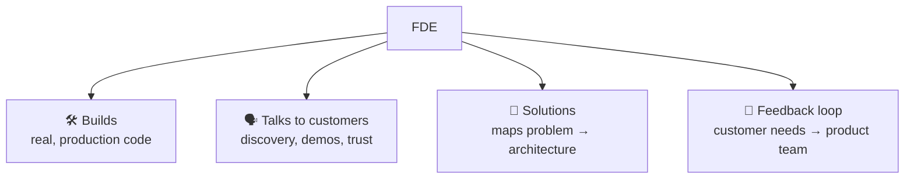
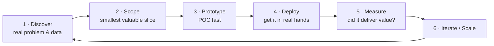
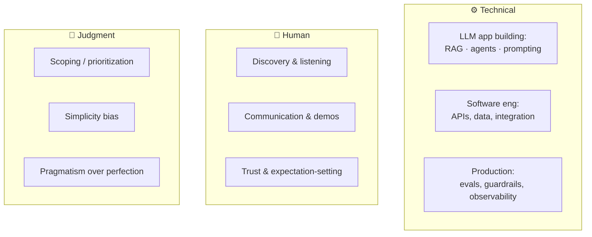
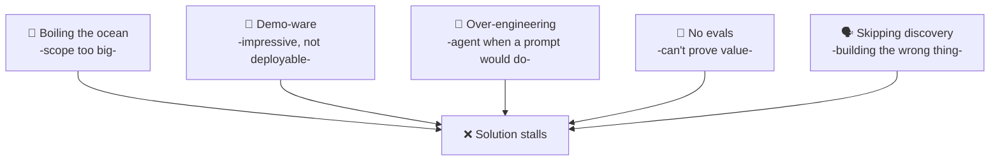

# 🧑‍💼 The Forward Deployed Engineer (FDE)

> **One-liner:** A Forward Deployed Engineer is an engineer who **embeds with a customer**,
> understands their real problem, and **builds a working AI solution on top of the core
> product** — bridging engineering, product, and the customer. Part builder, part consultant,
> part translator.

The FDE is the person who makes the technology **actually work in someone's business** —
not a demo, not a slide, a deployed thing people use.

---

## 🎯 What makes the role distinct

| vs. a … | The FDE difference |
|---------|--------------------|
| **Backend/ML engineer** | Faces the *customer*, not just the codebase |
| **Sales engineer** | Actually **ships** the solution, not just demos it |
| **Consultant** | Writes production code on a real platform |
| **Product manager** | Builds it themselves, in the field |

---

## 🔁 The FDE workflow (the loop)

This mirrors the [agentic loop](../agentic-loop/) — understand, build, observe, iterate — but with a human and a customer in it.

### 1 · Discover
Sit with the users. Find the **actual** pain (often *not* what was in the brief). Understand
the data, the workflow, the constraints, and what "success" means to *them*.
> 💡 The #1 FDE skill is asking questions until the real problem surfaces.

### 2 · Scope
Cut to the **smallest slice that delivers real value** — the wedge. Resist boiling the ocean.
A narrow thing that works beats a broad thing that doesn't.

### 3 · Prototype
Build a proof-of-concept **fast** using the simplest tools that could work. Order of reach:
**[prompt engineering](../prompt-engineering/) → [RAG](../rag/) → [agents](../agents/) →
[fine-tuning](../fine-tuning/)** (cheap/reversible first). Show it, get reactions early.

### 4 · Deploy
Move from notebook to **real usage**: integrate with their systems, add
[guardrails](../guardrails/), handle errors, respect security & data boundaries.

### 5 · Measure
Prove value with **[evaluation](../evaluation/)** and **[observability](../observability/)** —
task success, adoption, time saved, cost. If you can't measure it, you can't defend it.

### 6 · Iterate / Scale
Feed real failures back into the loop, harden the system, and **feed customer patterns back
to the product team** — that's the FDE's superpower.

---

## 🧰 The FDE skills matrix

| Bucket | You need to be able to… |
|--------|--------------------------|
| **Build** | Ship an LLM app end to end ([RAG](../rag/), [agents](../agents/), [prompting](../prompt-engineering/), [fine-tuning](../fine-tuning/)) |
| **Engineer** | Integrate with real systems, data, and APIs; write solid code |
| **Productionize** | [Evaluate](../evaluation/), [guard](../guardrails/), [observe](../observability/), [optimize cost](../model-routing/) |
| **Communicate** | Run discovery, demo, set expectations, build trust |
| **Judge** | Scope ruthlessly; pick the *simplest* thing that works |

---

## ⚠️ FDE anti-patterns (how solutions die)

> 🧭 **Golden rule:** the simplest solution that delivers value wins. Reach for
> [complexity](../agents/) only when a concrete problem demands it — the same "escalate
> deliberately" principle from the [agentic loop](../agentic-loop/).

---

## 🗺️ Where to go next

- Follow the **[full learning path](../README.md#-the-path-to-forward-deployed-engineer)** in the root README.
- Learn to combine the pieces → **[LLM system design](../llm-system-design/)**.
- The technical core: **[RAG](../rag/)** · **[agents](../agents/)** · **[evaluation](../evaluation/)** · **[guardrails](../guardrails/)**.
