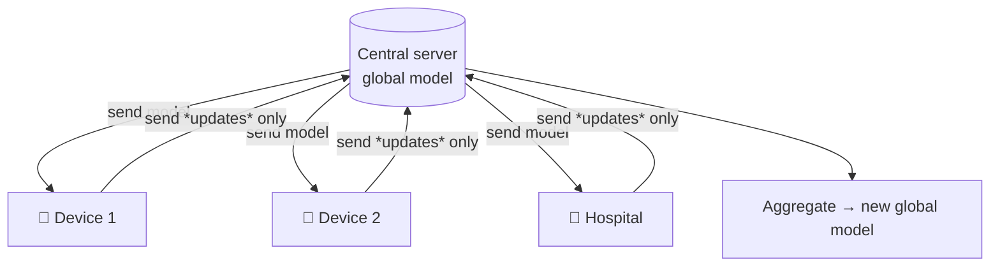
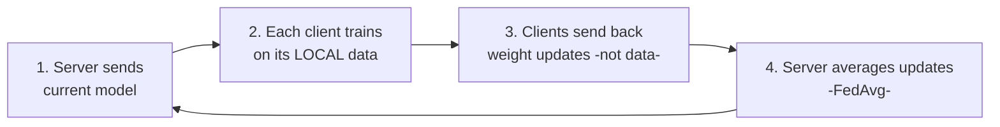
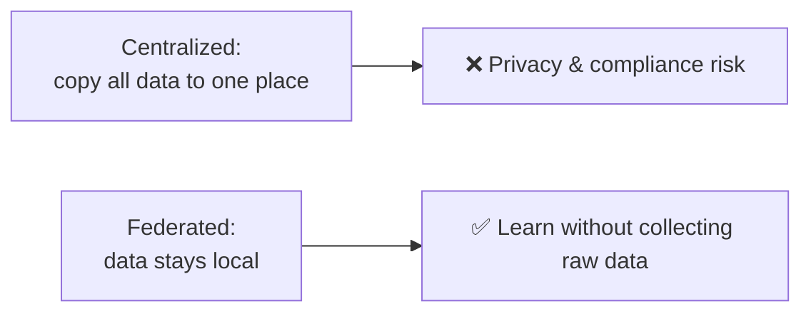
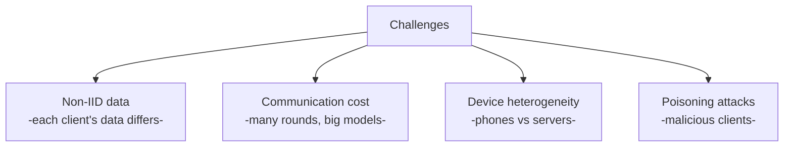

# 🔐 Federated Learning & Privacy-Preserving AI

> **One-liner:** Federated learning trains a shared model across many devices/organizations
> **without the raw data ever leaving its source**. The data stays home; only model updates
> travel. It's how you learn from private data you're not allowed to centralize.

---

## 🔁 The training round

The classic algorithm is **FedAvg** (Federated Averaging): average clients' updates, weighted
by data size. Raw data **never** moves.

---

## 🛡️ Why it matters: privacy

Enables learning from data that **can't** be pooled — medical records, phone keyboards,
across companies/regulatory borders.

---

## 🔒 Layering on stronger guarantees

Updates alone can still leak information, so federated learning is often combined with:

| Technique | Protects by |
|-----------|-------------|
| **Differential privacy** | Adding calibrated noise so no single record is identifiable |
| **Secure aggregation** | Server only sees the *sum* of updates, not any individual's |
| **Homomorphic encryption** | Compute on encrypted updates |

---

## ⚖️ Challenges

- Clients have **different, skewed** data → harder to converge.
- **Communication** is a bottleneck for large models.
- **Security** — malicious clients can try to poison the global model.

---

## 🗺️ Where it's used

- **Mobile keyboards** (next-word prediction learned on-device).
- **Healthcare** — train across hospitals without sharing patient data.
- **Finance / cross-org** collaboration under privacy rules.
- **Edge / IoT** learning.

> 💡 For LLMs specifically, full federated *pretraining* is rare (too big), but federated /
> privacy-preserving **[fine-tuning](../fine-tuning/)** on sensitive data is an active area.

➡️ Related: **[fine-tuning](../fine-tuning/)** · privacy themes in **[guardrails](../guardrails/)** · **[synthetic-data](../synthetic-data/)** (another privacy workaround).
