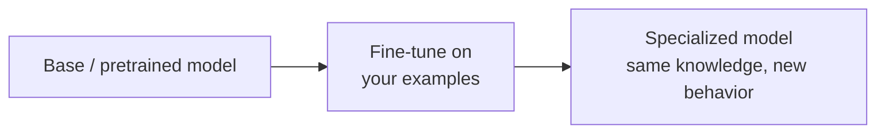
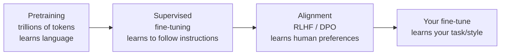
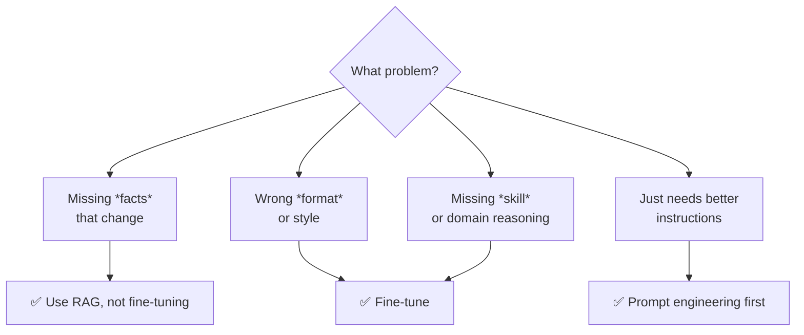

# 🎛️ Fine-tuning

> **One-liner:** **Fine-tuning changes the model's weights** so it internalizes a new
> skill, style, format, or domain. Where [RAG](../rag/) changes what the model *knows
> right now*, fine-tuning changes *what the model is*.

---

## 🧬 Where fine-tuning sits in a model's life

You almost never pretrain (that's millions of dollars). You **fine-tune** an already-capable base or instruct model on a few hundred to a few thousand examples.

---

## 🎯 When to fine-tune (and when NOT to)

| Fine-tune when… | Don't fine-tune when… |
|-----------------|------------------------|
| You need a **consistent style/format** (tone, JSON schema, brand voice) | You need **fresh or private facts** → use [RAG](../rag/) |
| You have a **narrow, repeated task** (classification, extraction) | A better **prompt** would fix it → [prompt engineering](../prompt-engineering/) |
| You want a **smaller/cheaper model** to match a big one on your task | You only have a handful of examples |
| Latency/cost matters and you can bake the behavior in | Your requirements change weekly |

> 💡 **Order of operations:** Prompt engineering → RAG → Fine-tuning. Try the cheap, reversible fixes first.

---

## 🧩 Go deeper

| Topic | What's inside |
|-------|---------------|
| **[Methods](./methods.md)** | Full fine-tuning vs **PEFT**: LoRA, QLoRA, adapters — how to train cheaply. |
| **[Alignment](./alignment.md)** | SFT → **RLHF**, **DPO**, ORPO — teaching preferences and behavior. |
| **[Data preparation](./data-preparation.md)** | The real work: building, formatting, and cleaning the dataset. |

---

## 🗺️ Where fine-tuning is used

| Use case | Why fine-tune |
|----------|---------------|
| **Structured extraction** (docs → JSON) | Reliable format every time |
| **Classification / routing** | Small fast model beats prompting a big one |
| **Brand / persona voice** | Consistent tone at scale |
| **Domain reasoning** (legal, medical, code) | Bake in domain patterns |
| **Distillation** | Make a small model imitate a large one (cheaper inference) |
| **Tool-calling / function format** | Reliable agent behavior |

---

## ⚠️ Watch out for

- **Catastrophic forgetting** — over-training can erode general ability. PEFT/LoRA and mixing in general data help.
- **Overfitting** — memorizing your small dataset instead of learning the pattern.
- **It won't add knowledge reliably** — fine-tuning teaches *behavior*, not a durable fact store. For facts, pair with [RAG](../rag/).
- **Data quality > data quantity** — 500 clean examples beat 50k noisy ones.

➡️ Start with **[methods](./methods.md)** to see how LoRA makes this affordable.
