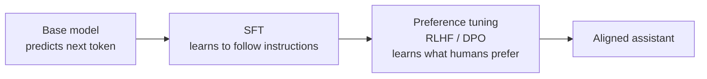
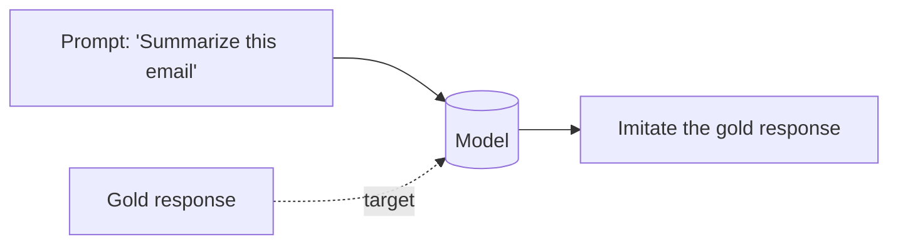
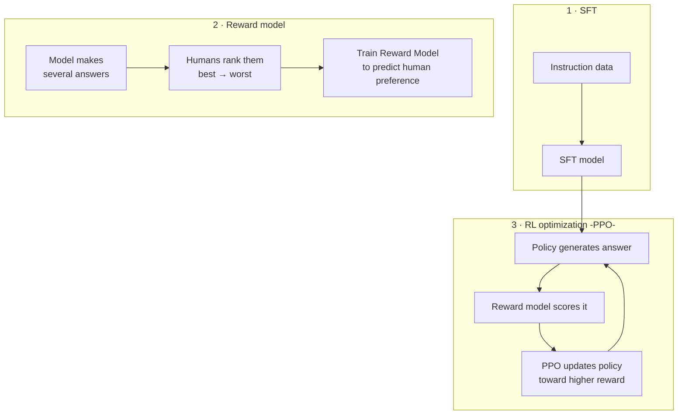
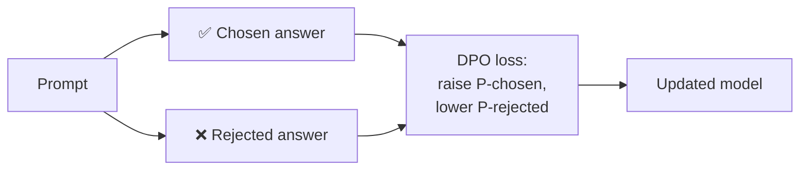
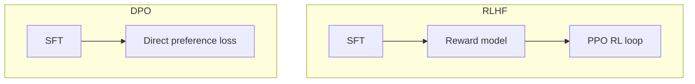

# 🧭 Alignment — SFT, RLHF, DPO

> **One-liner:** Alignment makes a model **helpful, honest, and harmless** — and makes it
> prefer the *kind* of answers humans actually want. It's the step that turns a raw
> text-predictor into a usable assistant.

---

## 1️⃣ SFT — Supervised Fine-Tuning

Show the model **(prompt → ideal response)** pairs. It learns to imitate good answers.
This is "regular" fine-tuning applied to instruction-following.

- ✅ Simple, effective, the foundation of every chat model.
- ❌ Only teaches "a good answer," not *which of two answers is better*. It can't easily learn subtle preferences or what to **avoid**.

## 2️⃣ RLHF — Reinforcement Learning from Human Feedback

The classic 3-step recipe that made ChatGPT-style assistants work.

- **Step 1:** SFT a base model.
- **Step 2:** Humans **rank** multiple responses; train a **reward model** to imitate those preferences.
- **Step 3:** Use RL (**PPO**) to push the model toward answers the reward model scores highly — with a **KL penalty** so it doesn't drift too far from the SFT model.
- ✅ Captures nuanced, hard-to-write-down preferences (helpfulness, safety, tone).
- ❌ Complex, unstable, expensive: multiple models in the loop, reward hacking risk.

## 3️⃣ DPO — Direct Preference Optimization ⭐

The modern simplification. **Skip the separate reward model and RL loop** — optimize the
model **directly** on preference pairs (chosen vs rejected) with a simple classification-style loss.

- ✅ Much **simpler and more stable** than RLHF — no reward model, no PPO.
- ✅ Cheaper, easier to reproduce. Now a very common default for preference tuning.
- ❌ Needs good preference-pair data; less flexible than full RL for some objectives.

## 4️⃣ Cousins of DPO

| Method | Twist |
|--------|-------|
| **ORPO** | Combines SFT + preference tuning in **one** step (no separate SFT needed) |
| **IPO** | DPO variant that's more robust to overfitting on preferences |
| **KTO** | Learns from **single** "good/bad" labels instead of paired comparisons |
| **RLAIF** | Replace human rankings with **AI feedback** (e.g. Constitutional AI) to scale |

---

## 🆚 RLHF vs DPO at a glance

| | RLHF | DPO |
|---|------|-----|
| Reward model | ✅ separate | ❌ none |
| RL loop (PPO) | ✅ yes | ❌ no |
| Stability | Trickier | Easier |
| Flexibility | Higher | Good enough for most |
| Popularity now | Foundational | **Common default** |

---

## 🗺️ Where this is used

- Building any **chat assistant** (helpful/harmless behavior).
- **Safety tuning** — refusing harmful requests, reducing toxicity.
- **Style/preference tuning** — matching a company's answer standards.
- **Reducing hallucination** — preferring "I don't know" over confident nonsense.

➡️ None of this works without good data → **[data preparation](./data-preparation.md)**.
