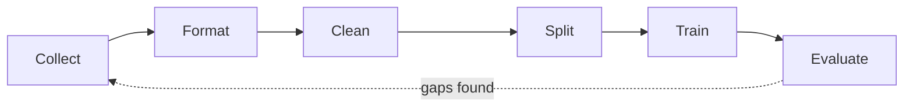
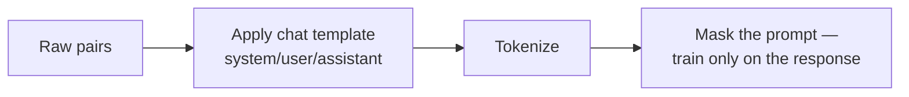
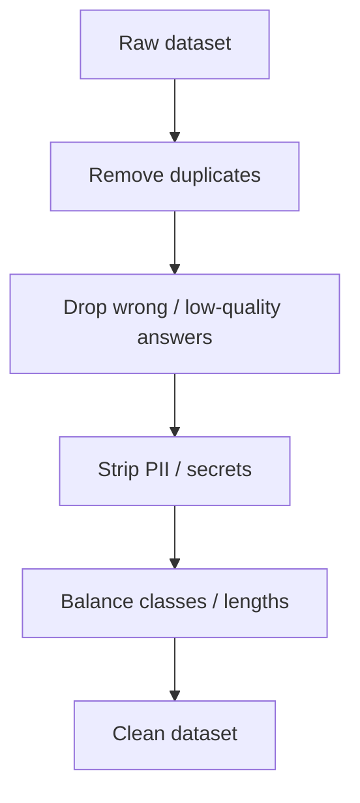
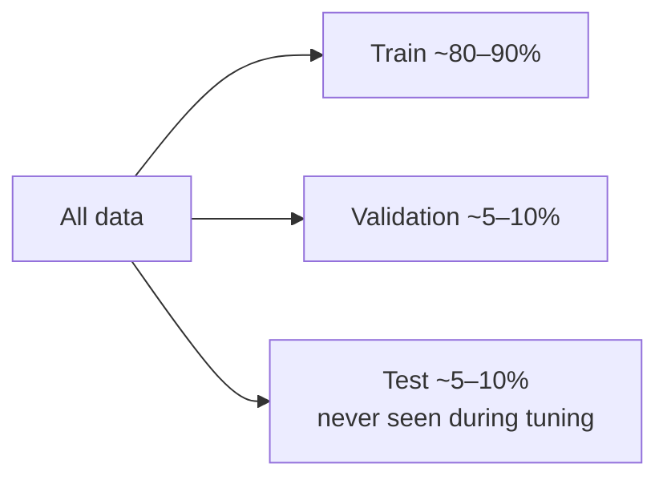
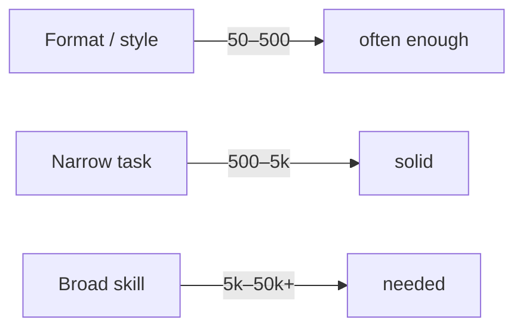
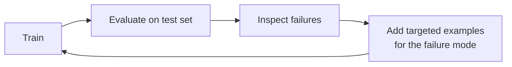

# 🧹 Data Preparation for Fine-tuning

> **One-liner:** Fine-tuning is **90% data work**. The model can only be as good as the
> examples you show it. Quality, consistency, and coverage beat raw quantity every time.



---

## 1️⃣ Collect

Sources of training pairs:

| Source | Notes |
|--------|-------|
| **Historical logs** | Real support tickets, past outputs — gold if you have them |
| **Human-written** | Experts craft ideal responses — high quality, slow |
| **Synthetic (LLM-generated)** | A strong model generates examples — fast, needs filtering |
| **Public datasets** | Bootstrap, then specialize |

> ⚖️ **Diversity matters:** cover the full range of inputs you'll see in production, including edge cases and the "don't do this" cases.

## 2️⃣ Format

Match the **chat template** the model expects. For instruction tuning, examples usually look like a conversation:

```json
{"messages": [
  {"role": "system",    "content": "You extract invoice fields as JSON."},
  {"role": "user",      "content": "Invoice #A-2231, total $4,200, due 2025-06-01"},
  {"role": "assistant", "content": "{\"id\": \"A-2231\", \"total\": 4200, \"due\": \"2025-06-01\"}"}
]}
```



- **Loss masking:** you typically compute loss **only on the assistant's tokens**, not the prompt — you want the model to learn the *response*, not to reproduce the question.
- **Be consistent:** same system prompt style, same output schema, everywhere.

## 3️⃣ Clean



- **Deduplicate** — repeats bias the model and inflate metrics.
- **Fix inconsistencies** — one output format, not five.
- **Remove leakage** — no test examples hiding in the training set.
- **Redact PII / secrets** — you're baking data into weights.

## 4️⃣ Split



- **Train:** what the model learns from.
- **Validation:** watch during training to catch **overfitting** (val loss rising while train loss falls).
- **Test:** the honest final grade — touch it once.

---

## 📏 How much data?



- Simple format/tone changes: **dozens to a few hundred** clean examples can move the needle (esp. with LoRA).
- New skills/domains: **thousands**.
- **Always** start small, evaluate, and add data where you see failures — don't over-collect up front.

---

## 🎯 Quality checklist

- [ ] Every example is **correct** and in the **exact** target format.
- [ ] Coverage of real inputs **and** edge cases.
- [ ] Includes examples of **what to refuse / when to say "I don't know."**
- [ ] Deduplicated, no train/test leakage.
- [ ] PII/secrets removed.
- [ ] Consistent system prompt & schema across all rows.

---

## 🔁 It's a loop, not a step



The fastest path to a good fine-tune: train small → find where it fails → add examples that fix *exactly* that → repeat. This "error-driven data collection" beats guessing.

➡️ Back to [Fine-tuning overview](./README.md) · compare with [RAG](../rag/).
