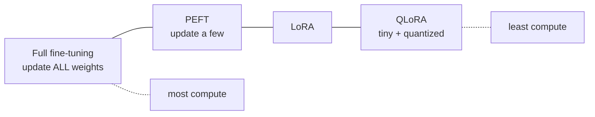
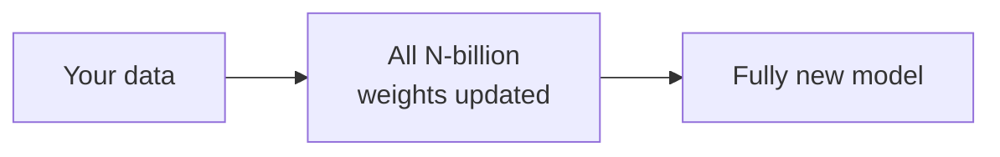
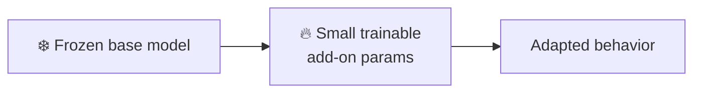
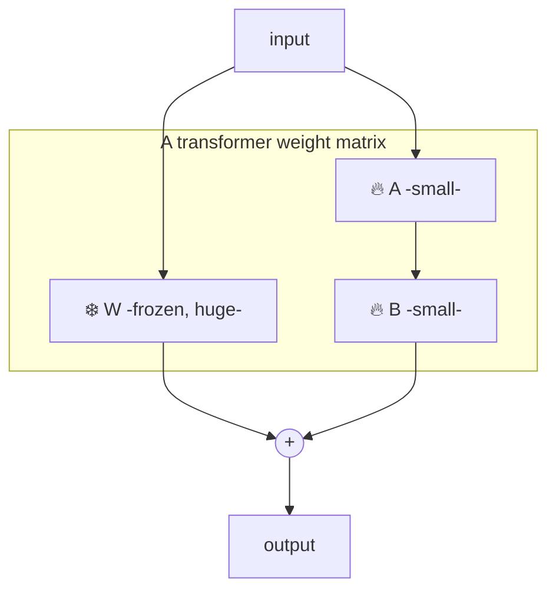
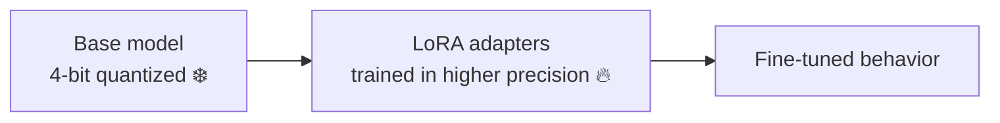
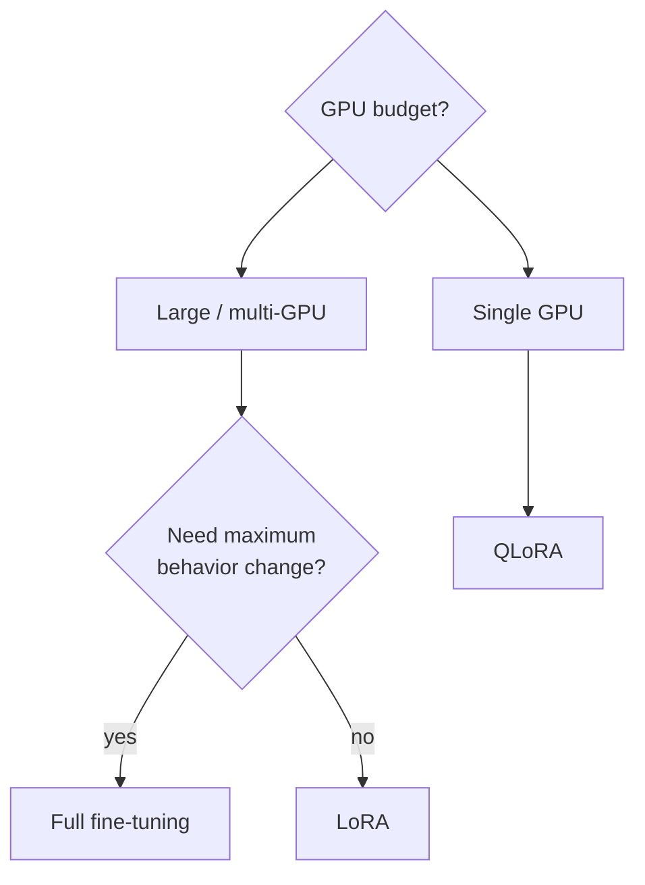
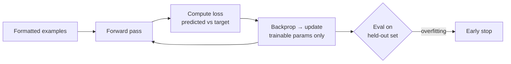

# 🔧 Fine-tuning Methods

> The central question: **how many weights do you update, and how expensively?**
> This spectrum runs from updating *everything* (full fine-tuning) to updating a
> *tiny fraction* (PEFT / LoRA).

---

## 1️⃣ Full fine-tuning

Update **every** parameter in the model.

- ✅ Maximum capacity to change behavior.
- ❌ Needs huge GPU memory (must hold weights + gradients + optimizer states).
- ❌ You store a **full copy** of the model per task. Expensive to serve many tasks.
- ❌ Higher risk of **catastrophic forgetting**.

## 2️⃣ PEFT — Parameter-Efficient Fine-Tuning

Freeze the base model; train a **small number of new parameters**. Same results for
most tasks at a fraction of the cost.

Umbrella term covering LoRA, adapters, prefix/prompt tuning, and more.

## 3️⃣ LoRA — Low-Rank Adaptation ⭐

The most popular method. Instead of editing the big weight matrices, **inject small
low-rank matrices** (A × B) alongside them and train only those. The base stays frozen.

- The update is `W + (A·B)` where A and B are **tiny** (rank `r`, e.g. 8–64).
- ✅ Train <1% of params → fits on modest GPUs.
- ✅ **Adapters are small files** (MBs) — keep one base model, swap many LoRA adapters per task/customer.
- ✅ Much less forgetting; base is untouched.

**Key knobs:** `r` (rank — capacity), `alpha` (scaling), `target_modules` (which layers get LoRA), `dropout`.

## 4️⃣ QLoRA — Quantized LoRA

LoRA, but the **frozen base is quantized to 4-bit** to slash memory further. Lets you
fine-tune very large models on a single consumer/prosumer GPU.

- ✅ Fine-tune large models on **one GPU** — democratized fine-tuning.
- ⚠️ Slightly slower; tiny quality trade-off vs full-precision LoRA (usually negligible).

## 5️⃣ Other PEFT variants (quick tour)

| Method | Idea |
|--------|------|
| **Adapters** | Insert small trainable layers between existing layers |
| **Prefix / P-tuning** | Prepend trainable "virtual tokens" to the input; base frozen |
| **Prompt tuning** | Learn a soft prompt embedding only |
| **DoRA** | LoRA variant that decomposes weight into magnitude + direction |

---

## 📊 Choosing a method

| Method | GPU need | Storage/ task | Quality | Use when |
|--------|----------|---------------|---------|----------|
| Full | 🔴 Very high | Full model | Highest ceiling | Big budget, big change |
| LoRA | 🟡 Moderate | MBs | ~Full for most tasks | **Default** |
| QLoRA | 🟢 Low | MBs | Slightly below LoRA | Limited hardware |

---

## 🧪 The training loop (conceptually)

Key hyperparameters: **learning rate**, **epochs** (often 1–3 — more overfits), **batch size**, and for LoRA the **rank/alpha**. Always hold out a validation set.

➡️ Next: teaching *preferences*, not just examples → **[alignment](./alignment.md)**.
