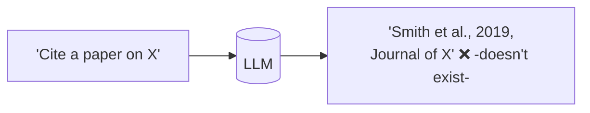
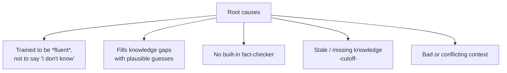
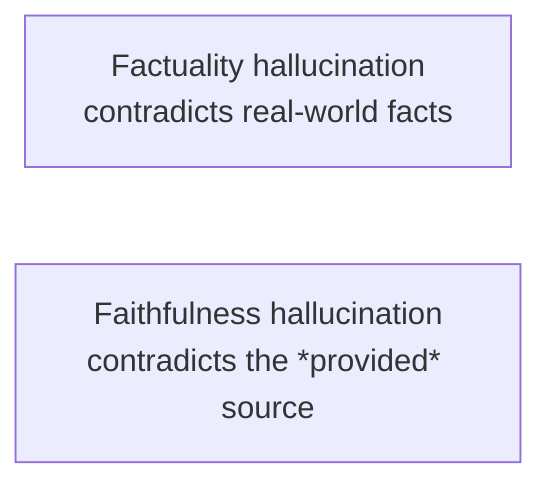
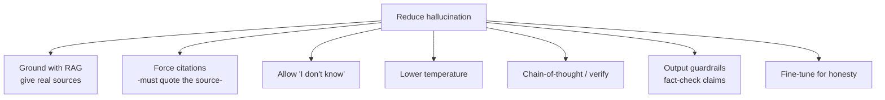
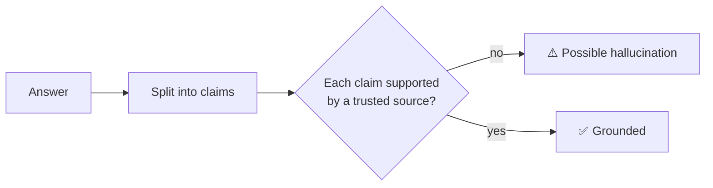

# 👻 Hallucination

> **One-liner:** A hallucination is when a model produces **confident, plausible-sounding
> output that is false** — invented facts, fake citations, wrong code. It's the #1 trust
> problem with LLMs.

---

## 🤔 Why do models hallucinate?

At its core, an LLM predicts **likely** text — not **true** text. When it lacks the fact,
the most "likely-looking" continuation can be a confident fabrication. Training rarely
rewards admitting uncertainty.

---

## 🧬 Two flavors

- **Factuality** — wrong about the world ("The Eiffel Tower is in Rome").
- **Faithfulness** — wrong about the source you gave it (misquotes a [RAG](../rag/) document). This is the one RAG systems fight with [groundedness checks](../rag/evaluation.md).

---

## 🛠️ Mitigations (stack them)

| Technique | How it helps |
|-----------|--------------|
| **[RAG](../rag/)** | Supplies real facts to answer from |
| **Citations / attribution** | Forces claims back to a source; easy to verify |
| **"Say I don't know"** | Give the model permission to abstain |
| **Low temperature** | Less random invention for factual tasks |
| **Self-check / verification** | Have the model (or another) verify claims |
| **[Guardrails](../guardrails/)** | Detect unsupported claims before shipping |
| **[Evaluation](../evaluation/)** | Measure hallucination rate; catch regressions |

> ⚠️ **None of these eliminate it.** Hallucination can be *reduced*, not *guaranteed* away —
> design for verification, especially in high-stakes domains.

---

## 🔍 How to detect it

- **Groundedness check** (for RAG): is every claim backed by the retrieved context?
- **Consistency check:** sample multiple answers — disagreement signals uncertainty.
- **LLM-as-judge / fact-checkers** against a knowledge source.

---

## 🗺️ Why it matters

- **High-stakes domains** (medical, legal, finance) — a confident wrong answer is dangerous.
- **Citations & research** — fake references erode trust.
- **[Agents](../agents/)** — a hallucinated tool call or fact can cascade into bad actions.

➡️ The main cure is grounding → **[RAG](../rag/)** · catch it with **[guardrails](../guardrails/)** & **[evaluation](../evaluation/)**.
