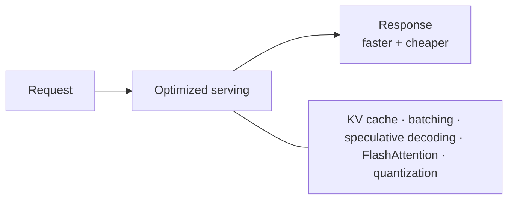
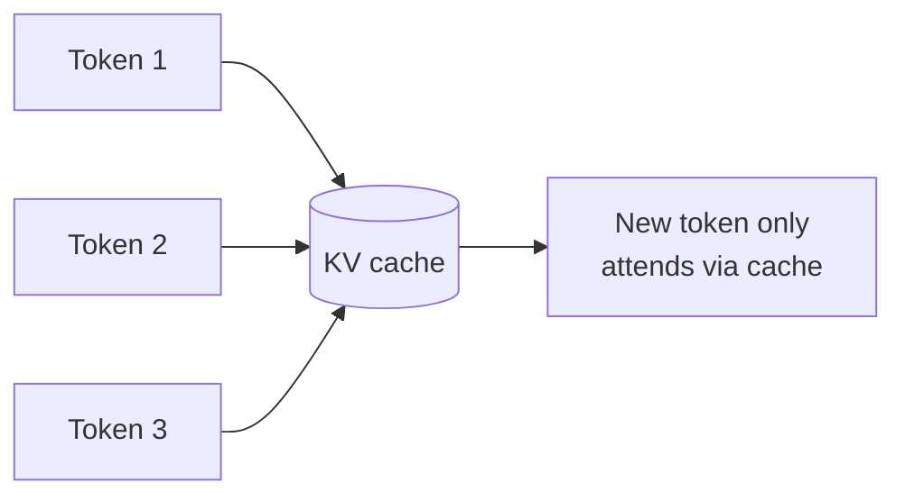
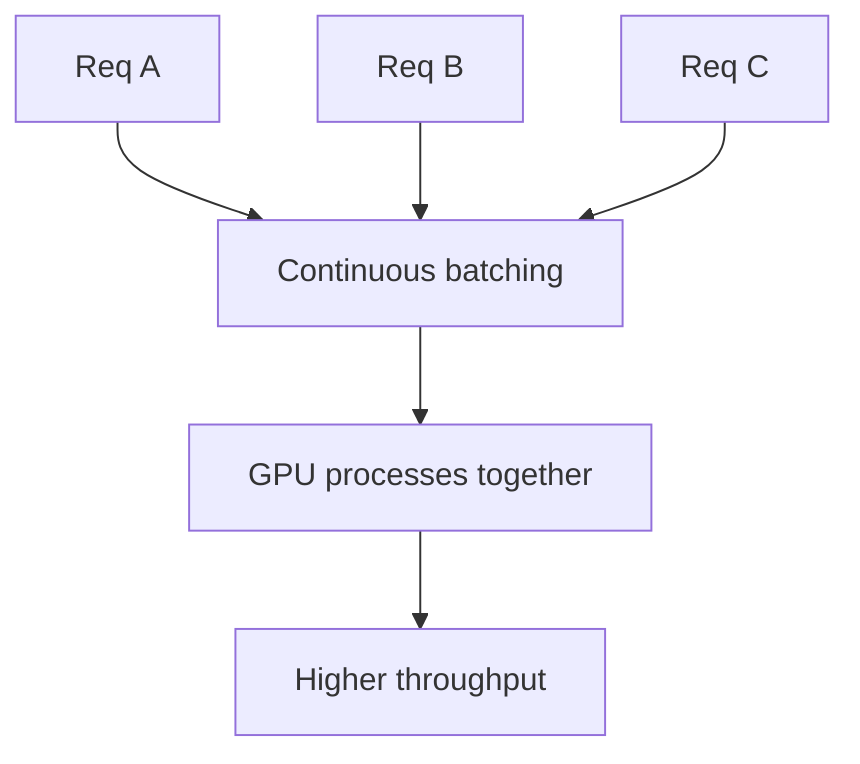
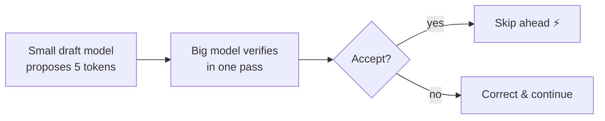
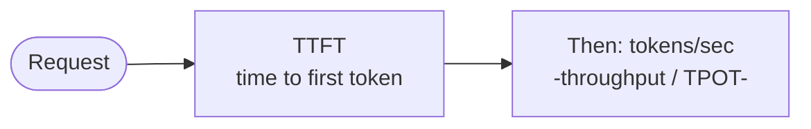

# 🚀 Inference Optimization

> **One-liner:** Inference is *serving* the model — and it's where the ongoing cost and
> latency live. Inference optimization is the bag of tricks that makes generation **faster,
> cheaper, and higher-throughput** without retraining the model.

---

## 🧠 The KV cache (the big one)

Generating token by token, the model would re-compute attention over all previous tokens
every step. The **KV cache** stores the Keys/Values of past tokens so each new token only
computes its own — turning O(n²) work into something far cheaper.

- ✅ Massive speedup for generation.
- ⚠️ The cache **grows with context length** and eats GPU memory → a major constraint for long contexts. (Optimized by **PagedAttention/ vLLM**, **GQA/MQA** which shrink KV size.)

---

## 📦 Batching

Serve many requests together to keep the GPU busy.

- **Continuous / in-flight batching** adds and removes requests dynamically instead of waiting for a full batch → much better GPU utilization.

---

## ⚡ Speculative decoding

A small **draft** model guesses several tokens ahead; the big model **verifies** them in one
pass. Accepted guesses = free speedup.

---

## 🧰 The toolbox at a glance

| Technique | Wins |
|-----------|------|
| **KV cache** | Avoid recomputing past attention |
| **PagedAttention (vLLM)** | Efficient KV memory → higher throughput |
| **Continuous batching** | Keep the GPU saturated |
| **[Quantization](../quantization/)** | Smaller/faster weights |
| **FlashAttention** | Faster, memory-efficient attention kernels |
| **Speculative decoding** | Draft-then-verify for lower latency |
| **GQA / MQA** | Shrink the KV cache (share KV heads) |
| **[Distillation](../distillation/)** | Serve a smaller student model |
| **Prompt / prefix caching** | Reuse computation for shared prompts |

---

## 📏 Two latency numbers to know

- **TTFT (Time To First Token)** — how quickly a response *starts* (dominated by processing the prompt, the "prefill").
- **Throughput (tokens/sec)** — how fast it *continues* (the "decode" phase).
- Different tricks help each: prompt caching helps TTFT; batching helps throughput.

---

## 🗺️ Where this matters

- **Production LLM serving** (cost & latency at scale)
- **Real-time apps** (chat, voice, coding assistants)
- **[Agents](../agents/)** — many LLM calls per task multiply every inefficiency
- **Local / edge** deployment

➡️ Related: **[quantization](../quantization/)** · **[distillation](../distillation/)** · the cost of long contexts in **[context-engineering](../context-engineering/)**.
