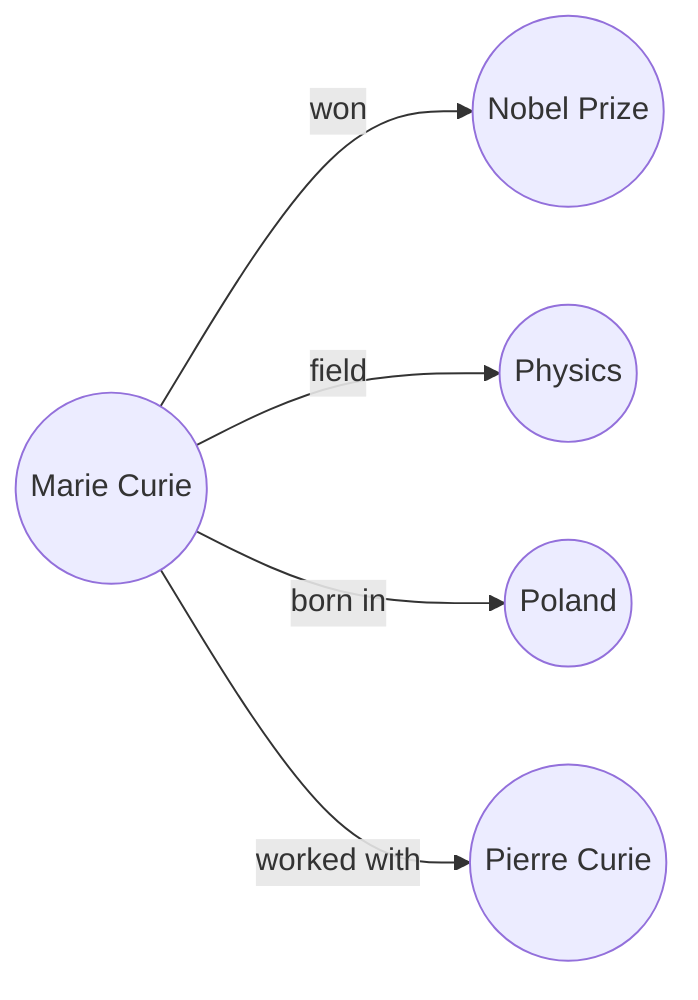
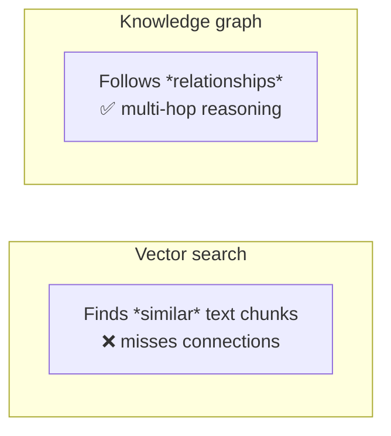
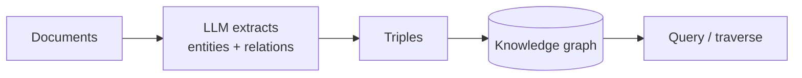
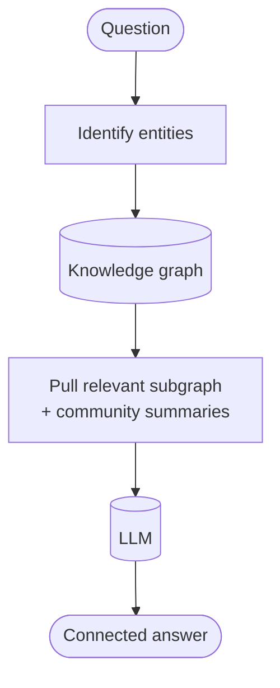

# 🕸️ Knowledge Graphs

> **One-liner:** A knowledge graph represents information as **entities** (nodes) connected
> by **relationships** (edges). It captures *how things relate* — something flat text and
> plain vector search struggle with — and powers **[Graph RAG](../rag/architectures/)**.

---

## 🧩 The building blocks: triples

Facts are stored as **(subject → predicate → object)** triples.

Many triples form a graph you can **traverse** to answer relational questions.

---

## 🆚 Why not just vector search?

- **Vector search** is great at "find things *like* this."
- **Graphs** are great at "how are X and Y **connected**?" and **multi-hop** questions
  ("Who did the author's advisor collaborate with?").

They're complementary — many systems combine both.

---

## 🏗️ Building a knowledge graph (LLM-assisted)

LLMs made KG construction far easier — they can read text and extract entities and
relationships automatically (though quality control still matters).

---

## 🔍 Graph RAG in one picture

This is the heart of **[Graph RAG](../rag/architectures/)** — retrieve over relationships,
not just similar chunks. Great for global questions ("what are the main themes?") and
reasoning across many documents.

---

## 🧰 Terms & tooling

| Term | Meaning |
|------|---------|
| **Ontology / schema** | The allowed entity & relation types |
| **Triple / RDF** | Subject-predicate-object fact format |
| **SPARQL / Cypher** | Query languages for graphs |
| **Graph database** | Neo4j, Neptune, etc. store & query graphs |
| **Entity resolution** | Merging duplicate entities ("NYC" = "New York City") |

---

## 🗺️ Where knowledge graphs are used

- **[Graph RAG](../rag/architectures/)** over connected corpora
- **Enterprise knowledge** (org data, product catalogs)
- **Fraud / investigations** (follow the connections)
- **Recommendations** (relationship-based)
- **Search engines** (entity understanding)

➡️ See it applied → **[RAG architectures → Graph RAG](../rag/architectures/)**.
