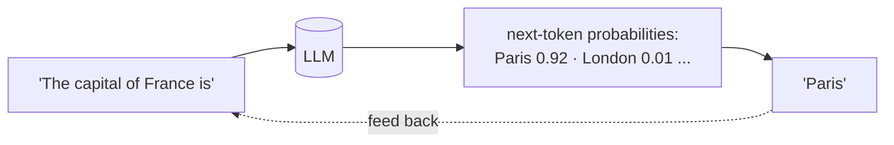
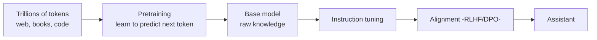
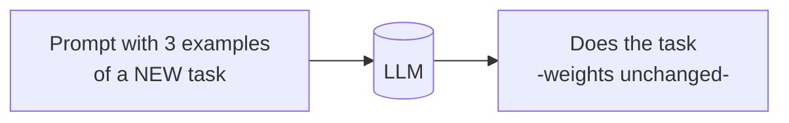
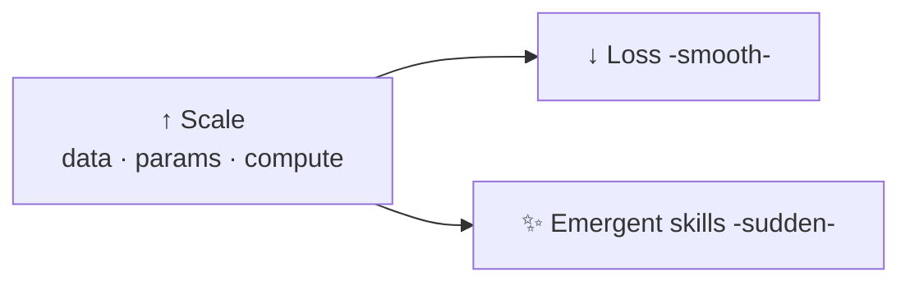

# 🗣️ Large Language Models (LLMs)

> **One-liner:** An LLM is a neural network trained on massive text to do one deceptively
> simple thing — **predict the next token** — and from that emerges the ability to write,
> reason, code, and converse.

Generation is just this loop: predict a token, append it, predict again (**autoregression**).

---

## 🏭 How an LLM is made

- **[Pretraining](../fine-tuning/)** — the expensive part: learn language & world knowledge from raw text.
- **Instruction tuning + [alignment](../fine-tuning/alignment.md)** — turn a text-predictor into a helpful assistant.
- This is the **[foundation model](#-foundation-models) → fine-tune** paradigm (transfer learning).

---

## 🧠 Key concepts & the jargon

| Term | Meaning |
|------|---------|
| **Parameters** | The learned weights (billions). Rough proxy for capacity. |
| **[Tokens](../tokenization/)** | The units the model reads/writes. |
| **[Context window](../context-engineering/)** | Max tokens it can consider at once. |
| **[Transformer](../transformers/)** | The neural architecture underneath. |
| **Temperature / sampling** | How random the output is. |
| **Emergent abilities** | Skills that appear only at scale (reasoning, in-context learning). |
| **In-context learning** | Learning a task from examples in the prompt — no weight change. |
| **Knowledge cutoff** | Training data has an end date → stale facts (fix with [RAG](../rag/)). |
| **Hallucination** | Confident, wrong output → see [hallucination](../hallucination/). |

---

## 🌱 In-context learning (why prompting works)

The model "learns" the task from the prompt at inference time. This is what makes
[prompt engineering](../prompt-engineering/) and [few-shot](../prompt-engineering/) possible.

---

## 📈 Scaling laws & emergence

More data + more parameters + more compute → predictably lower loss, and at certain
scales, **new abilities emerge** (multi-step reasoning, tool use, in-context learning).

---

## 🧱 Foundation models

A **foundation model** is a large model pretrained on broad data that you **adapt** to many
downstream tasks (via prompting, [RAG](../rag/), or [fine-tuning](../fine-tuning/)) instead
of training from scratch. LLMs are the text example; there are also vision and
[multimodal](../multimodal/) foundation models.

---

## 🗺️ The families you'll hear about

- **Decoder-only** (GPT-style) — text generation, chat. The dominant LLM design.
- **Encoder-only** (BERT-style) — embeddings, classification (see [transformers](../transformers/)).
- **Encoder-decoder** (T5-style) — translation, summarization.
- **[Reasoning models](../reasoning-models/)** — spend extra compute "thinking" before answering.
- **[Mixture-of-Experts](../mixture-of-experts/)** — huge models that activate only part per token.

➡️ Dive into the engine → **[transformers](../transformers/)**.
