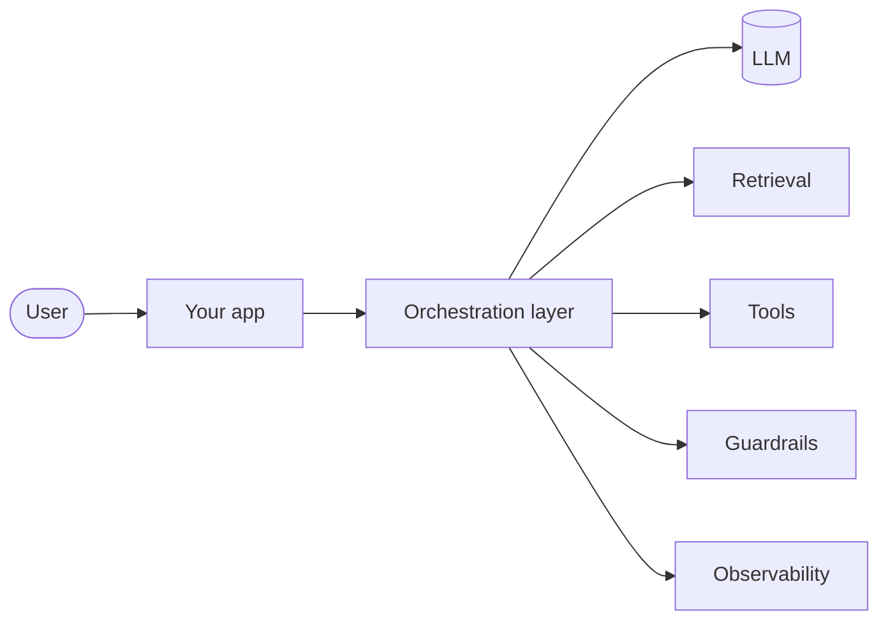
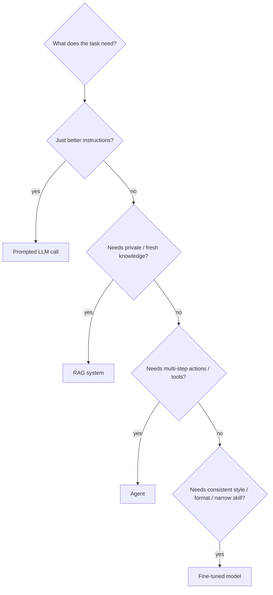
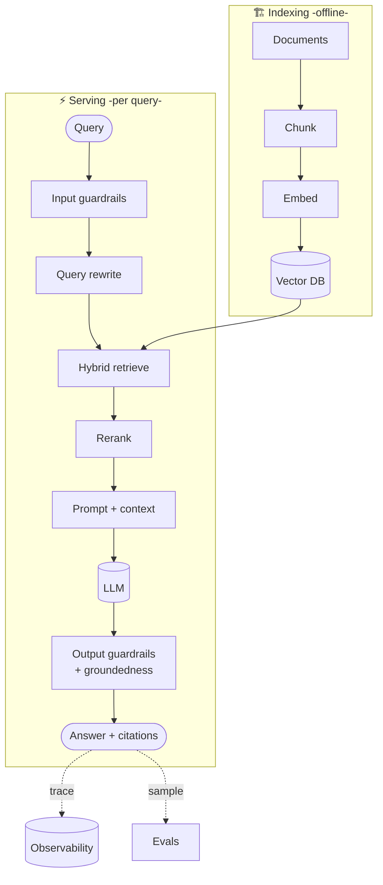
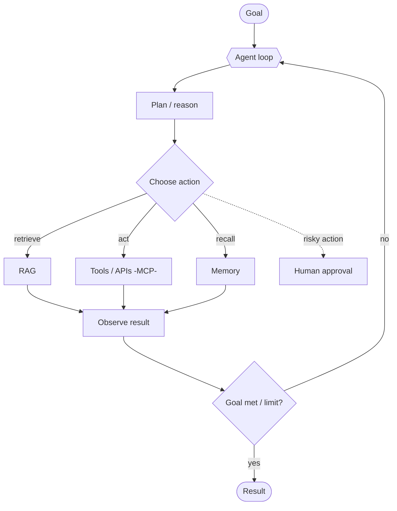
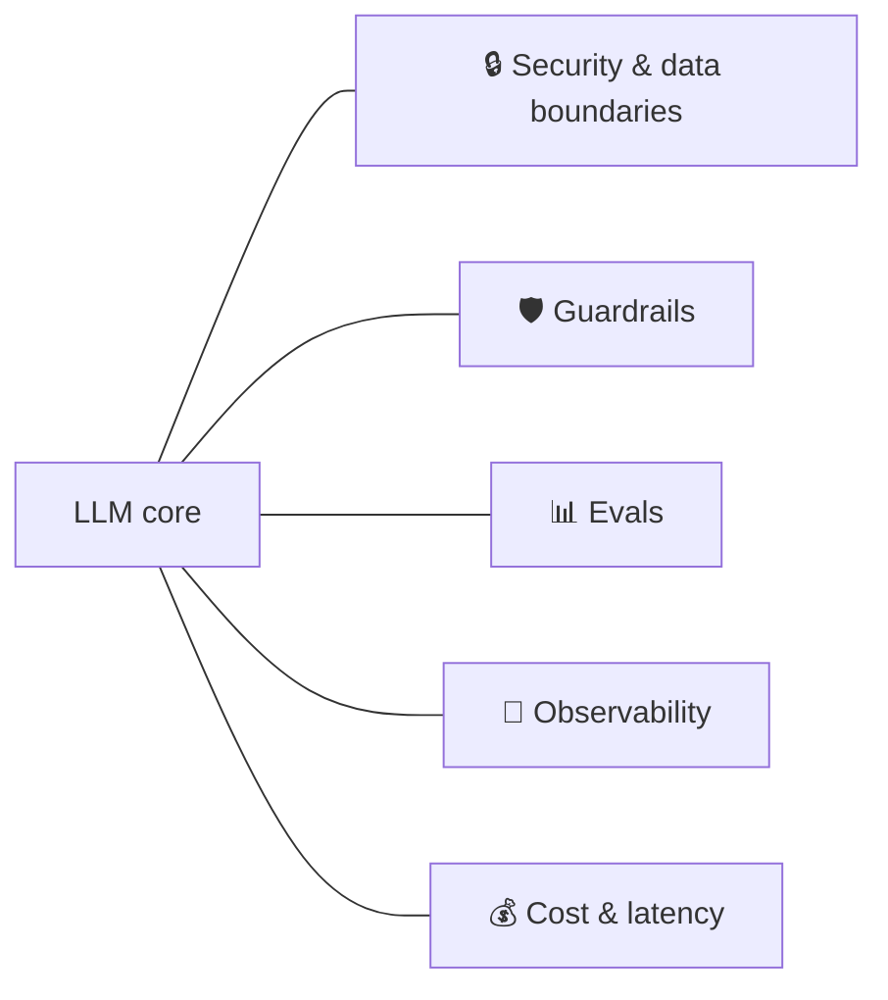
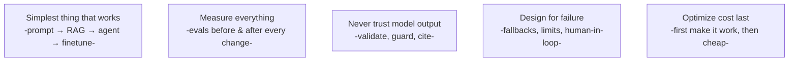

# 🏗️ LLM System Design — Putting the Pieces Together

> **One-liner:** Individual concepts are Lego bricks. This page shows how they **click
> together** into real systems — the reference architectures an [FDE](../fde/) actually
> ships. Read this after you know the pieces; it's the "so how do I build the whole thing?"

---

## 🧭 The decision tree: what do I even build?

> Start at the **top** (cheapest, most reliable) and only move down when the task forces it.
> Most production systems are a **combination** — e.g. a fine-tuned model inside a RAG
> pipeline wrapped by an agent.

---

## 🏛️ Reference architecture 1 — Production RAG assistant

**Bricks used:** [chunking](../rag/chunking.md) · [embeddings](../embeddings/) ·
[vector DB](../vector-databases/) · [retrieval](../rag/retrieval.md) ·
[reranking](../rag/reranking.md) · [guardrails](../guardrails/) ·
[evaluation](../rag/evaluation.md) · [observability](../observability/).

---

## 🤖 Reference architecture 2 — Tool-using agent

**Bricks used:** [agentic loop](../agentic-loop/) · [architectures](../agents/architectures.md) ·
[tools/MCP](../agents/tools.md) · [memory](../agents/memory.md) · [RAG](../rag/) ·
[guardrails](../guardrails/) · loop limits.

---

## 🎛️ The cross-cutting layers (every serious system has these)

| Layer | Concern | Bricks |
|-------|---------|--------|
| **Security** | Data boundaries, secrets, permissions, PII | [guardrails](../guardrails/), [federated](../federated-learning/) |
| **Safety** | Injection, harmful output, unsafe actions | [guardrails](../guardrails/), [red-teaming](../red-teaming/) |
| **Quality** | Is it right? Did a change regress? | [evaluation](../evaluation/), [hallucination](../hallucination/) |
| **Ops** | Trace, monitor, debug live | [observability](../observability/) |
| **Cost/latency** | Serve it affordably & fast | [routing](../model-routing/), [caching](../semantic-caching/), [inference opt](../inference-optimization/) |

---

## 🧱 Design principles

- **Start simple, escalate deliberately.** Complexity is a cost you pay in reliability.
- **Evals are your ground truth.** Every architecture choice should be validated, not vibed.
- **Treat the model as an untrusted, brilliant intern** — verify its work, bound its power.

---

## 🗺️ Where this fits

This is the **capstone** page — the [FDE](../fde/) reads it to turn a pile of concepts into a
shippable design. Come back here whenever you're staring at a blank architecture diagram.

➡️ Back to the **[learning path](../README.md#-the-path-to-forward-deployed-engineer)** · the role → **[FDE](../fde/)**.
