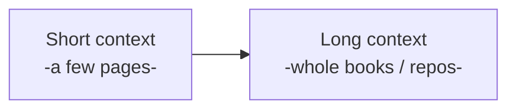
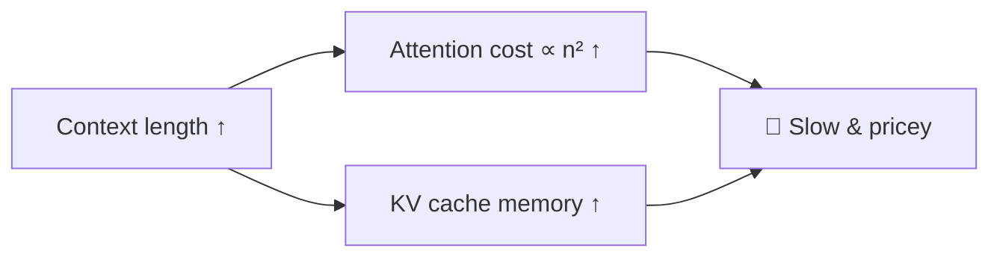
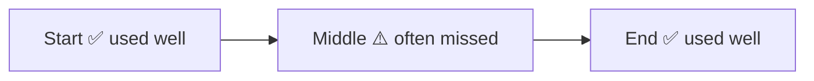
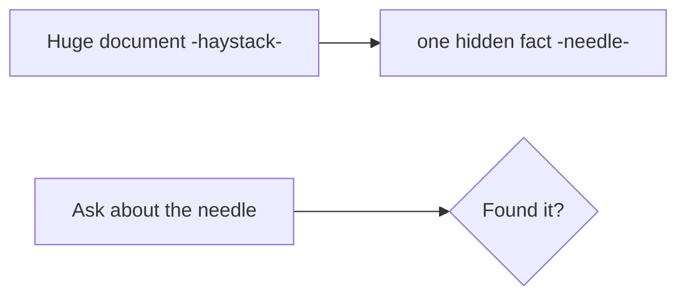
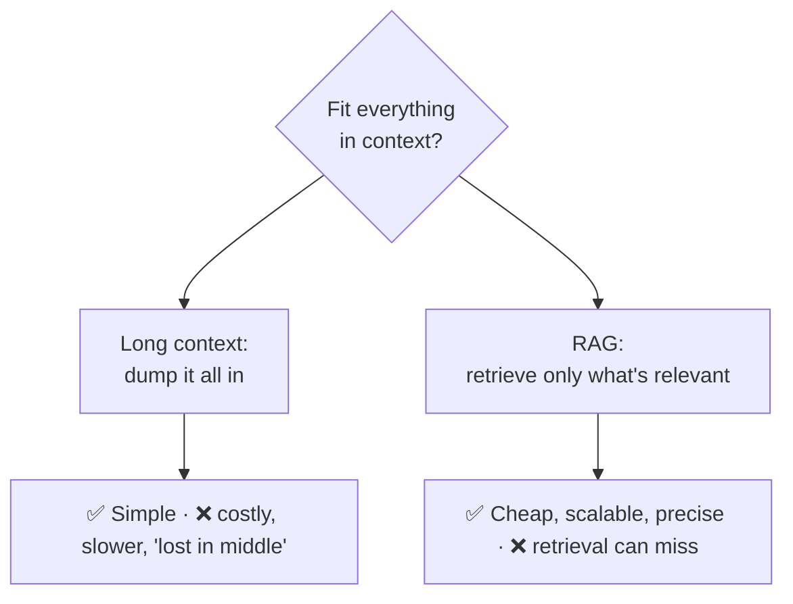

# 📜 Long Context

> **One-liner:** "Long context" means models that can take **very large inputs** — hundreds
> of thousands to millions of [tokens](../tokenization/). It unlocks feeding whole books,
> codebases, or long chats at once — but bigger isn't automatically better.

---

## 🧗 Why long context is hard

[Self-attention](../transformers/) cost grows with the **square** of length, and the
[KV cache](../inference-optimization/) grows with it too — so long contexts are expensive in
compute and memory.

**How models get longer context:** positional tricks like **RoPE scaling**, efficient
attention, and training on longer sequences → see [transformers](../transformers/) &
[inference-optimization](../inference-optimization/).

---

## 🎯 "Lost in the middle"

Even when info *fits*, models tend to use the **beginning and end** of a long context well
and **under-weight the middle**.

- Put the **most important** context at the **edges**, not buried in the middle.
- This is a core reason [reranking](../rag/reranking.md) and [context engineering](../context-engineering/) matter.

---

## 🧪 The needle-in-a-haystack test

A standard eval: hide one fact (the "needle") somewhere in a huge context and ask for it.
Measures whether the model can actually *retrieve* from anywhere in its window.

Passing at short lengths ≠ passing at full length — always test at the length you'll use.

---

## ⚖️ Long context vs RAG (a real debate)

- **Long context** — simplest; great for one-off deep analysis of a bounded document.
- **[RAG](../rag/)** — cheaper and scalable for large/changing corpora; you only pay for relevant chunks.
- **They combine:** retrieve a lot, then let a long-context model reason over it.

---

## 🗺️ Where long context shines

- **Whole-document analysis** (contracts, papers, financial filings).
- **Full-codebase** reasoning for coding assistants.
- **Long conversations / [agent](../agents/) histories** without constant summarization.
- **Many-shot** prompting (dozens of examples in-context).

> 💡 **Rule of thumb:** more context ≠ better answers. Use the *fewest high-signal tokens*
> that fully specify the task — the [context engineering](../context-engineering/) mantra.

➡️ Related: **[context-engineering](../context-engineering/)** · **[RAG](../rag/)** · **[inference-optimization](../inference-optimization/)**.
