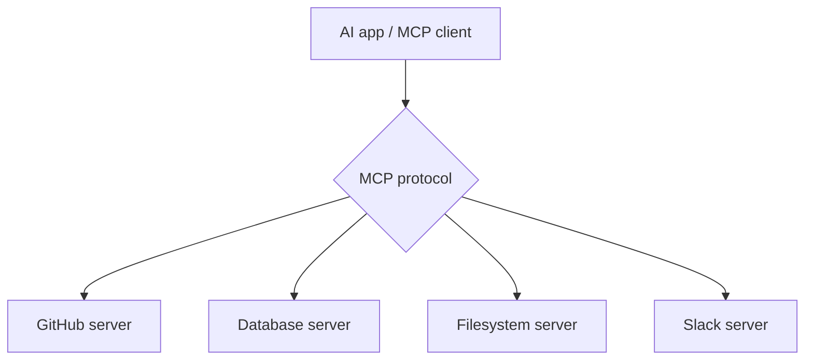
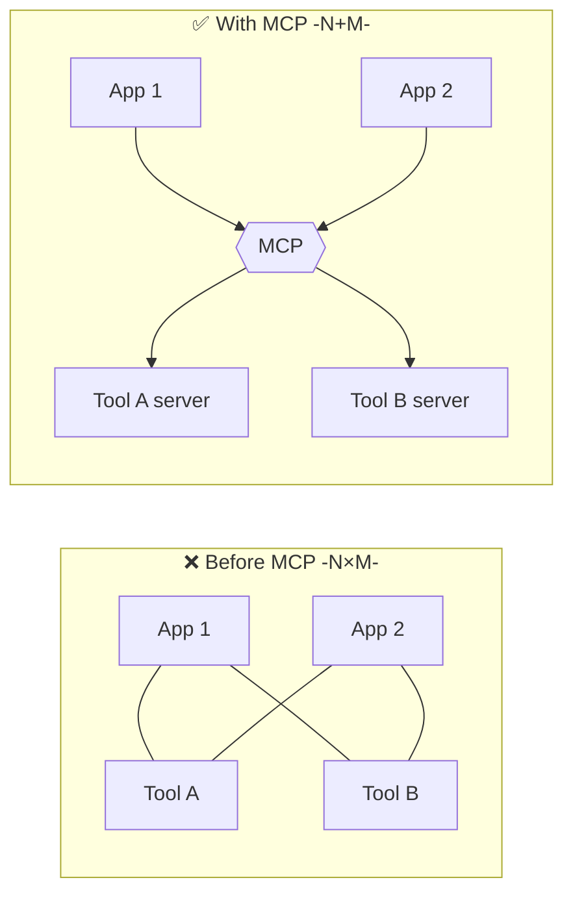
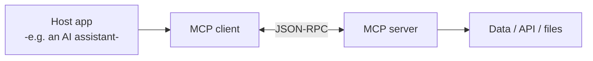
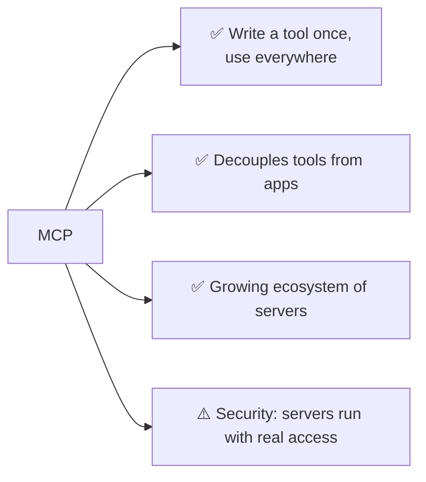

# 🔌 MCP — Model Context Protocol

> **One-liner:** MCP is an **open standard** for connecting AI apps to tools, data, and
> systems. Instead of building a custom integration for every app × every tool, you build
> an **MCP server** once and any MCP-compatible client can use it. Think **"USB-C for AI."**

---

## 🧩 The problem it solves

Without a standard, every AI app needs a **bespoke connector** to every system — an N×M
integration mess.

Build the tool server **once**; every MCP client gets it for free.

---

## 🏗️ Architecture: client ↔ server

- **Host** — the AI application (chat app, IDE, agent).
- **Client** — the connector inside the host that speaks MCP.
- **Server** — exposes capabilities from some system (GitHub, a DB, the filesystem).

---

## 🧰 What an MCP server exposes

| Primitive | What it is |
|-----------|-----------|
| **Tools** | Actions the model can call (functions/APIs) → see [tools](../agents/tools.md) |
| **Resources** | Data the model can read (files, records, docs) |
| **Prompts** | Reusable prompt templates the server offers |

---

## ⚖️ Why it matters

- ✅ **Interoperability** — no per-app rewrites.
- ✅ **Reusability** — a rich ecosystem of ready servers.
- ⚠️ **Security** — an MCP server can touch real systems; treat untrusted servers and their
  outputs carefully (see [guardrails](../guardrails/) and prompt injection).

---

## 🗺️ Where MCP is used

- **AI coding assistants** connecting to repos, docs, terminals.
- **[Agents](../agents/)** that need a standard way to reach many tools.
- **Enterprise assistants** wiring into internal databases & apps.
- Anywhere you'd otherwise write a one-off [function-calling](../agents/tools.md) integration.

➡️ MCP is *how* agents reach tools → see **[agents/tools](../agents/tools.md)**.
