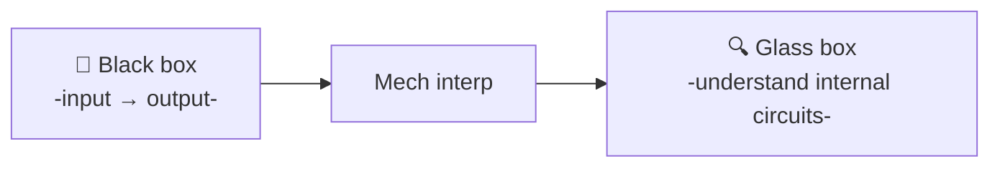
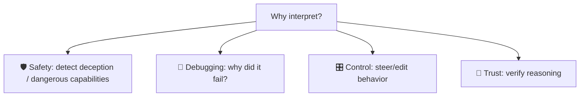
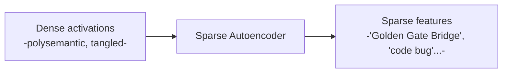
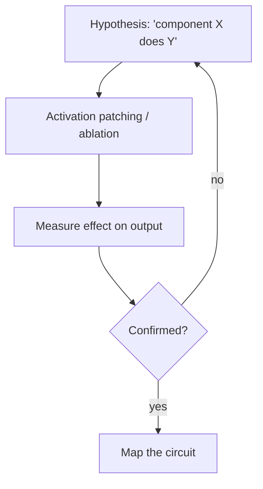

# 🔬 Mechanistic Interpretability

> **One-liner:** Mechanistic interpretability ("mech interp") tries to **reverse-engineer
> what's happening inside a model** — to understand the actual computations and "concepts"
> its neurons represent, rather than treating it as a black box.

---

## 🎯 Why bother?

If we can *see* how a model computes, we can catch unsafe behavior, fix bugs at the source,
and even **steer** it — instead of only tweaking prompts and hoping.

---

## 🧩 Key concepts & jargon

| Term | Meaning |
|------|---------|
| **Feature** | A concept the model represents internally (e.g. "this text is in French") |
| **Circuit** | A connected set of components that implements a behavior |
| **Superposition** | Models cram **more features than neurons** by overlapping them → messy to read |
| **Polysemantic neuron** | One neuron that fires for many unrelated concepts (a symptom of superposition) |
| **SAE** (Sparse Autoencoder) | A tool that **untangles** superposition into cleaner, interpretable features |
| **Probing** | Training a small classifier to check what info a layer encodes |
| **Activation patching** | Swap activations between runs to find which components *cause* a behavior |
| **Logit lens** | Read the model's "current guess" at intermediate layers |

---

## 🧵 Superposition & sparse autoencoders

Because of **superposition**, single neurons are hard to interpret. **Sparse autoencoders**
learn a larger set of sparse features that are far more human-readable — a big recent advance.

Once you can *name* a feature, you can **amplify or suppress** it to steer the model.

---

## 🛠️ How researchers investigate

Causal methods (patching, ablation) test *what actually drives* a behavior — not just what correlates.

---

## ⚖️ Reality check

- 🔬 It's an **active research frontier**, not a finished toolset.
- 🐘 Modern models are enormous; full understanding is far off.
- ✅ But it already yields **steering**, safety probes, and real insight into small circuits.

---

## 🗺️ Where it's used / why it matters

- **AI safety & alignment** — detect deception, unsafe capabilities → [guardrails](../guardrails/), [alignment](../fine-tuning/alignment.md).
- **Model debugging** — trace failures to internal causes.
- **Steering / editing** — turn concepts up/down, or edit facts in weights.
- **Science of deep learning** — understanding [transformers](../transformers/) themselves.

➡️ Related: **[transformers](../transformers/)** · **[alignment](../fine-tuning/alignment.md)** · **[guardrails](../guardrails/)**.
