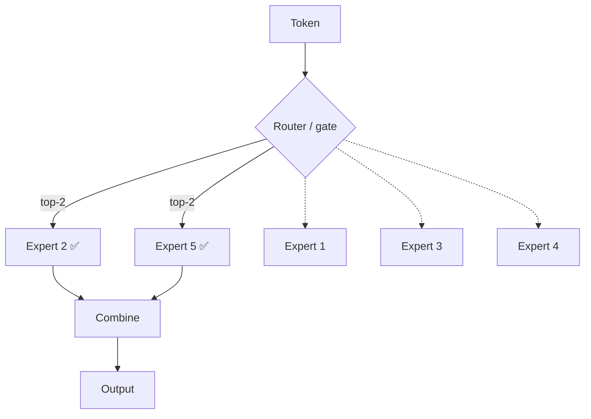
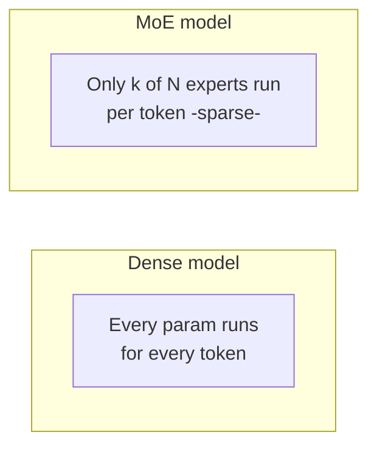
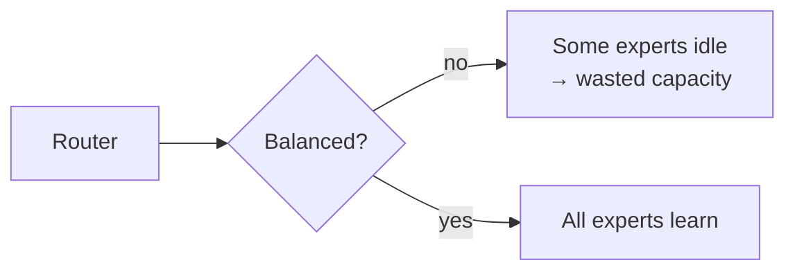

# 🧑‍🔬 Mixture of Experts (MoE)

> **One-liner:** Instead of one giant dense network where **every** parameter runs for
> **every** token, an MoE has many smaller "expert" sub-networks and a **router** that
> activates only a **few** per token. Huge total capacity, but only a fraction runs each time.

---

## 🧠 Dense vs sparse (the key contrast)

- **Total parameters**: huge (all experts exist).
- **Active parameters**: small (only the routed experts run).
- Result: **the knowledge capacity of a big model at the compute cost of a small one.**

---

## 🔀 The router is everything

A small learned **gating network** decides which experts handle each token. Getting this
right is the hard part.

| Challenge | Why |
|-----------|-----|
| **Load balancing** | Don't let a few experts get all the traffic (others go untrained). Fixed with auxiliary "load-balancing" losses. |
| **Routing instability** | Small changes can flip routing; needs care to train. |
| **Which experts?** | Usually **top-1 or top-2** of N experts per token. |

---

## ⚖️ Trade-offs

| ✅ Pros | ❌ Cons |
|--------|--------|
| More capacity per unit of compute | **All experts must fit in memory** (big VRAM) |
| Faster training & inference vs equally-"smart" dense model | Routing adds complexity & instability |
| Experts can specialize | Harder to fine-tune / deploy |
| Scales to very large total params | Uneven load can waste capacity |

---

## 🗺️ Where MoE is used

- Many **frontier LLMs** use MoE to reach huge scale affordably.
- **Efficient inference** when you want big-model quality without big-model per-token cost.
- Any setting where **memory is available but compute-per-token must stay low**.

> 💡 **Mental model:** a hospital with many specialists. A receptionist (router) sends each
> patient (token) to the right 1–2 doctors (experts) instead of making every patient see
> every doctor.

➡️ Related scaling ideas → **[large-language-models](../large-language-models/)** · efficiency → **[inference-optimization](../inference-optimization/)**.
