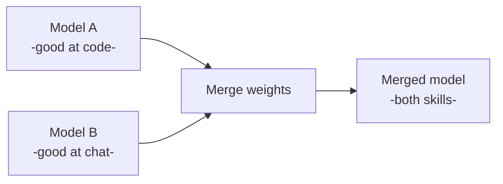
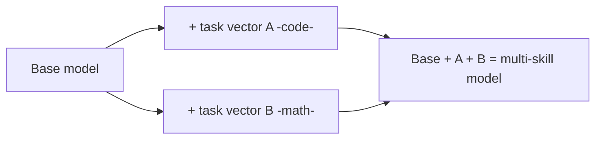
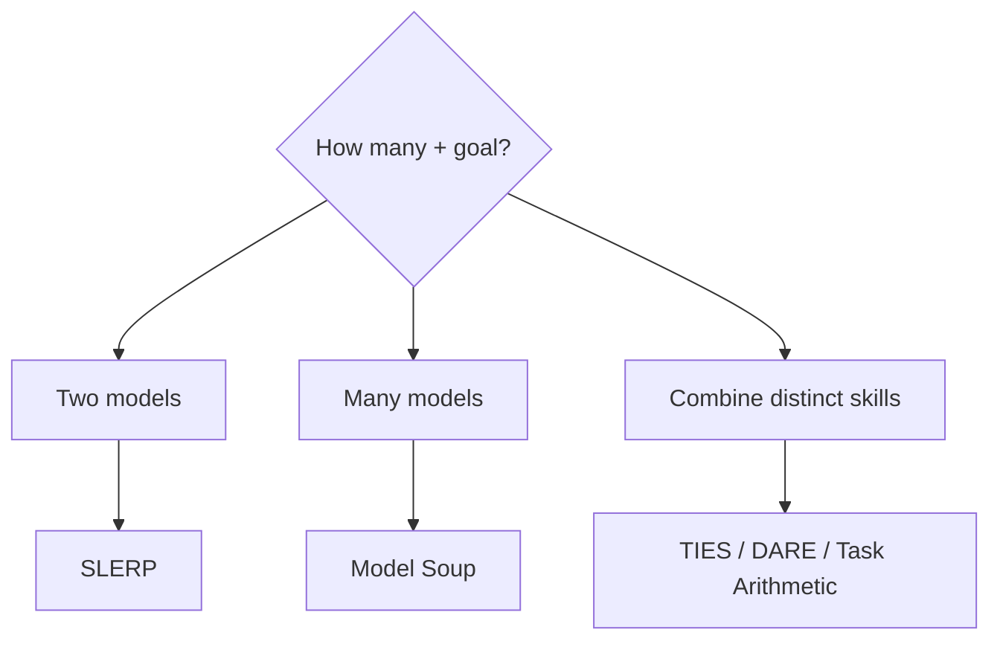
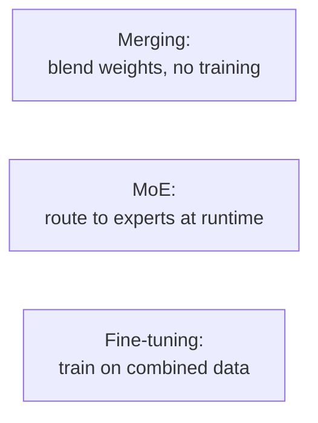

# 🧷 Model Merging

> **One-liner:** Model merging combines **two or more fine-tuned models into one** — by
> mathematically blending their weights — **without any additional training**. You get a
> model with multiple skills, for basically the cost of some arithmetic.

---

## 💡 Why it works (task vectors)

Fine-tuning moves weights in a direction — a **"task vector"** = (fine-tuned − base). You
can **add** task vectors to combine skills, or subtract to remove behaviors.

- ✅ **No training, no GPUs for gradients** — just weight math (minutes on CPU/one GPU).
- ⚠️ Models must be **compatible** — same architecture & size (usually same base).

---

## 🧰 Merging methods

| Method | Idea |
|--------|------|
| **Linear / Model Soup** | Average the weights of several models |
| **SLERP** | Spherical interpolation between **two** models (smoother than linear) |
| **Task Arithmetic** | Add/subtract task vectors to add/remove skills |
| **TIES** | Trim small changes, resolve sign conflicts, then merge |
| **DARE** | Randomly drop & rescale deltas before merging (reduces interference) |
| **Franken-merging / passthrough** | Stack layers from different models (can change size) |

---

## ⚖️ Trade-offs

- ✅ Cheap, fast, no training data needed; combine community fine-tunes.
- ✅ Can improve robustness (souping) or stack capabilities.
- ⚠️ **Interference** — skills can degrade each other; TIES/DARE fight this.
- ⚠️ Results are **empirical** — often needs trial-and-error + [evaluation](../evaluation/).
- ⚠️ Only same-family models; can't merge fundamentally different architectures.

---

## 🆚 Merging vs alternatives

- **[Fine-tuning](../fine-tuning/)** on combined data is stronger but needs data + compute.
- **[MoE](../mixture-of-experts/)** keeps experts separate and routes at inference.
- **Merging** is the cheapest way to get "several skills in one model."

---

## 🗺️ Where model merging is used

- **Combining community fine-tunes** into one capable open model (very common on model hubs).
- **Adding a skill** to a model without retraining.
- **Model soups** for a more robust, higher-average model.
- Tooling: **mergekit** is the popular toolkit.

➡️ Related: **[fine-tuning](../fine-tuning/)** · **[mixture-of-experts](../mixture-of-experts/)** · **[LoRA](../fine-tuning/methods.md)** (adapters can also be merged).
