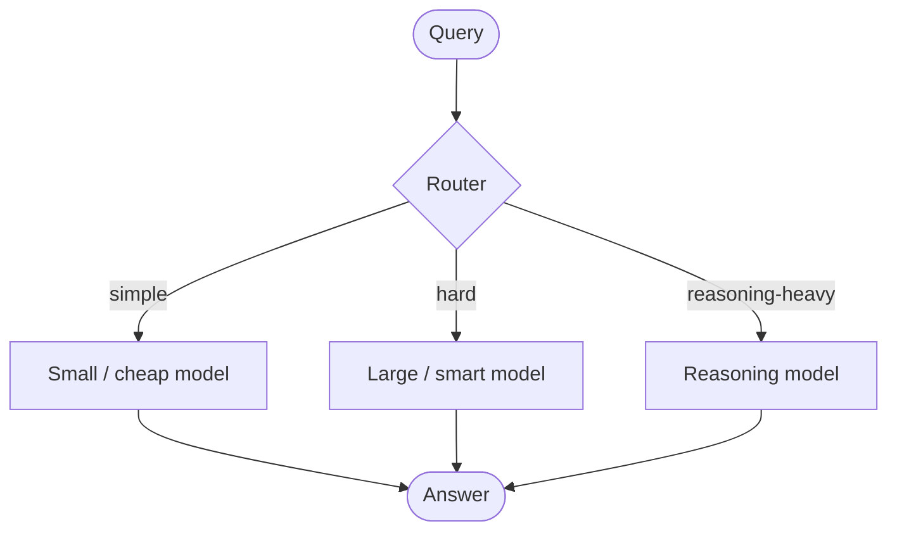
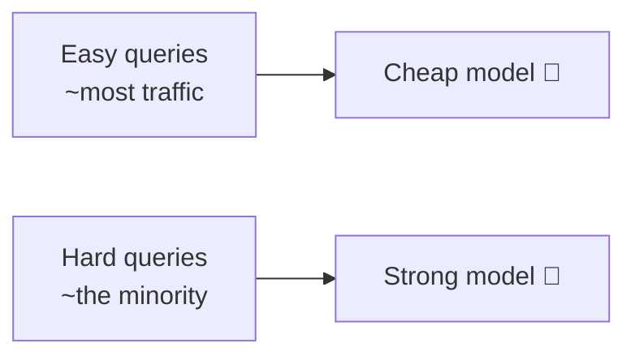
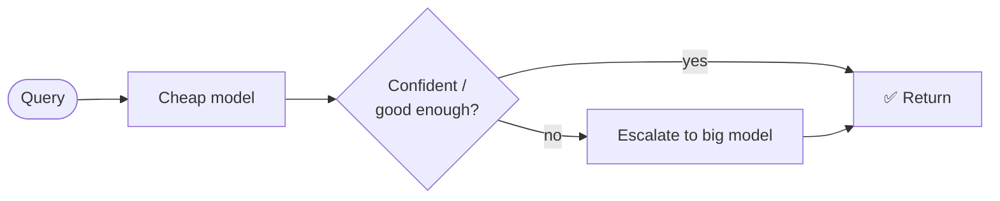
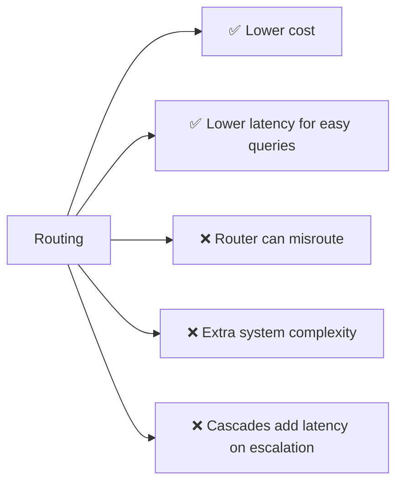

# 🚦 Model Routing & Cascades

> **One-liner:** Don't send every request to your biggest, most expensive model. A
> **router** sends each query to the *cheapest model that can handle it* — big savings on
> cost and latency with little quality loss.

---

## 💡 The core idea

Most real traffic is easy. Reserving a frontier model for *every* request wastes money.
Route by **difficulty**.

---

## 🧭 Routing strategies

| Strategy | How it decides |
|----------|----------------|
| **Classifier router** | A small model predicts difficulty/category → picks a model |
| **Cascade** | Try cheap model first; escalate only if confidence is low |
| **Rule-based** | Route by keywords, length, task type, or user tier |
| **Semantic** | Route by query embedding / similarity to known buckets |
| **Capability** | Send code → code model, images → [multimodal](../multimodal/), etc. |

### Cascade pattern (try cheap, escalate)

---

## ⚖️ Trade-offs

- The router itself must be **cheap and accurate** — a bad router negates the savings.
- Cascades trade a little **extra latency** on hard queries for big savings on easy ones.

---

## 🗺️ Where routing is used

- **Cost optimization** at scale (the headline reason).
- **Latency-sensitive** apps (fast path for common queries).
- **Multi-capability** systems (route to specialized/[reasoning](../reasoning-models/) models).
- **AI gateways** and LLM proxies.

> 💡 Related idea: **model cascades** and **speculative decoding** ([inference-optimization](../inference-optimization/)) both exploit "use a small model when you can, the big one only when you must."

➡️ Related: **[inference-optimization](../inference-optimization/)** · **[reasoning-models](../reasoning-models/)** · **[evaluation](../evaluation/)** (to tune the router).
