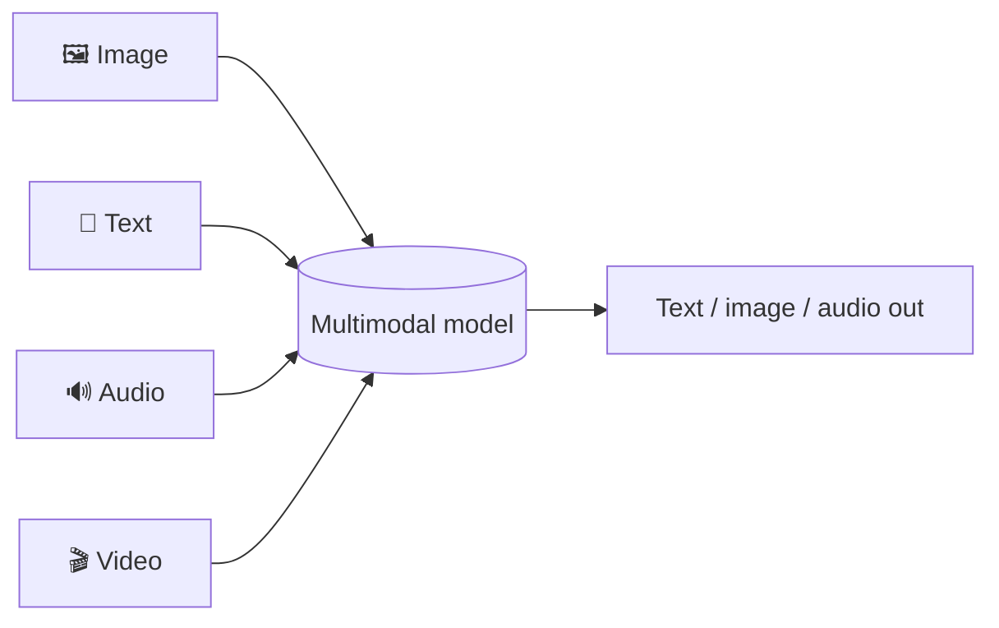
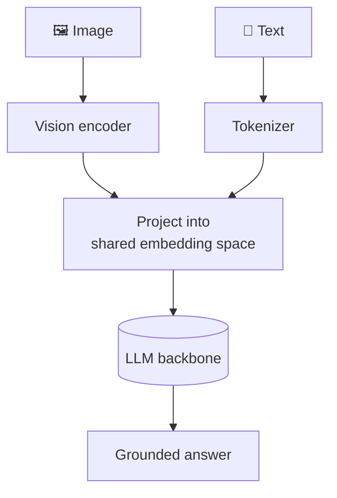
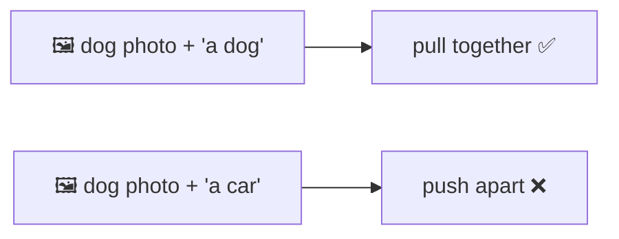

# 🖼️🔊 Multimodal AI

> **One-liner:** Multimodal models handle **more than text** — images, audio, video,
> documents — often mixing them in a single conversation. "Describe this photo," "read this
> chart," "listen and answer" all live here.

---

## 🧩 How it works: shared representation

Each modality is converted into **tokens/embeddings in a common space**, so the model can
reason across them together.

- A **vision encoder** turns an image into embeddings the LLM can "read" as if they were tokens.
- The LLM then reasons over image + text **jointly**.

---

## 🧭 Two flavors you'll hear about

| Flavor | What it does | Example task |
|--------|--------------|--------------|
| **VLM** (Vision-Language Model) | Understands images + text → outputs text | "What's wrong in this diagram?" |
| **Any-to-any / omni** | Multiple inputs **and** outputs (text, image, audio) | Voice in → voice out; text → image |

---

## 🔗 Contrastive models (CLIP-style)

A foundational technique: train image and text encoders so that **matching pairs are close**
in a shared space and non-matching pairs are far apart.

This enables **zero-shot classification** and **cross-modal search** (find images by text),
and underpins [diffusion](../diffusion-models/) text conditioning and [multimodal embeddings](../embeddings/).

---

## 🗺️ Where multimodal is used

| Use case | Modalities |
|----------|-----------|
| **Document AI** | Read PDFs, tables, charts, screenshots |
| **Visual Q&A / accessibility** | Describe images, answer about them |
| **Voice assistants** | Speech in → speech out |
| **Video understanding** | Summarize, search, caption |
| **Multimodal [RAG](../rag/)** | Retrieve across images + text |
| **[Computer/browser use](../agents/tools.md)** | Agents that "see" the screen |
| **Medical / satellite / OCR** | Domain imagery + text |

---

## ⚠️ Extra challenges vs text-only

- **More tokens** — images can cost many tokens → [context](../context-engineering/) & cost pressure.
- **Grounding** — pointing to the *right* region of an image.
- **New failure modes** — misreading charts, hallucinating image details.
- **Evaluation** is harder across modalities.

➡️ Image generation side → **[diffusion-models](../diffusion-models/)** · shared spaces → **[embeddings](../embeddings/)**.
