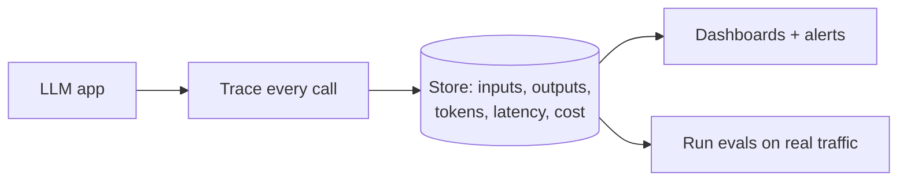
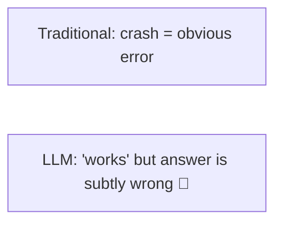
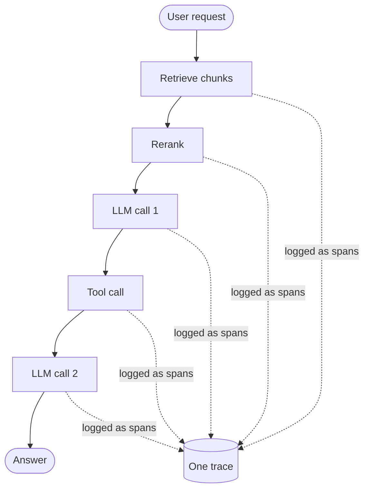
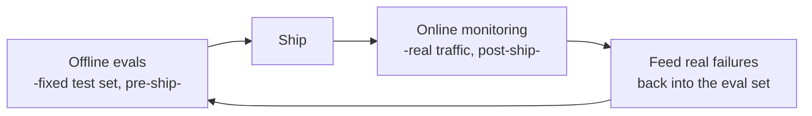

# 📡 LLM Observability & LLMOps

> **One-liner:** Once an LLM app is live, you need to **see what it's actually doing** —
> trace every call, measure quality/cost/latency, and catch regressions. Observability is
> "logging + tracing + evals" for non-deterministic AI systems.

---

## 🤔 Why LLM apps need special observability

Traditional apps are deterministic; LLM apps are **non-deterministic**, multi-step, and fail
*softly* (a plausible wrong answer, not a stack trace).

You can't just watch for exceptions — you have to watch **quality**.

---

## 🧵 Tracing a multi-step call

A single user request can fan out into retrieval, reranking, several LLM calls, and tool
calls. Tracing ties them into one **timeline** you can inspect.

Essential for debugging [RAG](../rag/) and [agents](../agents/) — you can see *exactly* which
step went wrong (bad retrieval? bad prompt? bad tool result?).

---

## 📊 What to measure

| Category | Metrics |
|----------|---------|
| **Quality** | Faithfulness, relevance, task success, thumbs up/down |
| **Cost** | Tokens & $ per request / per user / per feature |
| **Latency** | TTFT, total time, per-step timing |
| **Reliability** | Error rates, tool failures, timeouts, retries |
| **Safety** | Flagged/blocked content, injection attempts → [guardrails](../guardrails/) |
| **Usage** | Volume, top queries, cache hit rate |

---

## 🔁 Offline evals vs online monitoring

- **Offline** ([evaluation](../evaluation/)) catches regressions before release.
- **Online** catches what your test set missed — then you *add those cases* to the eval set.

---

## 🧰 Tooling & the LLMOps picture

LangSmith, Langfuse, Arize Phoenix, Helicone, Weights & Biases, OpenTelemetry (GenAI). Often
paired with prompt versioning, dataset management, and A/B testing — collectively **LLMOps**.

---

## 🗺️ Where observability matters

- **Any production LLM app** — you can't improve what you can't see.
- **[Agents](../agents/)** — many steps = many failure points to trace.
- **Cost control** — find the expensive calls (pairs with [model-routing](../model-routing/), [semantic-caching](../semantic-caching/)).
- **Safety & compliance** — audit trails of what the model did.

➡️ Related: **[evaluation](../evaluation/)** · **[guardrails](../guardrails/)** · **[inference-optimization](../inference-optimization/)**.
