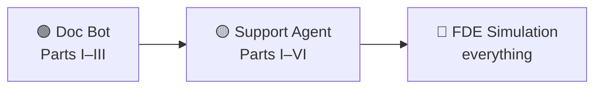

# 🎓 Capstone Projects

Three end-to-end builds that force you to **combine** the concepts. Each has a brief,
requirements, an evaluation rubric, and stretch goals. Do them in order — each assumes the
last.

> 🏁 **Definition of done for all three:** it runs, you can demo it, and you can **show the
> numbers** that say it works.

---

## 🟢 Capstone 1 — "Chat with Your Docs" (with citations)

**Brief:** Build a RAG assistant over a document set you care about (course notes, a product
manual, a few PDFs) that answers questions **and cites the source passage**.

**Requirements**
- [ ] Ingest ≥ 20 pages; chunk + embed into a [vector store](../vector-databases/).
- [ ] [Hybrid retrieval](../rag/retrieval.md) (dense + keyword) with a [reranker](../rag/reranking.md).
- [ ] Answers include **citations** (source + quote); says **"I don't know"** when unsupported.
- [ ] A **20-question [eval set](../rag/evaluation.md)** with context-recall + faithfulness scores.
- [ ] A short README: architecture diagram + how to run.

**Concepts:** [chunking](../rag/chunking.md) · [embeddings](../embeddings/) · [vector DBs](../vector-databases/) · [retrieval](../rag/retrieval.md) · [reranking](../rag/reranking.md) · [RAG eval](../rag/evaluation.md) · [prompt](../prompt-engineering/)/[context engineering](../context-engineering/).

### 📋 Rubric (100 pts)
| Criteria | Pts |
|----------|-----|
| Retrieval quality (finds the right chunk) | 25 |
| Answer faithfulness + citations | 25 |
| Eval set exists & is used to tune | 20 |
| Handles "I don't know" / no-answer | 15 |
| Code clarity + README/diagram | 15 |

**Stretch:** add [semantic caching](../semantic-caching/); add an adaptive "do I need to retrieve?" step ([Self-RAG](../rag/architectures/self-rag.md)).

---

## 🟡 Capstone 2 — "Support Agent" (tools + guardrails + observability)

**Brief:** Turn the doc bot into an **[agent](../agents/)** for a support scenario: it can
look things up (your RAG), call ≥ 2 tools (e.g. `lookup_order`, `create_ticket` — mocked is
fine), and it's **safe and observable**.

**Requirements**
- [ ] [ReAct or plan-execute](../agents/architectures.md) loop with **stopping conditions** (max steps, loop detection).
- [ ] ≥ 2 [tools](../agents/tools.md) with clean schemas; input validation; graceful tool errors.
- [ ] RAG available as one of the agent's actions.
- [ ] [Guardrails](../guardrails/): input (injection) + output (PII / unsafe action) checks; **human approval** for any "write" action.
- [ ] [Observability](../observability/): every run traced (steps, tokens, latency, cost).
- [ ] A **[red-team](../red-teaming/)** pass: 10 attacks, logged, mitigations noted.

**Concepts:** everything in Capstone 1 **plus** [agents](../agents/) · [agentic loop](../agentic-loop/) · [tools/MCP](../agents/tools.md) · [memory](../agents/memory.md) · [guardrails](../guardrails/) · [observability](../observability/) · [red-teaming](../red-teaming/).

### 📋 Rubric (100 pts)
| Criteria | Pts |
|----------|-----|
| Agent completes multi-step tasks reliably | 25 |
| Tool design + error handling | 15 |
| Guardrails (in/out + human-in-loop) | 20 |
| Observability / tracing | 15 |
| Red-team results + fixes | 15 |
| Loop safety (limits, no runaway) | 10 |

**Stretch:** add [model routing](../model-routing/) (cheap vs strong) and report cost saved; add long-term [memory](../agents/memory.md).

---

## 🔴 Capstone 3 — "FDE Simulation" (the real test)

**Brief:** Play the [Forward Deployed Engineer](../fde/). Pick a domain (legal intake, clinic
scheduling, e-commerce support, internal IT helpdesk…) and take a **vague problem to a
scoped, deployed-ish, measured solution** — documenting your thinking like you would for a
real customer.

**Deliverables**
1. **Discovery doc** — the real problem, users, data, constraints, success metrics. ([FDE](../fde/))
2. **Scope** — the smallest valuable slice (the wedge) + what you're deliberately *not* doing.
3. **Design doc** — decision-tree choice, architecture diagram, cross-cutting layers. ([system design](../llm-system-design/))
4. **Working POC** — the scoped slice, actually running.
5. **Eval plan + results** — how you know it works ([evaluation](../evaluation/)); baseline vs improved.
6. **Cost/latency plan** — [routing](../model-routing/)/[caching](../semantic-caching/)/[inference](../inference-optimization/) choices with numbers.
7. **Risk pre-mortem** — top failure modes + mitigations + fallbacks.
8. **Handoff/scale note** — what production hardening and "100× scale" would need.

### 📋 Rubric (100 pts)
| Criteria | Pts |
|----------|-----|
| Discovery: found the *real* problem | 15 |
| Scope: tight wedge, clear non-goals | 15 |
| Design: justified, right-sized (not over-engineered) | 15 |
| POC actually works & demos value | 20 |
| Evaluation: measured, not vibes | 15 |
| Production thinking: cost, risk, guardrails, scale | 15 |
| Communication: clear docs a customer could read | 5 |

> 🧭 **What's really being graded:** not "can you use RAG" — **can you take ambiguity and
> ship value.** That's the job.

---

➡️ Back to the **[projects index](./README.md)** · the **[learning path](../README.md#-the-path-to-forward-deployed-engineer)** · the **[FDE role](../fde/)**.
