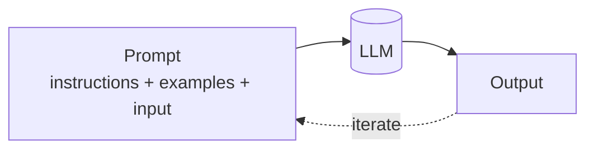
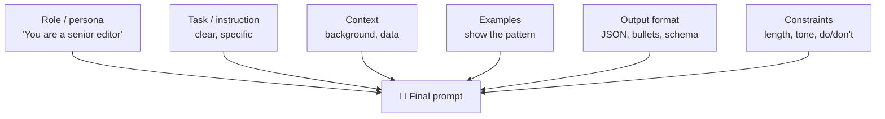
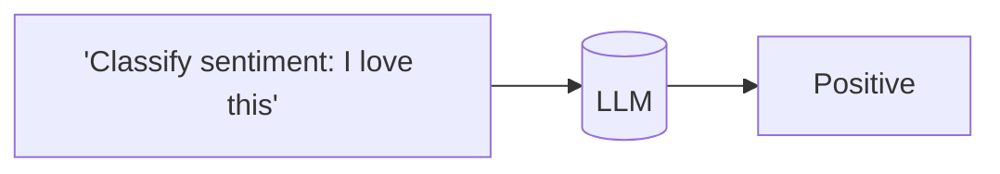
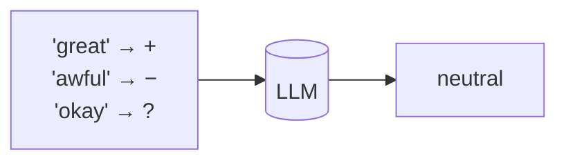
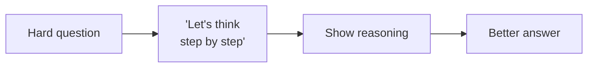
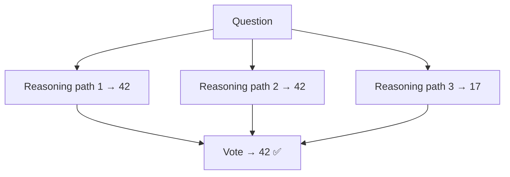
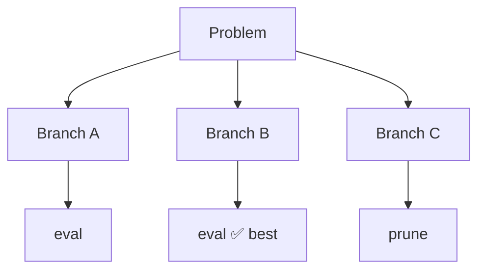
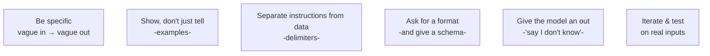

# ✍️ Prompt Engineering

> **One-liner:** Prompt engineering is shaping the **input text** to steer the model's
> output — the cheapest, fastest, most reversible way to change behavior. No training,
> no infrastructure, just words.

Where [fine-tuning](../fine-tuning/) changes the model and [RAG](../rag/) changes its knowledge,
**prompt engineering changes what you ask and how**. Always try it first.

---

## 🧱 Anatomy of a good prompt

The more precisely you specify **role, task, context, format, and constraints**, the more reliable the output.

---

## 🎓 Core techniques

### Zero-shot
Just ask. No examples. Works for simple, common tasks.

### Few-shot
Show a few **examples** of the input→output pattern. The model imitates them.

- Great for enforcing **format** and handling **ambiguous** tasks. 2–5 diverse examples usually enough.

### Chain-of-Thought (CoT)
Ask the model to **reason step by step** before answering. Dramatically improves math,
logic, and multi-step problems.

### Self-consistency
Sample **multiple** CoT reasoning paths and take the **majority** answer.

### Beyond linear: ToT / GoT
**Tree-of-Thought** explores and *evaluates* multiple branches; **Graph-of-Thought**
generalizes to a graph. Used for hard search/planning problems.

---

## 🧰 Technique cheat-sheet

| Technique | Use when |
|-----------|----------|
| **Zero-shot** | Simple, familiar tasks |
| **Few-shot** | Need a specific format or handle ambiguity |
| **Chain-of-Thought** | Math, logic, multi-step reasoning |
| **Self-consistency** | High-stakes reasoning; can afford extra calls |
| **Role prompting** | Set expertise/persona/tone |
| **Structured output** | Need parseable JSON/tables (use schemas) |
| **Instruction + delimiters** | Separate instructions from data (also safer vs injection) |
| **Prompt chaining** | Break a big task into smaller prompted steps |
| **ReAct** | Reasoning + tool use → see [agents](../agents/) |

---

## 🎛️ Decoding knobs (not the prompt, but shape the output)

| Parameter | Effect |
|-----------|--------|
| **Temperature** | Higher = more random/creative; lower = more deterministic |
| **Top-p / top-k** | Restrict the candidate token pool |
| **Max tokens** | Cap output length |
| **Stop sequences** | Where to cut generation |

> For extraction/classification → **low temperature**. For brainstorming → **higher**.

---

## ✅ Best practices

- **Specificity beats cleverness.** Say exactly what you want.
- **Positive instructions** ("respond in 3 bullets") beat negative ones ("don't be verbose").
- **Let it say "I don't know"** to cut hallucination.
- **Test systematically** — small changes have big effects; keep a prompt eval set.

---

## 🔗 Prompt engineering vs Context engineering

Prompt engineering is about **the words you write**. As soon as you're also deciding
*what memory, retrieved docs, tool outputs, and history* fill the window, you've crossed
into **[context engineering](../context-engineering/)** — the superset for agentic systems.

➡️ Next: managing the whole window → **[context engineering](../context-engineering/)**.
