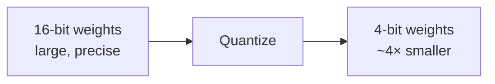
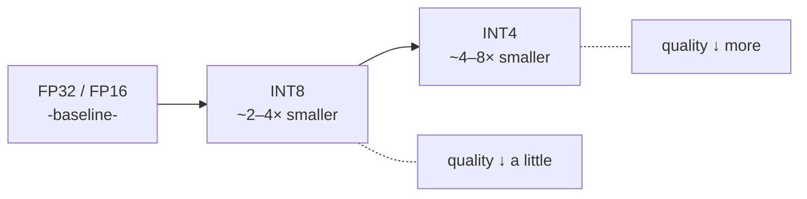
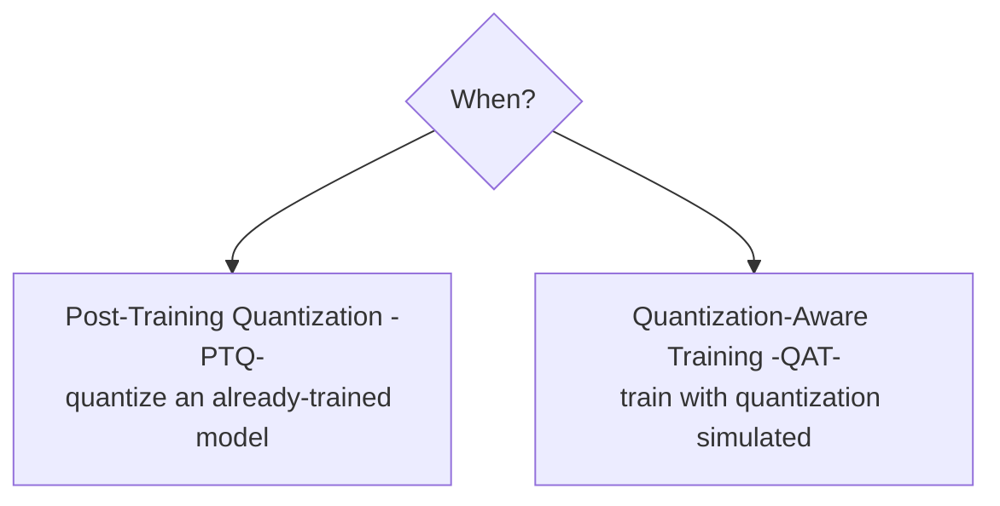
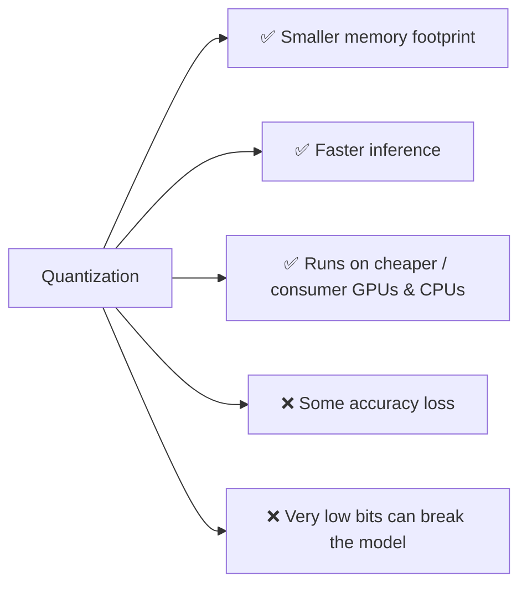

# 🗜️ Quantization

> **One-liner:** Quantization shrinks a model by storing its weights in **fewer bits**
> (e.g. 16-bit → 4-bit). The model gets smaller and faster, uses less memory, and runs on
> cheaper hardware — with only a small quality cost.

---

## 🔢 The idea: fewer bits per number

Each weight is a number. Full precision uses 16 or 32 bits; quantization maps those to a
smaller range of 8-, 4-, or even lower-bit values.

| Precision | Rough size vs FP16 | Typical quality |
|-----------|--------------------|-----------------|
| FP16 / BF16 | 1× (baseline) | Full |
| INT8 | ~½ | Near-full |
| INT4 | ~¼ | Slight drop, usually fine |
| <4-bit | smaller | Noticeable drop |

---

## 🕐 When you quantize matters

- **PTQ** — quantize after training. Fast, cheap, no retraining. The common path.
- **QAT** — simulate quantization *during* training so the model adapts. More accurate, more work.

---

## 🧰 Common methods & formats

| Name | What it is |
|------|-----------|
| **GPTQ** | Popular PTQ method for LLMs (4-bit) |
| **AWQ** | Activation-aware quantization; protects important weights |
| **GGUF** | File format for quantized models (llama.cpp ecosystem, run on CPU/laptop) |
| **bitsandbytes** | On-the-fly 8-bit/4-bit loading in PyTorch |
| **[QLoRA](../fine-tuning/methods.md)** | Fine-tune on top of a 4-bit frozen base |

---

## ⚖️ Trade-offs

> 💡 **Sweet spot:** 4-bit (INT4) quantization keeps most quality while cutting memory ~4× —
> it's why you can run big open models on a single GPU or even a laptop.

---

## 🗺️ Where quantization is used

- **Running LLMs locally** (laptops, edge, on-device)
- **Cheaper serving** at scale (fit more model per GPU)
- **[QLoRA fine-tuning](../fine-tuning/methods.md)** on limited hardware
- **Mobile / embedded** AI

➡️ Part of the broader **[inference-optimization](../inference-optimization/)** toolkit · shrink models another way → **[distillation](../distillation/)**.
