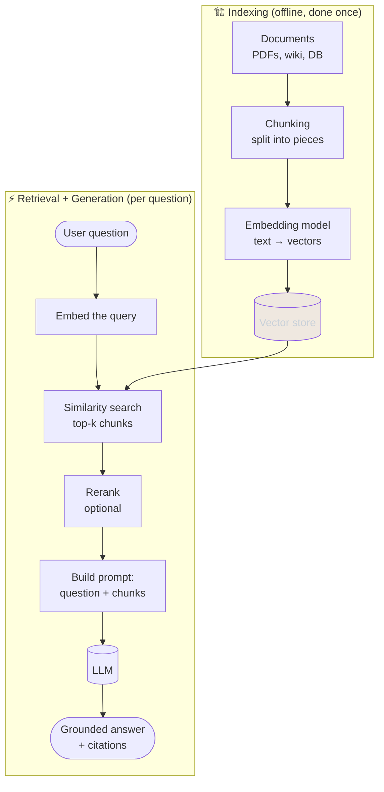
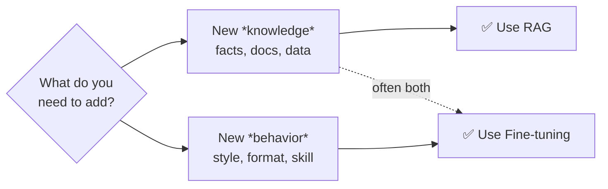

# 📖 RAG — Retrieval-Augmented Generation

> **One-liner:** Instead of relying only on what a model memorized during training,
> **retrieve** relevant documents at query time and **stuff them into the prompt** so the
> model answers from *fresh, private, or authoritative* knowledge.

RAG is the answer to three LLM weaknesses:
- 🕰️ **Stale knowledge** — the model's training has a cutoff date.
- 🔒 **No private data** — it never saw your company wiki, tickets, or PDFs.
- 🤥 **Hallucination** — grounding answers in real sources reduces made-up facts.

---

## 🔄 How RAG works (the whole pipeline)

**In words:**
1. **Index (offline):** chop your documents into **chunks**, turn each into an **embedding** (a vector), and store them in a **vector database**.
2. **Retrieve (per query):** embed the user's question, find the **top-k** most similar chunks, optionally **rerank** them.
3. **Generate:** paste those chunks into the prompt as context and let the LLM answer — ideally **citing** the sources.

---

## 🧩 The pieces (go deeper)

| Stage | What it decides | Deep dive |
|-------|-----------------|-----------|
| **Chunking** | How you split documents — the single biggest quality lever. | [chunking.md](./chunking.md) |
| **Embeddings** | How text becomes vectors you can search. | [embeddings.md](./embeddings.md) |
| **Retrieval** | How you find the right chunks (dense, sparse, hybrid). | [retrieval.md](./retrieval.md) |
| **Reranking** | Reordering candidates so the *best* chunks land on top. | [reranking.md](./reranking.md) |
| **Architectures** | Naive → Advanced → Modular → Agentic → Graph RAG. | [architectures/](./architectures/) |
| **Evaluation** | Proving it actually works (faithfulness, recall…). | [evaluation.md](./evaluation.md) |

---

## 🎯 Where RAG is used

| Use case | Why RAG fits |
|----------|--------------|
| **Customer support bots** | Answer from up-to-date product docs & policies. |
| **Enterprise search / "chat with your docs"** | Private knowledge the model never trained on. |
| **Coding assistants** | Pull in the *current* repo, API docs, internal libs. |
| **Legal / medical / finance** | Answers must cite an authoritative source. |
| **Research assistants** | Ground summaries in a specific corpus of papers. |

---

## ⚖️ RAG vs Fine-tuning (the classic question)

- Need the model to **know new facts** that change often → **RAG**.
- Need the model to **behave differently** (tone, JSON format, domain reasoning) → **[Fine-tuning](../fine-tuning/)**.
- Real systems frequently use **both**: fine-tune the *style*, RAG the *facts*.

---

## 🚧 Common failure modes

| Symptom | Likely cause | Fix |
|---------|-------------|-----|
| Right doc exists but wasn't retrieved | Bad chunking or embeddings | Better [chunking](./chunking.md), [hybrid retrieval](./retrieval.md) |
| Retrieved junk / irrelevant chunks | No reranking, k too high | Add a [reranker](./reranking.md) |
| Model ignores the context | Prompt buries the docs | [Context engineering](../context-engineering/) |
| Answer contradicts the source | Weak grounding instructions | Force citations, lower temperature |
| "I don't know" too often | Retrieval recall too low | Query rewriting, more k, hybrid search |

➡️ Start with **[chunking](./chunking.md)** — it's where most RAG quality is won or lost.
