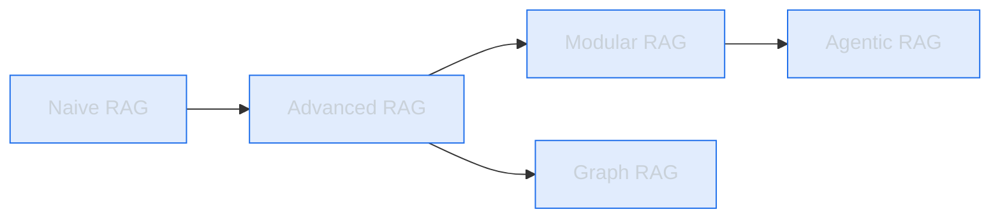
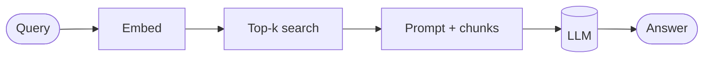
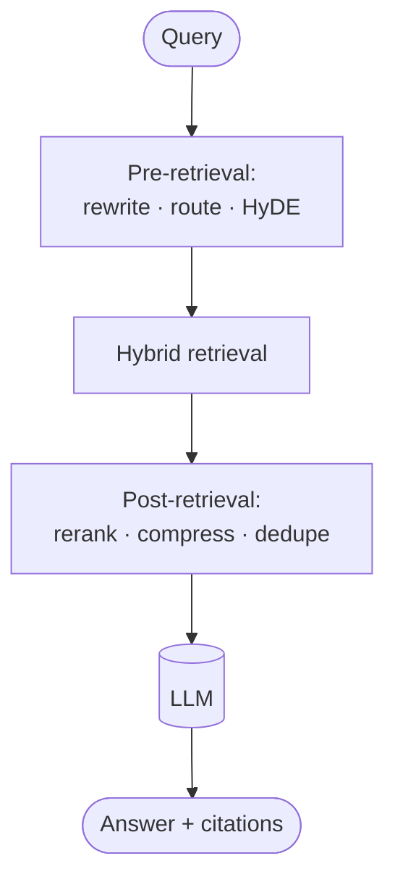
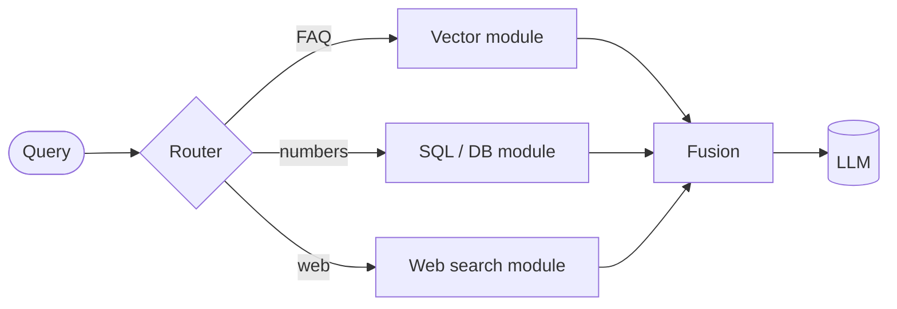
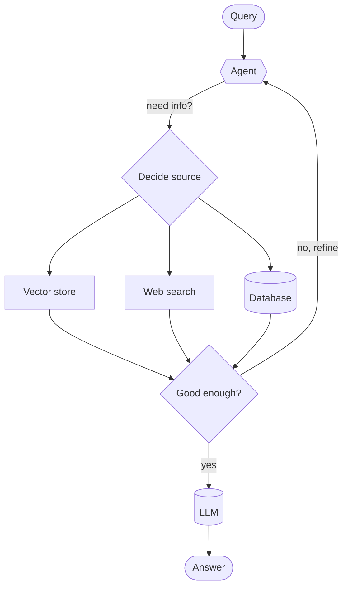
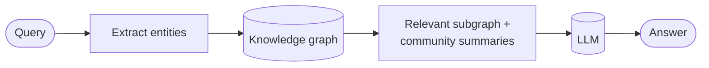
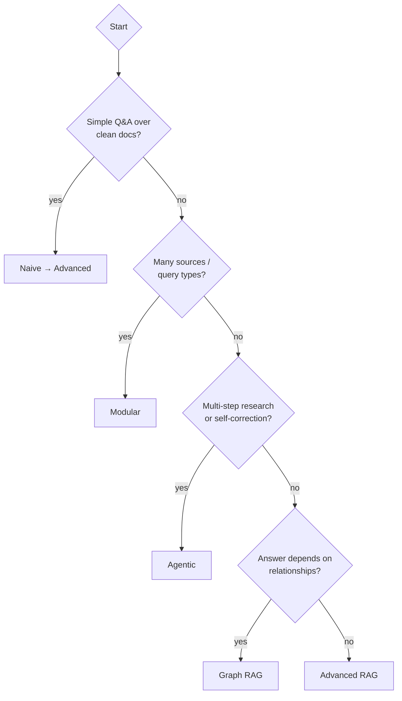

# 🏛️ RAG Architectures

RAG isn't one thing — it's a spectrum from "embed and search" to fully agentic,
self-correcting retrieval systems. Here's the evolution, each with a diagram and
**where it's used**.

| Architecture | Core idea | Complexity | Best for |
|--------------|-----------|-----------|----------|
| [Naive RAG](#1-naive-rag) | retrieve → stuff → generate | ⭐ | Prototypes, simple Q&A |
| [Advanced RAG](#2-advanced-rag) | pre- & post-retrieval optimization | ⭐⭐ | Most production systems |
| [Modular RAG](#3-modular-rag) | swappable, reconfigurable components | ⭐⭐⭐ | Complex, evolving platforms |
| [Agentic RAG](#4-agentic-rag) | an agent decides *how/what/when* to retrieve | ⭐⭐⭐⭐ | Multi-step, multi-source research |
| [Graph RAG](#5-graph-rag) | retrieve over a knowledge graph | ⭐⭐⭐⭐ | Connected data, "how are X and Y related" |

---

## 1. Naive RAG

The original pattern: embed, retrieve top-k, concatenate, generate.

- ✅ Dead simple, fast to build.
- ❌ No query cleanup, no reranking, no checks. Fragile on real data.
- **Used for:** demos, MVPs, small clean corpora.

## 2. Advanced RAG

Add optimization **before** retrieval (query rewriting, [HyDE](../retrieval.md), routing)
and **after** retrieval ([reranking](../reranking.md), compression, filtering).

- ✅ The big quality jump over naive; still a linear pipeline.
- **Used for:** the majority of serious production RAG (support bots, doc chat).

## 3. Modular RAG

Treat each capability (retrieve, rerank, memory, routing, fusion) as a **swappable
module** you can rewire — including loops and branches, not just a straight line.

- ✅ Flexible, reusable, testable pieces; route to the right data source.
- **Used for:** platforms serving many query types / data sources.

## 4. Agentic RAG

An **[agent](../../agents/)** sits on top and *decides*: Do I even need to retrieve?
Which source? Is this result good enough, or should I search again? It can **loop**
and **self-correct**.

Includes patterns like **Self-RAG** (model critiques its own retrieval/answer) and
**Corrective RAG / CRAG** (grade retrieved docs; fall back to web search if they're weak).

- ✅ Handles multi-step, multi-source, "research"-style questions; recovers from bad retrieval.
- ❌ Slower, costlier, harder to make reliable. See the [agentic loop](../../agentic-loop/).
- **Used for:** research assistants, complex enterprise Q&A, deep-research tools.

## 5. Graph RAG

Retrieve over a **[knowledge graph](https://en.wikipedia.org/wiki/Knowledge_graph)**
(entities + relationships) instead of (or alongside) flat text chunks. Great when the
answer depends on **connections** across documents.

- ✅ Answers "how are X and Y related?" and global "what are the main themes?" questions that flat RAG struggles with; multi-hop reasoning.
- ❌ Building & maintaining the graph is expensive.
- **Used for:** interconnected corpora — research literature, org knowledge, investigations, compliance.

---

## 🧭 Choosing

**Rule of thumb:** start at **Advanced RAG**. Only reach for Agentic/Graph when you can point at a concrete failure that a simpler pipeline can't fix.

➡️ Back to [RAG overview](../README.md).
