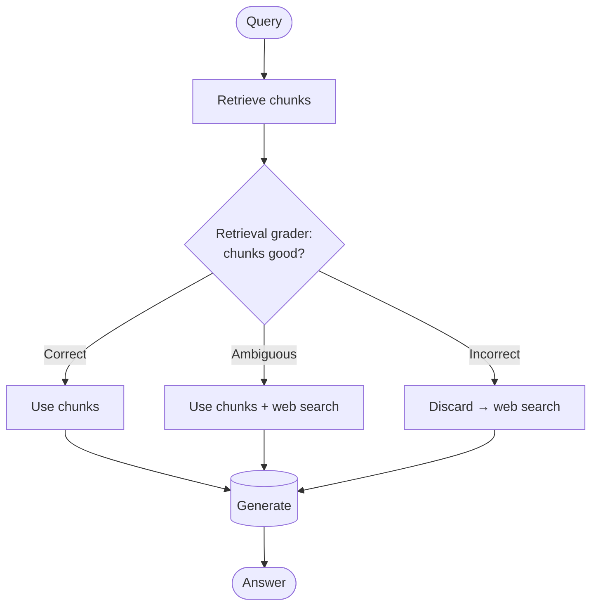
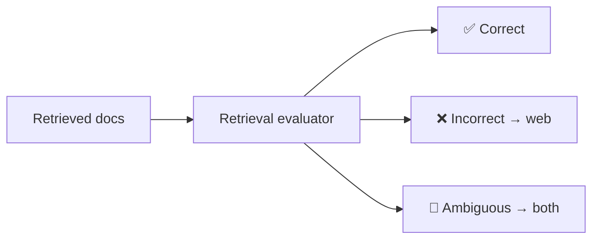
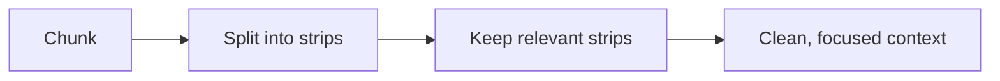
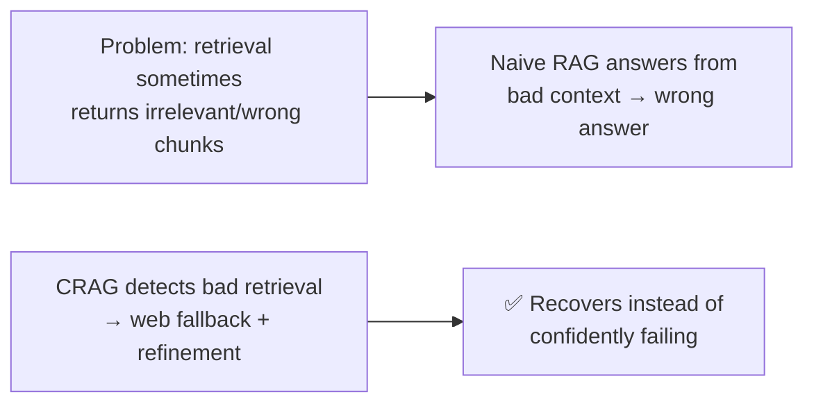

# 🩹 Corrective RAG (CRAG)

> **One-liner:** Corrective RAG adds a **retrieval grader** that checks whether the retrieved
> chunks are actually good — and if they're **not**, it *corrects course* (e.g. falls back
> to a web search) instead of answering from bad context.

---

## 🧠 The key idea: grade, then act

A lightweight **evaluator** scores retrieved documents into one of three buckets, each with a
different corrective action:

| Grade | Meaning | Action |
|-------|---------|--------|
| **Correct** | Chunks are relevant | Use them (after refining) |
| **Incorrect** | Chunks are off | Discard → **fall back to web search** |
| **Ambiguous** | Not sure | Use **both** local chunks and web |

---

## 🔧 Knowledge refinement

For "correct" docs, CRAG often **decompose-then-filter**: break chunks into smaller
"knowledge strips," keep the relevant strips, drop the noise — so only high-signal context
reaches the model.

---

## ✨ Why it helps

It directly attacks the **"right doc wasn't retrieved"** failure mode → fewer [hallucinations](../../hallucination/).

---

## ⚖️ CRAG vs Self-RAG

| | [Self-RAG](./self-rag.md) | Corrective RAG |
|---|---------------------------|----------------|
| Core mechanism | Model's own **reflection tokens** | External **retrieval grader** |
| Needs special training? | Yes (trained tokens) | Lighter — grader can be a small model |
| Signature move | Decide *when* to retrieve + self-critique | *Grade* retrieval, **web-search fallback** |
| Both aim to… | Filter bad context, reduce hallucination | Same goal, different route |

Both are **[Agentic RAG](./README.md#4-agentic-rag)** patterns — they add a decision/critique
loop on top of plain retrieval.

➡️ Compare with **[Self-RAG](./self-rag.md)** · back to **[architectures](./README.md)**.
