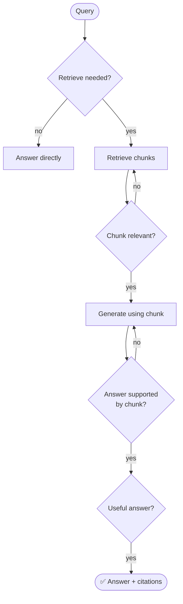
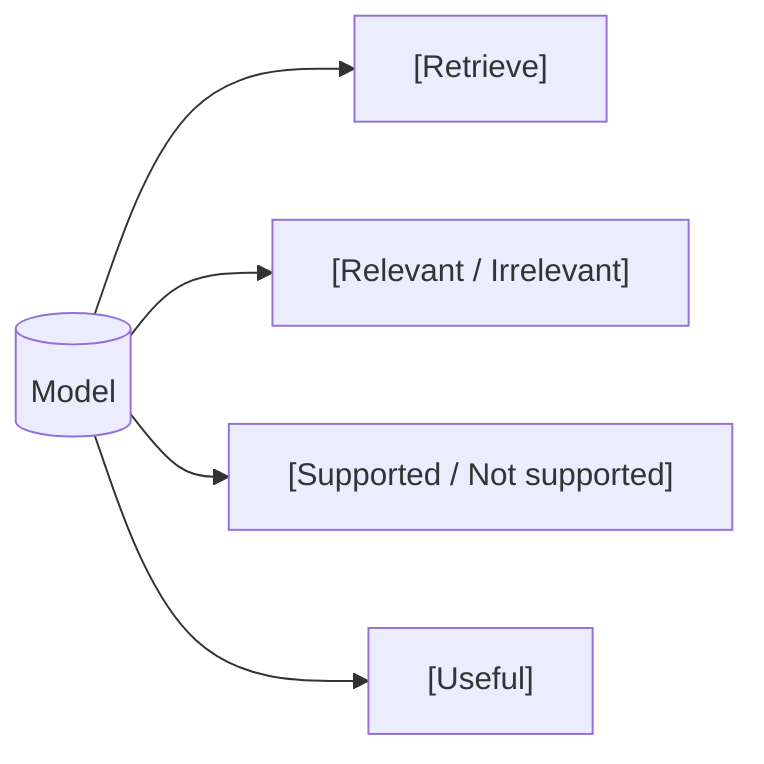
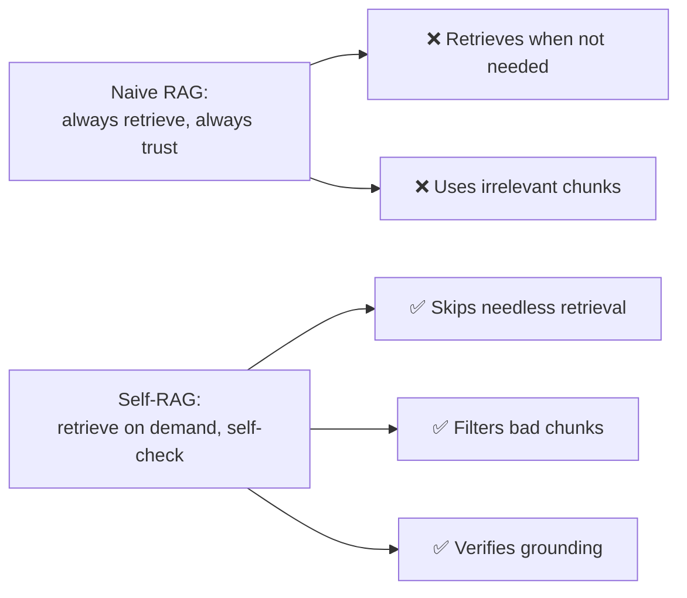

# 🪞 Self-RAG (Self-Reflective RAG)

> **One-liner:** Self-RAG teaches the model to **decide *when* to retrieve, and to critique
> its own retrieval and answers** using special "reflection tokens." Instead of always
> retrieving and blindly trusting the chunks, the model reflects at each step.

---

## 🧠 The key idea: reflection tokens

Self-RAG is trained to emit special tokens that gate the process:

| Reflection | Question it answers |
|------------|---------------------|
| **Retrieve?** | Do I even need to look something up for this? |
| **Relevant?** | Is this retrieved chunk actually relevant? |
| **Supported?** | Is my statement backed by the chunk (not hallucinated)? |
| **Useful?** | Is the overall answer actually helpful? |

---

## ✨ Why it's better than naive RAG

- **Adaptive retrieval** — no wasted lookups for questions the model already knows.
- **Self-critique** — discards irrelevant chunks and checks that claims are supported → less [hallucination](../../hallucination/).

---

## ⚖️ Trade-offs

- ✅ Higher factuality & citation accuracy; efficient (retrieves only when useful).
- ❌ Requires a model **trained/fine-tuned** to emit reflection tokens (not just prompting).
- ❌ More generation steps than naive RAG.

➡️ Compare with **[Corrective RAG](./corrective-rag.md)** · back to **[architectures](./README.md)**.
