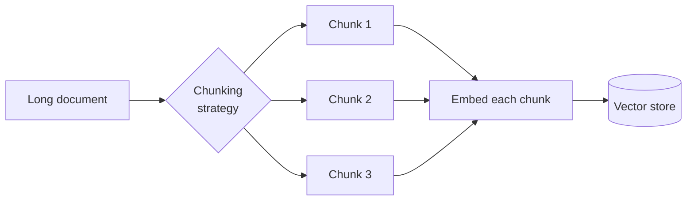
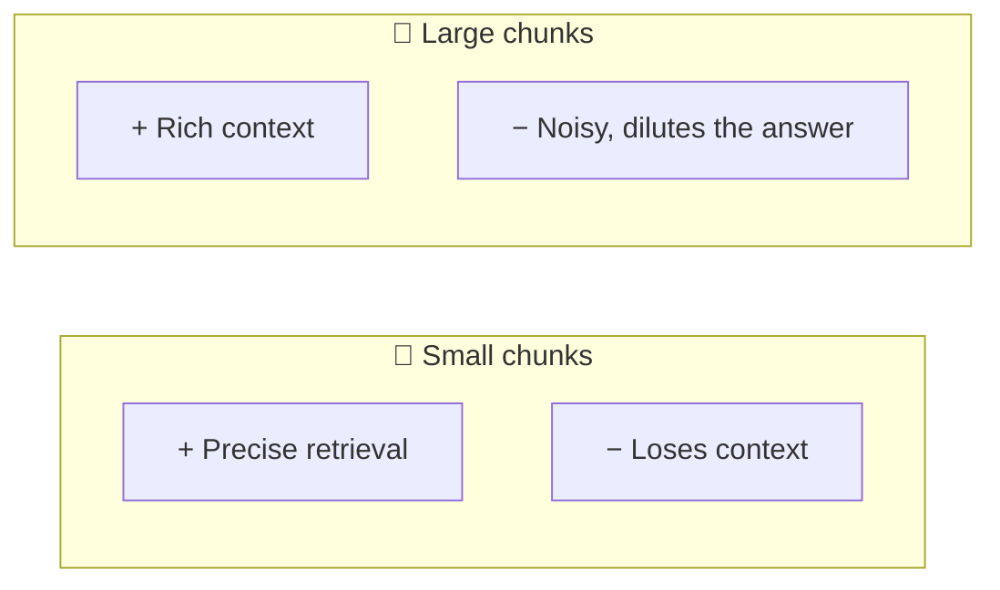
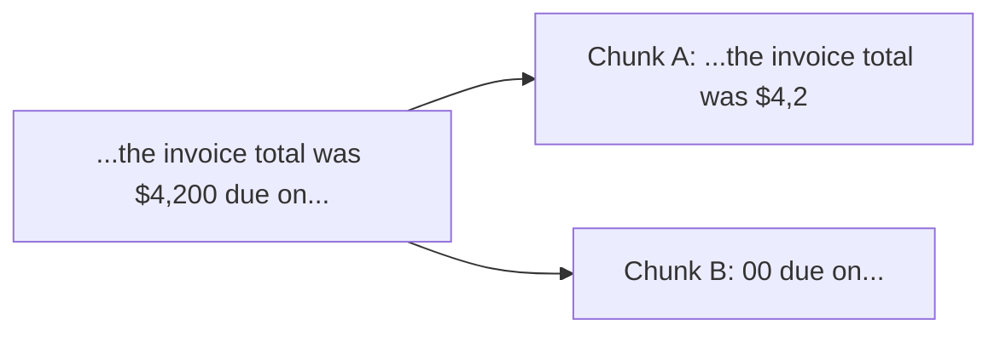
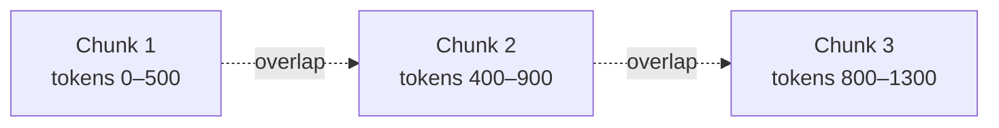
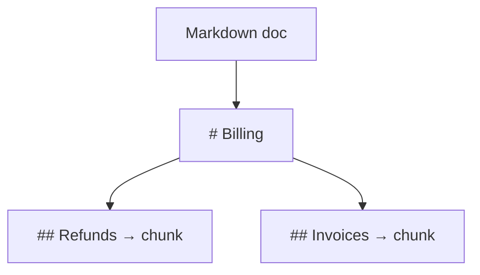
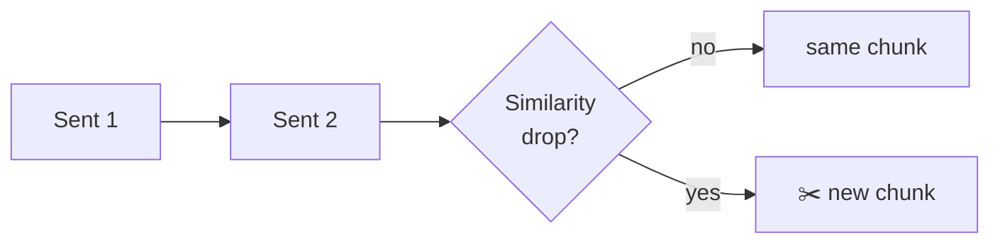
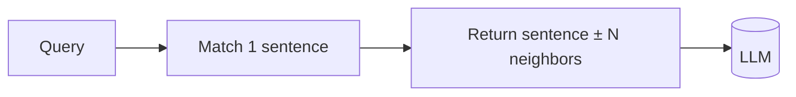
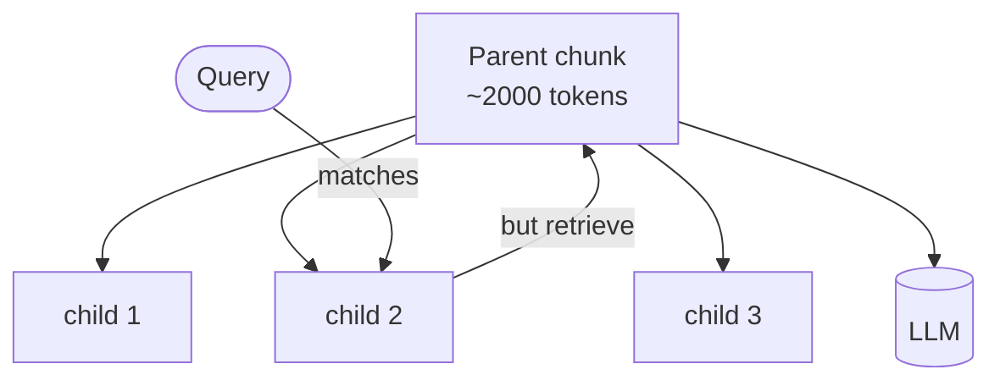

# ✂️ Chunking — How to Split Documents for RAG

> **Why it matters:** The chunk is the *unit of retrieval*. If a chunk is too big, it's
> full of noise and the real answer gets diluted. Too small, and it loses the context
> needed to make sense. **Chunking is the #1 lever on RAG quality.**

---

## 📐 The core trade-off

The art is keeping **one idea per chunk** while preserving enough surrounding context to be self-contained.

---

## 🧰 Chunking strategies (worst → best for most cases)

### 1. Fixed-size chunking
Split every *N* characters/tokens. Simple, fast, **context-blind** — it will happily cut a sentence in half.

- ✅ Trivial to implement, predictable size.
- ❌ Breaks sentences, splits ideas mid-thought.

### 2. Fixed-size **with overlap**
Same, but each chunk repeats the last ~10–20% of the previous one, so an idea cut at a boundary still appears whole in a neighbor.

- ✅ Cheap fix that recovers a lot of boundary loss. **The sane default.**
- ❌ Redundant storage; still ignores structure.

### 3. Recursive / structure-aware chunking
Split on a **hierarchy of separators** — paragraphs → sentences → words — only going finer when a piece is still too big. Respects the document's natural boundaries.

- ✅ Keeps paragraphs and sentences intact. Great general-purpose choice.
- ❌ Needs a max size; still not *semantic*.

### 4. Document-structure chunking
Use the format's own structure: Markdown headings, HTML tags, code functions, PDF sections. Each chunk = one logical section, tagged with its heading path.

- ✅ Chunks map to real sections; headings become great metadata.
- ❌ Only works when documents are well-structured.

### 5. Semantic chunking
Embed sentences, then start a **new chunk whenever the topic shifts** (embedding similarity between consecutive sentences drops below a threshold).

- ✅ Chunks align with actual topics, not arbitrary sizes.
- ❌ More expensive (embed everything up front); threshold needs tuning.

---

## 🪟 Advanced patterns

### Sentence-window retrieval
Embed **single sentences** (precise matching), but at generation time return the sentence **plus a window of neighbors** (rich context). Best of both worlds.

### Parent-document / small-to-big retrieval
**Search** over small child chunks, but **feed** the LLM the larger parent chunk they came from.

### Contextual chunking
Before embedding, prepend a short LLM-generated summary of *where this chunk sits* in the document (e.g. "This is from the Refunds policy, EU region"). Dramatically improves retrieval of otherwise-ambiguous chunks.

---

## 📊 Quick chooser

| Your data | Start with |
|-----------|-----------|
| Plain prose, unknown structure | Recursive + overlap |
| Markdown / HTML / well-formatted docs | Document-structure |
| Highly topical, long articles | Semantic |
| Need precise facts + context | Sentence-window or parent-document |
| Code | Structure-aware (by function/class) |

---

## 🎛️ Rules of thumb

- **Size:** ~200–500 tokens per chunk is a common sweet spot for prose. Test, don't guess.
- **Overlap:** ~10–20% of chunk size.
- **Always attach metadata** to each chunk: source, section heading, page, date. It powers [filtered retrieval](./retrieval.md) and citations.
- **One idea per chunk** is the guiding principle behind all of the above.

➡️ Next: how those chunks become searchable vectors → **[embeddings](./embeddings.md)**.
