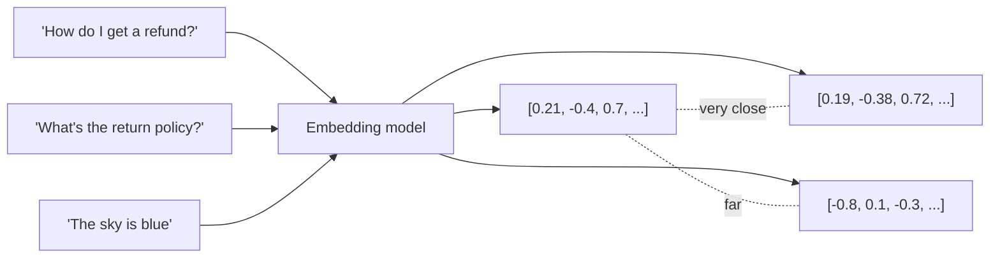
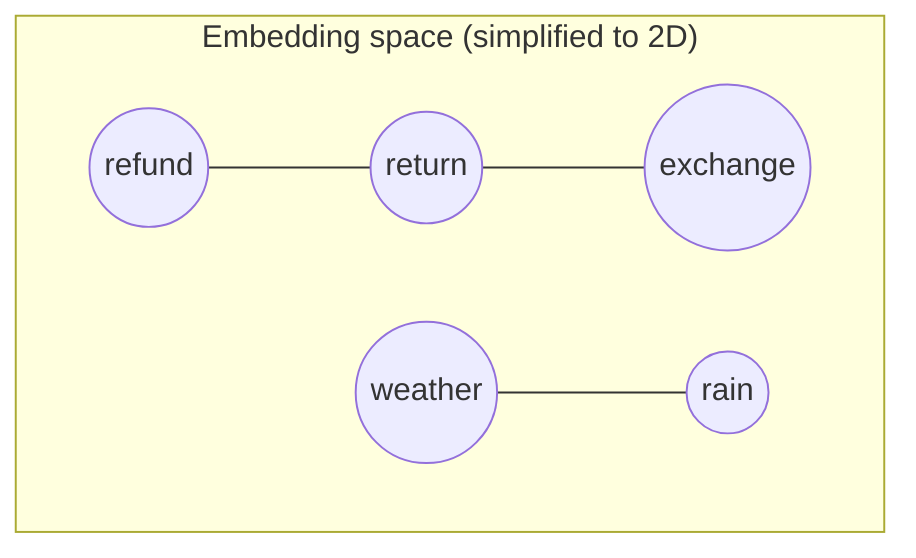
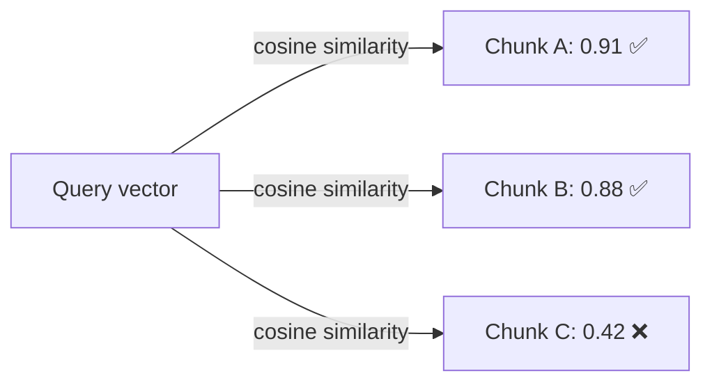
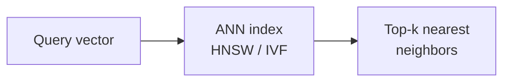
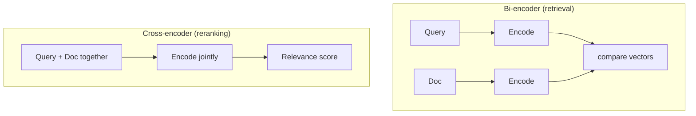

# 🔢 Embeddings — Turning Text into Searchable Vectors

> **One-liner:** An embedding is a list of numbers (a **vector**) that captures the
> *meaning* of a piece of text. Similar meanings → nearby vectors. This is what makes
> "search by meaning" (semantic search) possible.

A and B *mean* almost the same thing, so their vectors sit close together — even though they share no keywords. That's the whole magic.

---

## 🌐 Vector space intuition

Real embeddings live in **hundreds or thousands of dimensions** (e.g. 384, 768, 1536, 3072). We can't picture that, but the principle holds: **distance ≈ dissimilarity**.

---

## 📏 How similarity is measured

| Metric | What it measures | Notes |
|--------|------------------|-------|
| **Cosine similarity** | Angle between vectors | Most common for text; ignores magnitude |
| **Dot product** | Angle *and* magnitude | Fast; used when vectors are normalized |
| **Euclidean (L2)** | Straight-line distance | Common in some vector DBs |

Higher cosine = more similar. Retrieval = "find the vectors with the highest similarity to the query vector."

---

## 🗄️ Vector databases & ANN search

You can't compare the query to **millions** of vectors one by one. Vector DBs use
**Approximate Nearest Neighbor (ANN)** indexes (e.g. **HNSW**, **IVF**) to find the
closest vectors in milliseconds — trading a tiny bit of accuracy for huge speed.

| Vector store | Flavor |
|--------------|--------|
| **FAISS** | Library, local, very fast |
| **Chroma** | Lightweight, great for prototyping |
| **Qdrant / Weaviate / Milvus** | Full-featured vector DBs |
| **pgvector** | Postgres extension — vectors next to your relational data |
| **Pinecone** | Managed, serverless |

---

## 🎯 Choosing an embedding model

| Consideration | Why it matters |
|---------------|----------------|
| **Dimensions** | More dims = richer meaning but bigger/ slower index |
| **Max input length** | Must fit your chunk size |
| **Domain** | General vs code vs legal/biomedical fine-tuned models |
| **Multilingual** | Cross-language retrieval? |
| **Cost / hosting** | API (managed) vs open-source (self-host) |
| **MTEB score** | The [MTEB leaderboard](https://huggingface.co/spaces/mteb/leaderboard) benchmarks retrieval quality |

> ⚠️ **Golden rule:** embed your **documents** and your **queries** with the **same model**.
> Mixing models puts them in different vector spaces and retrieval breaks.

---

## 🧠 Bi-encoder vs Cross-encoder

This distinction matters for the difference between **retrieval** and **[reranking](./reranking.md)**:

- **Bi-encoder:** encodes query and doc *separately* → precompute doc vectors → **fast, scalable** → used for the first retrieval pass.
- **Cross-encoder:** encodes query and doc *together* → **more accurate but slow** → used to [rerank](./reranking.md) the top candidates.

---

## 🔎 Where embeddings show up

- **RAG retrieval** (this whole pillar)
- **Semantic search** across any corpus
- **Clustering / deduplication** of documents
- **Classification** (nearest-labeled-example)
- **Recommendations** (similar items)
- **[Semantic chunking](./chunking.md)** (detecting topic shifts)

➡️ Next: how we actually *find* chunks — **[retrieval approaches](./retrieval.md)**.
