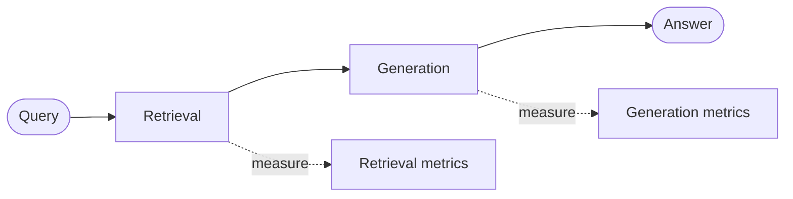
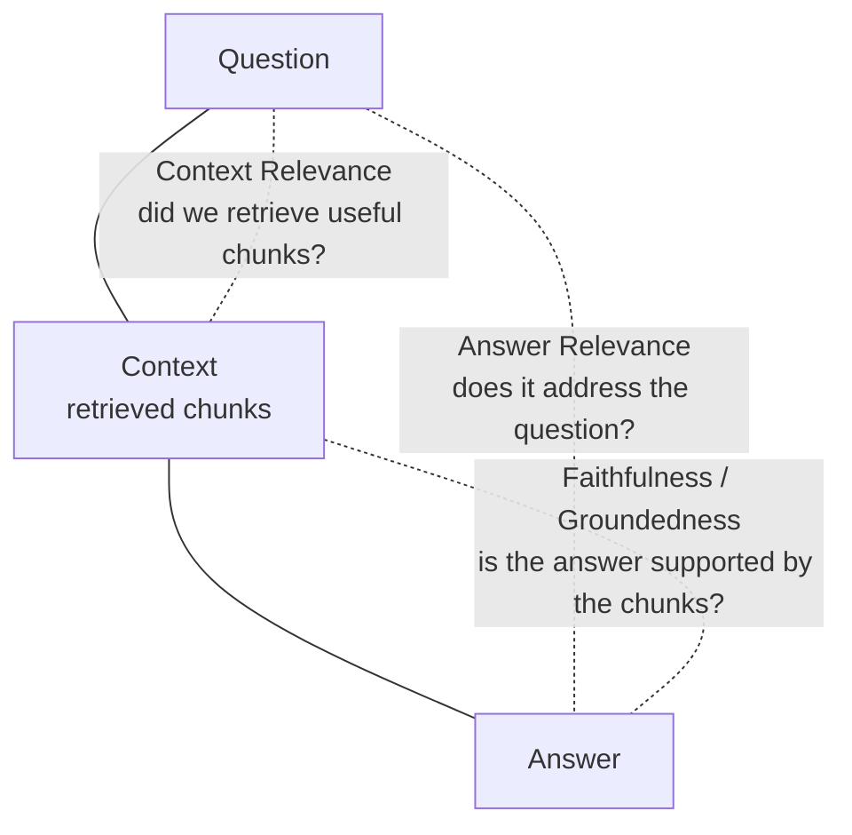
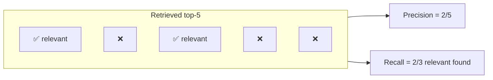
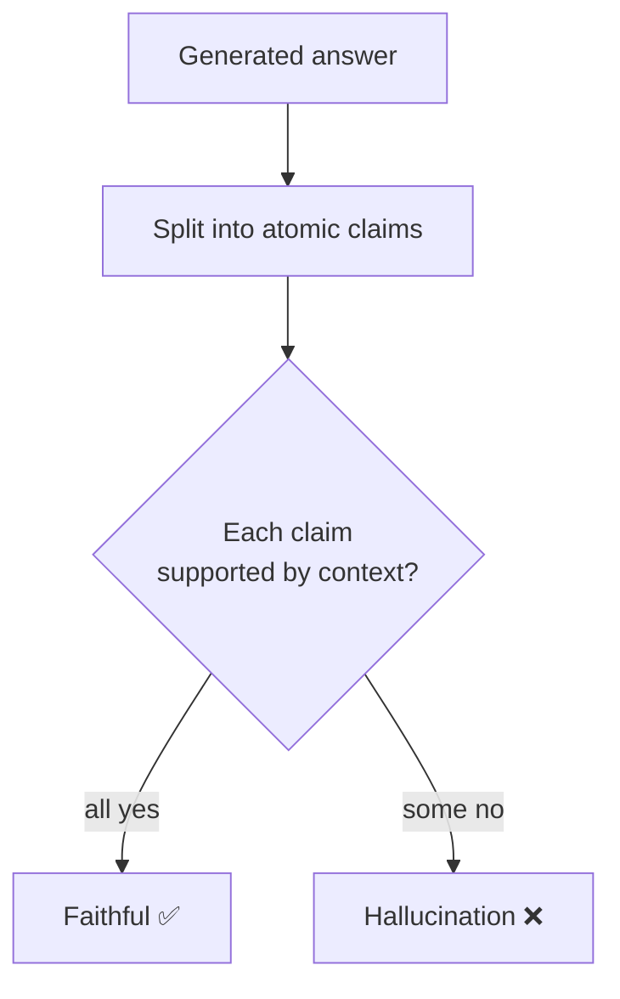
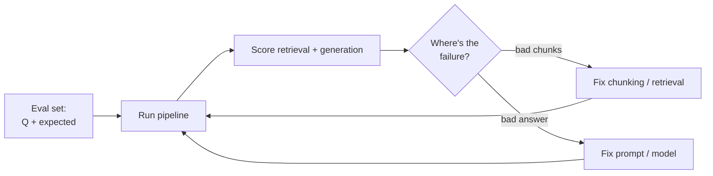

# 📏 Evaluating RAG

> **One-liner:** "It looks good" is not a metric. RAG has **two** things to measure —
> did you **retrieve** the right stuff, and did the model **generate** a faithful answer
> from it? You need both.

---

## 🎯 The RAG "triad"

If all three hold, you have a trustworthy RAG system:
- **Context relevance** — are the retrieved chunks actually about the question?
- **Faithfulness (groundedness)** — is every claim in the answer supported by those chunks (no hallucination)?
- **Answer relevance** — does the answer actually respond to what was asked?

---

## 🔎 Retrieval metrics

You need a small **eval set**: questions paired with the chunks/documents that *should* be retrieved (the "ground truth").

| Metric | Question it answers |
|--------|---------------------|
| **Context Recall** | Of the chunks we *should* have found, how many did we? (Did we miss the answer?) |
| **Context Precision** | Of the chunks we returned, how many were relevant? (How much noise?) |
| **Hit Rate** | Was at least one correct chunk in the top-k? |
| **MRR** (Mean Reciprocal Rank) | How high up was the first correct chunk? |
| **nDCG** | Are the *most* relevant chunks ranked highest? |

---

## 🧠 Generation metrics

Harder to measure because answers are free text. Common approaches:

| Approach | How |
|----------|-----|
| **LLM-as-a-judge** | A strong LLM scores faithfulness / relevance against the context. Scales well. |
| **Faithfulness check** | Break the answer into claims; verify each is supported by the retrieved context. |
| **Reference-based** | Compare to a gold answer (exact match / semantic similarity / ROUGE — weak for open-ended). |
| **Human review** | Gold standard, doesn't scale. Use for calibration. |

---

## 🧪 Frameworks & tooling

| Tool | Focus |
|------|-------|
| **RAGAS** | Faithfulness, context precision/recall, answer relevance — purpose-built for RAG |
| **TruLens** | The RAG triad, feedback functions |
| **DeepEval / promptfoo** | Test-suite style eval, CI integration |
| **LangSmith / Phoenix (Arize)** | Tracing + eval on real traffic |

---

## 🔁 The eval loop (how you actually improve)

**Debugging rule:** if the retrieved chunks *don't contain the answer*, it's a **retrieval** problem ([chunking](./chunking.md) / [retrieval](./retrieval.md)). If they *do* but the answer is still wrong, it's a **generation** problem (prompt / model / [context engineering](../context-engineering/)).

---

## ✅ A minimal eval to start today

1. Collect **20–50 real questions** with known correct sources.
2. Measure **context recall** (did the right chunk get retrieved at all?).
3. Use an **LLM judge** for **faithfulness** on the answers.
4. Change **one thing** (chunk size, add reranker, tweak prompt), re-run, compare.

That single loop will beat months of "vibes-based" tuning.

➡️ Back to [RAG overview](./README.md) · or explore [architectures](./architectures/).
