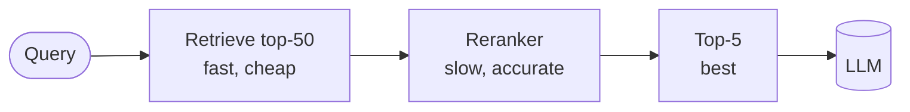
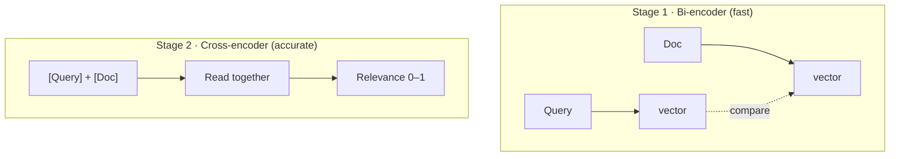
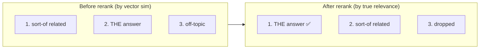
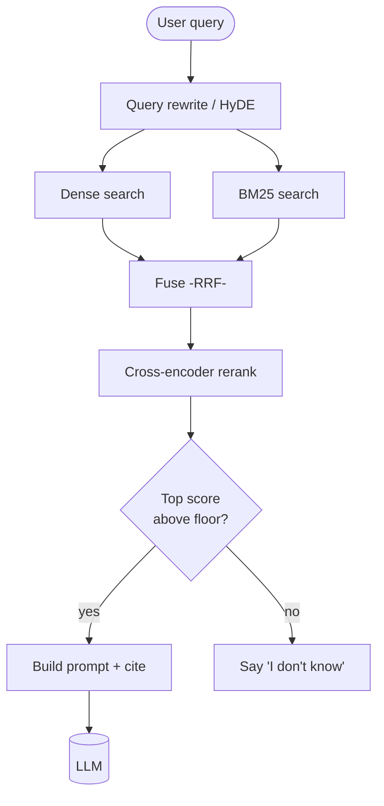

# 🎯 Reranking

> **One-liner:** First-pass retrieval is fast but sloppy — it casts a wide net.
> A **reranker** is a slower, smarter model that re-scores those candidates so the
> **truly** relevant chunks rise to the top before you spend tokens on them.

**Why two stages?** Encoding query+doc *together* (a [cross-encoder](./embeddings.md#-bi-encoder-vs-cross-encoder)) is far more accurate but too slow to run over millions of chunks. So:
1. **Retrieve** a wide net (top-50) cheaply with a bi-encoder / BM25.
2. **Rerank** just those 50 with an expensive cross-encoder.
3. Keep the **top-5** for the prompt.

---

## 🔬 Bi-encoder vs cross-encoder (why reranking is better)

The cross-encoder actually *reads the query and the document at the same time*, so it catches nuance that separate vectors miss (negation, specific conditions, "only for EU customers").

---

## 🧰 Kinds of rerankers

| Type | Example | Notes |
|------|---------|-------|
| **Cross-encoder** | Fine-tuned relevance models | The classic reranker; strong accuracy |
| **Hosted reranker APIs** | Cohere Rerank, Jina, Voyage | Drop-in, no hosting |
| **LLM-as-reranker** | Prompt an LLM to score/order chunks | Flexible, more expensive & slower |
| **ColBERT (late interaction)** | Token-level matching | High quality, heavier index |

---

## 📊 What reranking fixes

Retrieval often puts the perfect chunk at rank 4 or 7. Reranking promotes it to rank 1 — which matters a lot because LLMs weight **earlier** context more (the "lost in the middle" effect).

---

## 🎚️ Practical tips

- **Retrieve wide, rerank narrow:** e.g. fetch 30–50, keep 3–8.
- **Watch latency:** reranking adds a model call. Batch it; cache when you can.
- **Set a score floor:** if even the top reranked chunk is weak, answer "I don't know" instead of hallucinating.
- **Combine with [hybrid retrieval](./retrieval.md):** hybrid for recall → reranker for precision is the strongest common recipe.

---

## 🗺️ The full high-quality RAG retrieval stack

➡️ Next: prove the whole thing works → **[evaluation](./evaluation.md)**.
