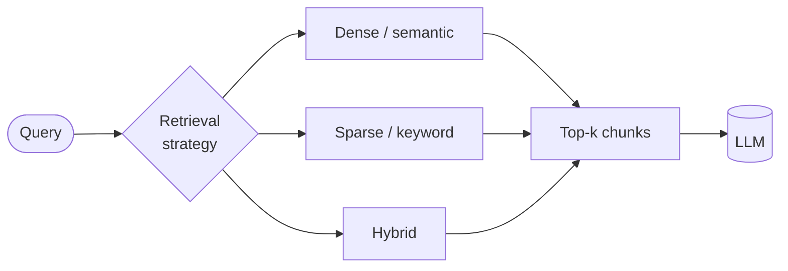
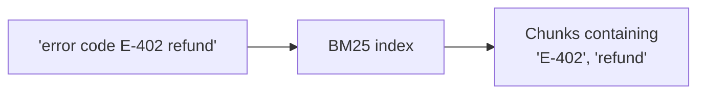
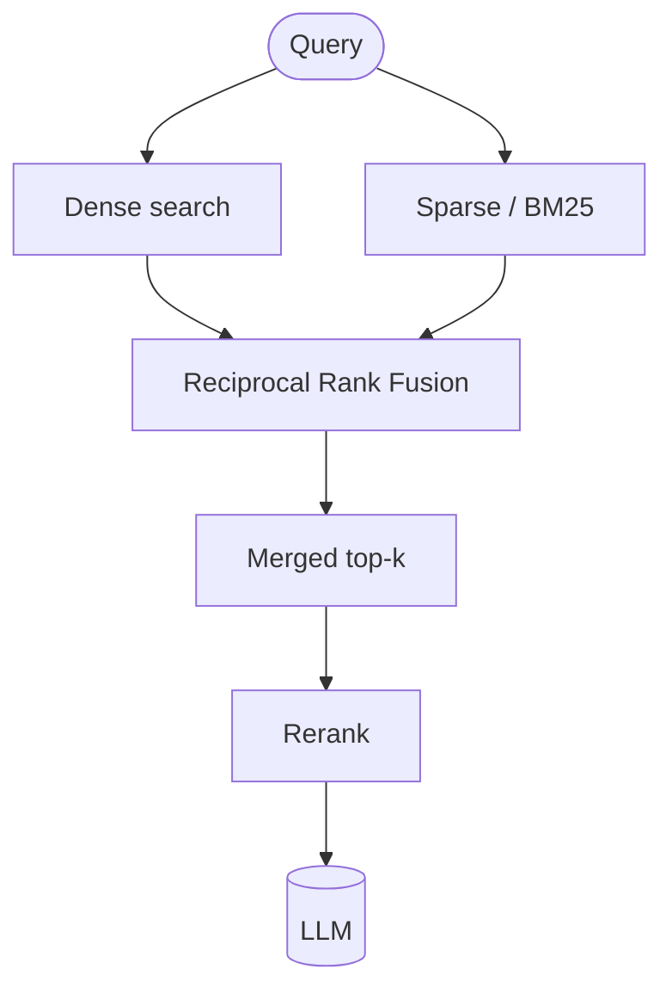
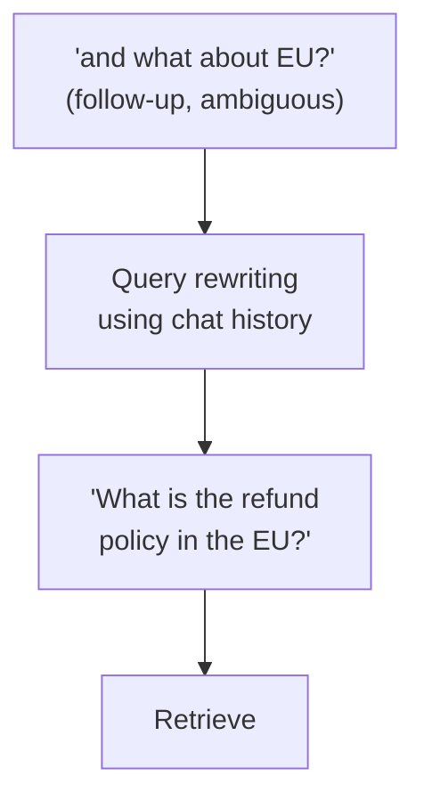
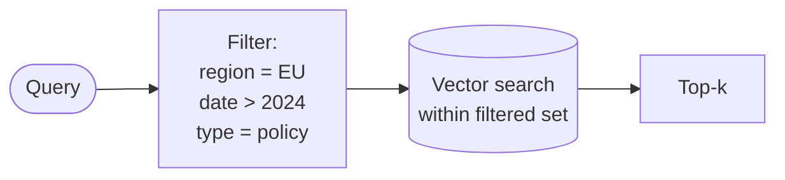

# 🔍 Retrieval Approaches

> **One-liner:** Retrieval is the step that turns a user question into a set of relevant
> chunks. Get this wrong and the LLM has nothing good to work with — "garbage in, garbage out."

---

## 1️⃣ Sparse retrieval (keyword / lexical)

Classic search: match on **words**. Algorithms like **BM25** / TF-IDF score chunks by term overlap with the query.

- ✅ **Exact matches** — great for codes, IDs, names, rare jargon, acronyms.
- ✅ Cheap, interpretable, no embedding model needed.
- ❌ **No understanding** — "car" won't match "automobile."

## 2️⃣ Dense retrieval (semantic / vector)

Match on **meaning** using [embeddings](./embeddings.md) and vector similarity.

- ✅ Understands synonyms, paraphrases, intent.
- ❌ Can **miss exact keywords** (may not surface "E-402" if it's rare).
- ❌ Needs an embedding model + vector index.

## 3️⃣ Hybrid retrieval (the usual winner) 🏆

Run **both** and fuse the results — typically with **Reciprocal Rank Fusion (RRF)**.

- ✅ Keyword precision **and** semantic recall.
- ✅ Robust across query types (exact IDs *and* fuzzy questions).
- This is the **recommended default** for production RAG.

---

## 🧭 Query transformations (fix the *question* before searching)

Often the raw user query is a bad search query. Rewrite it first.

| Technique | What it does |
|-----------|--------------|
| **Query rewriting** | Turn a vague follow-up into a standalone query (resolve "it", "that"). |
| **Multi-query** | Generate several paraphrases, retrieve for each, merge results. |
| **HyDE** (Hypothetical Document Embeddings) | Ask the LLM to *draft a fake answer*, embed **that**, and search with it — the fake answer often sits closer to real docs than the question does. |
| **Step-back prompting** | Ask a broader question first to pull in background context. |
| **Query decomposition** | Break a complex question into sub-questions, retrieve for each. |

*HyDE in a nutshell.*

---

## 🎚️ Metadata filtering

Combine vector search with **structured filters** on chunk metadata — narrow *before* or *during* the similarity search.

Examples: only search the current user's documents, only the latest version, only a given language or product line. This is why **rich metadata at [chunking](./chunking.md) time** pays off.

---

## 📈 Tuning knobs

| Knob | Effect |
|------|--------|
| **k** (how many chunks) | Higher recall, more noise & cost. Then [rerank](./reranking.md) down. |
| **Similarity threshold** | Drop weak matches; return "I don't know" if nothing clears it. |
| **Hybrid weighting** | How much to trust dense vs sparse. |
| **MMR** (Maximal Marginal Relevance) | Diversify results so you don't get 5 near-duplicate chunks. |

---

## 🗺️ Where each approach shines

| Scenario | Best fit |
|----------|----------|
| Product codes, legal citations, names | Sparse or Hybrid |
| Natural-language questions | Dense or Hybrid |
| Multi-tenant / permissioned data | Dense + **metadata filtering** |
| Complex multi-part questions | Query decomposition + Hybrid |
| "Just make it good" | **Hybrid + reranking** |

➡️ Next: reorder the candidates so the best ones win → **[reranking](./reranking.md)**.
