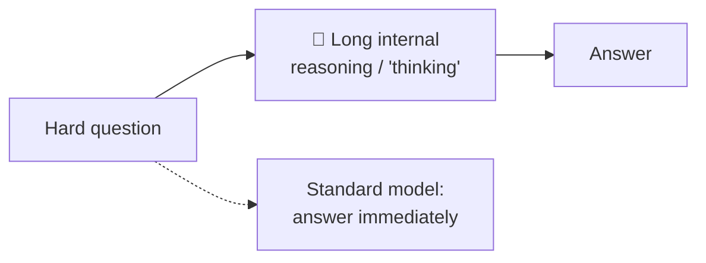
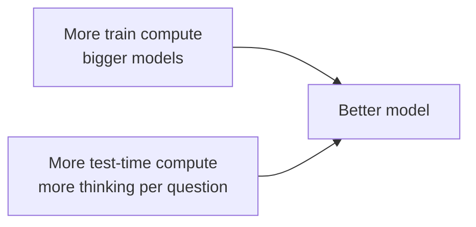
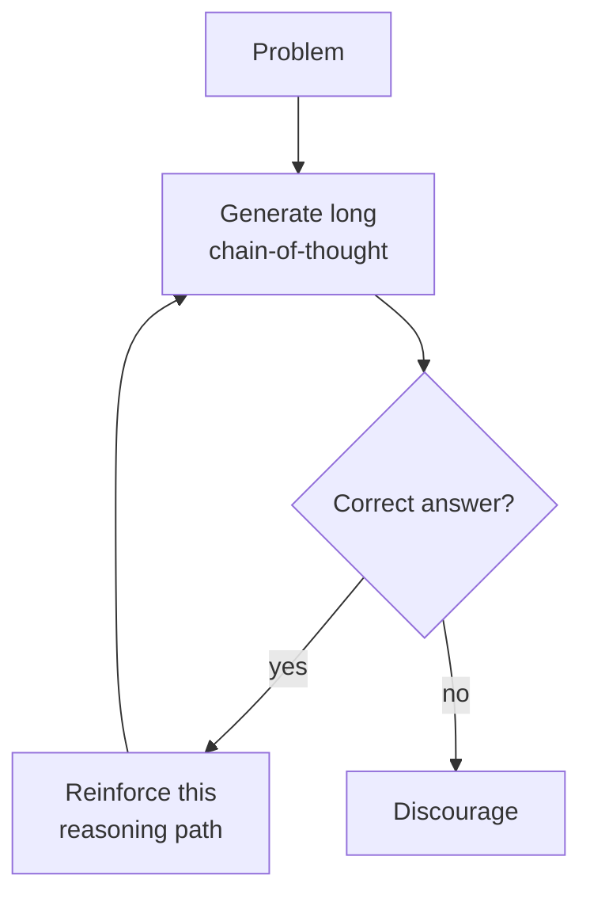
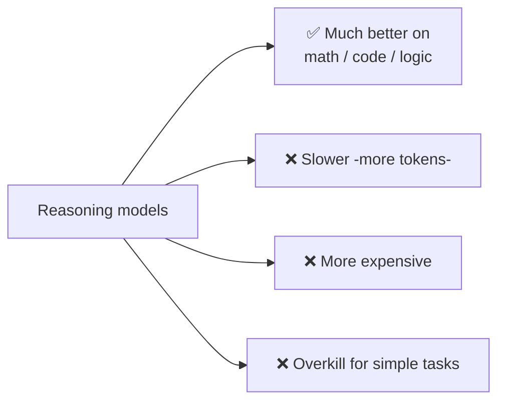

# 🧩 Reasoning Models & Test-Time Compute

> **One-liner:** Reasoning models are LLMs trained to **"think" before answering** —
> spending extra compute at inference to work through a problem step by step, dramatically
> improving math, coding, and logic. The key phrase: **test-time (inference-time) compute**.

---

## 💡 The core insight

Old scaling: make the model bigger, train longer (**train-time** compute). New axis: let
the model **think longer at inference** (**test-time** compute). More "thinking tokens" →
better answers on hard problems.

---

## 🏗️ How they're built

Typically **reinforcement learning on reasoning**: the model generates long chains of
thought and is rewarded when it reaches the **correct** answer — so it *learns how to
reason*, not just to imitate.

This differs from plain [prompting "think step by step"](../prompt-engineering/): here the
reasoning ability is **baked into the weights** via training.

---

## 🔧 Techniques in the family

| Technique | Idea |
|-----------|------|
| **Long chain-of-thought** | Extended internal reasoning before answering |
| **Self-consistency** | Sample many reasoning paths, take the majority |
| **[Tree/Graph-of-Thought](../prompt-engineering/)** | Explore & evaluate multiple branches |
| **Verifier / reward models** | Score reasoning steps; keep the good ones |
| **Search at inference** | Best-of-N, beam search over reasoning |

---

## ⚖️ Trade-offs

> 🧭 **When to use:** hard, multi-step problems (competition math, complex coding, planning).
> For simple lookups or chat, a standard model is faster and cheaper. Many systems **route**:
> easy → fast model, hard → reasoning model.

---

## 🗺️ Where reasoning models shine

- **Competition-level math & science**
- **Complex coding** (multi-file, algorithmic)
- **Planning** for [agents](../agents/) and multi-step tasks
- **Data analysis** requiring careful multi-step logic

➡️ Reasoning powers better [agent](../agents/) decisions in the [agentic loop](../agentic-loop/).
