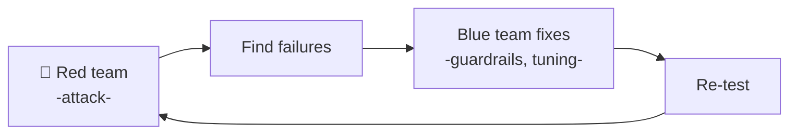
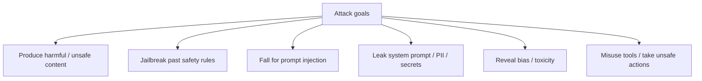
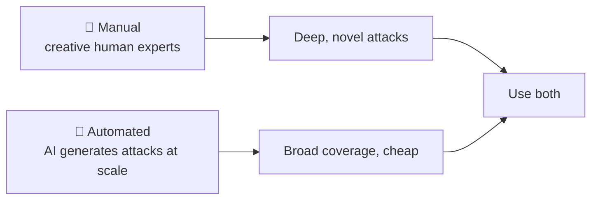
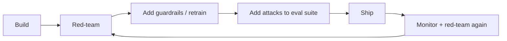

# 🧨 Red-Teaming

> **One-liner:** Red-teaming is **deliberately attacking your own AI** to find how it breaks
> *before* real users or adversaries do — probing for harmful outputs, jailbreaks, prompt
> injection, and data leaks. It's offense in service of defense.

---

## 🎯 What red-teamers try to make the model do

For [agents with tools](../agents/tools.md), the stakes are higher — an exploit can trigger
**real actions**, not just bad text.

---

## 🗡️ Common attack techniques

| Technique | Idea |
|-----------|------|
| **Prompt injection** | Hide instructions in input or retrieved data → [guardrails](../guardrails/) |
| **Jailbreak prompts** | "Ignore previous instructions", roleplay, hypotheticals |
| **Obfuscation** | Encodings, typos, other languages to dodge filters |
| **Many-shot** | Flood context with examples that erode safety |
| **Crescendo** | Escalate gradually over turns toward a harmful goal |
| **Tool/data poisoning** | Malicious content in docs an [agent](../agents/) reads |

---

## 🤖 Manual vs automated red-teaming

- **Manual** — humans find creative, novel exploits.
- **Automated** — another model generates thousands of attack prompts ([synthetic-data](../synthetic-data/)) for scale and regression testing.

---

## 🔁 Red-teaming in the lifecycle

Findings become **permanent [evaluation](../evaluation/) cases** so the same hole can't silently reopen.

---

## ⚖️ Red-teaming vs evaluation vs guardrails

- **[Evaluation](../evaluation/)** — measures overall quality/behavior.
- **Red-teaming** — actively *hunts for worst-case* failures.
- **[Guardrails](../guardrails/)** — the runtime defenses you build to block what red-teaming found.

---

## 🗺️ Where red-teaming is used

- **Pre-launch safety sign-off** for customer-facing AI.
- **Regulated / high-risk** deployments.
- **[Agent](../agents/)** systems with tool access.
- **Ongoing** — new jailbreaks appear constantly; it's never "done."

➡️ Related: **[guardrails](../guardrails/)** · **[evaluation](../evaluation/)** · **[hallucination](../hallucination/)**.
