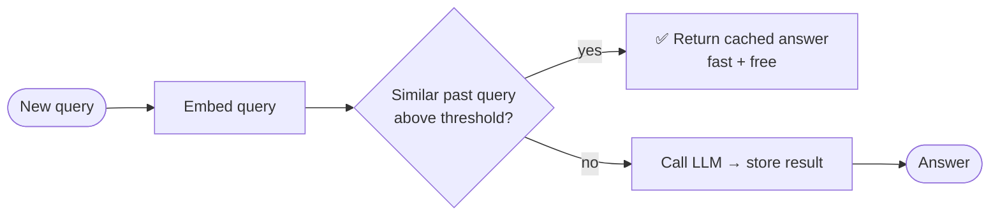
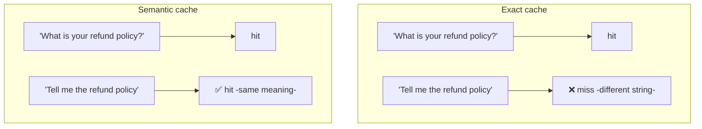
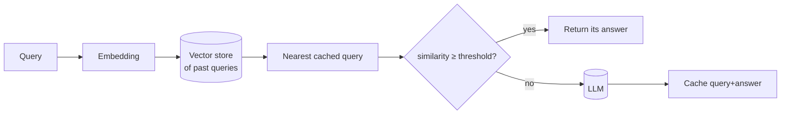
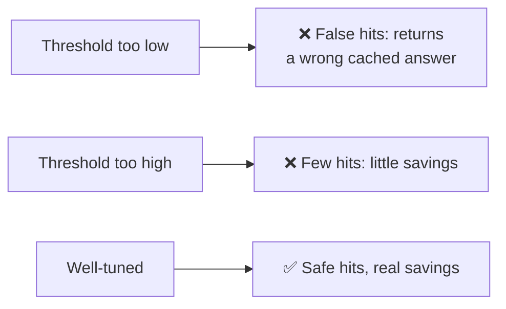

# ⚡ Semantic Caching

> **One-liner:** A normal cache only hits on **exact** repeats. A **semantic cache** hits
> when a new query *means the same thing* as a past one — using [embeddings](../embeddings/)
> to match — so you skip the LLM call and return a cached answer instantly and cheaply.

---

## 🔁 Exact vs semantic cache

Different words, same intent → the semantic cache still hits.

---

## 🛠️ How it works

It's essentially a [vector-database](../vector-databases/) lookup over previous queries.

---

## 🎚️ The critical knob: the threshold

Too loose → you serve answers to *different* questions (dangerous). Too strict → few hits.
**Tune and monitor** the similarity threshold carefully.

---

## ⚖️ Trade-offs

| ✅ Pros | ❌ / ⚠️ Cons |
|--------|-------------|
| Big cost & latency savings on repetitive traffic | False positives serve wrong answers |
| Reduces load on the model | Stale answers if content changes → need invalidation |
| Simple to bolt on | Not for highly personalized/dynamic responses |

- **Invalidation:** expire or refresh cache when underlying data changes (esp. with [RAG](../rag/)).
- **Personalization:** be careful caching answers that depend on the specific user/context.

---

## 🗺️ Where semantic caching is used

- **High-traffic chatbots / FAQs** with lots of rephrased-but-similar questions.
- **[RAG](../rag/) systems** to skip re-answering common queries.
- **Cost control** in front of expensive models (pairs well with [model-routing](../model-routing/)).

> 💡 Related but different: **prompt/prefix caching** ([inference-optimization](../inference-optimization/))
> reuses *computation* for shared prompt prefixes; semantic caching reuses whole *answers*.

➡️ Related: **[embeddings](../embeddings/)** · **[vector-databases](../vector-databases/)** · **[inference-optimization](../inference-optimization/)**.
