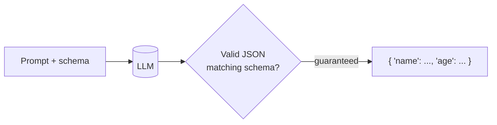
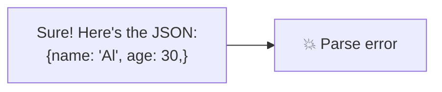
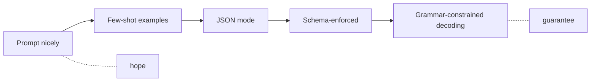
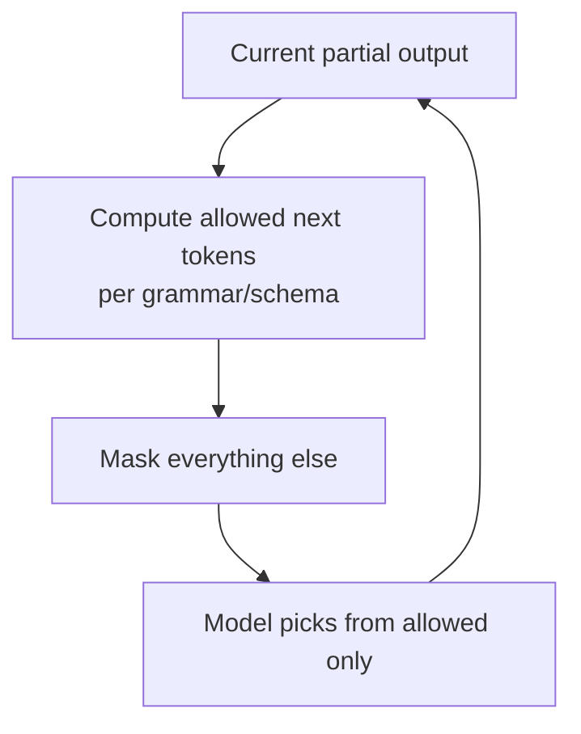
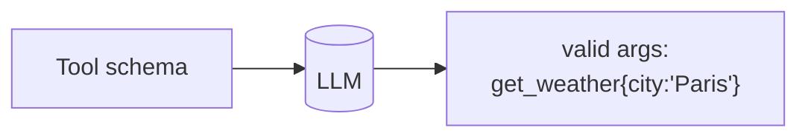

# 🧾 Structured Output & Constrained Decoding

> **One-liner:** When you need an LLM's output to be **valid JSON** (or match a schema/
> grammar) *every time* — not "usually" — you use structured output techniques that
> **constrain** what the model is allowed to generate.

---

## 🤔 Why it's hard

Free-form generation can produce *almost*-valid JSON — a trailing comma, a missing quote, a
chatty preamble — and your parser breaks. For pipelines and [agents](../agents/tools.md),
"almost valid" = broken.

---

## 🧰 The spectrum of approaches (weak → strong guarantee)

| Approach | Guarantee | How |
|----------|-----------|-----|
| **Prompting** | Weak | "Respond only with JSON" |
| **Few-shot** | Better | Show example outputs |
| **JSON mode** | Valid JSON | Provider forces JSON syntax |
| **Schema / function calling** | Matches your schema | Give a JSON Schema; model fills it |
| **Constrained decoding** | Strict | Only allow tokens that keep output valid |

---

## 🔒 Constrained / guided decoding (the strong version)

At each step the decoder **masks out** any token that would violate the schema/grammar — so
invalid output is *impossible*, not just discouraged.

- Tools/libraries: **Outlines**, **JSON Schema / function calling**, **GBNF grammars** (llama.cpp), **XGrammar**.
- Works for JSON, regex patterns, enums, even full context-free grammars.

---

## 🔗 Relationship to function calling

[Function/tool calling](../agents/tools.md) *is* structured output: the model emits
arguments that must match the tool's parameter schema. Reliable agents depend on this.

---

## ⚖️ Trade-offs & tips

- ✅ Reliable, parseable output; fewer retries; safer pipelines.
- ⚠️ Over-constraining can hurt quality (the model can't "think" in prose first) — allow a reasoning field, or reason *then* format.
- ⚠️ Very complex schemas can confuse the model — keep them as simple as the task allows.
- 💡 Still **validate** downstream; treat model output as untrusted ([guardrails](../guardrails/)).

---

## 🗺️ Where it's used

- **Data extraction** (docs → JSON) and classification.
- **[Agent tool calls](../agents/tools.md)** and API integrations.
- **Any LLM step feeding code** that expects a fixed shape.

➡️ Related: **[agents/tools](../agents/tools.md)** · **[prompt-engineering](../prompt-engineering/)** · **[guardrails](../guardrails/)**.
