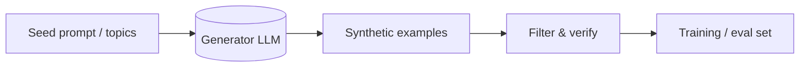
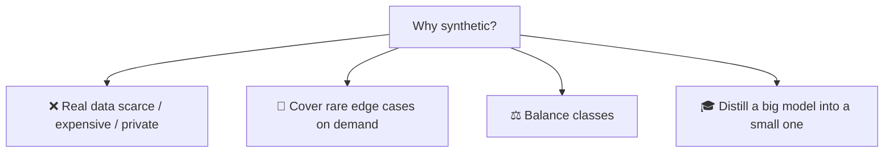
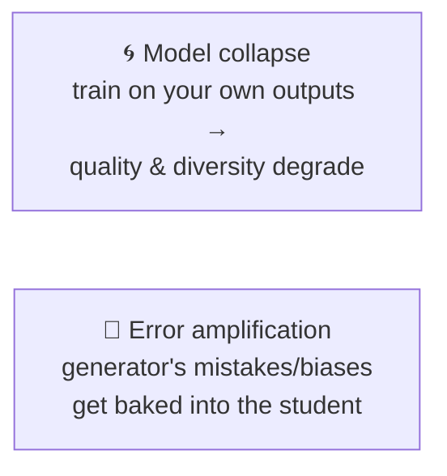
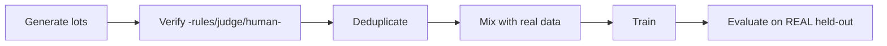

# 🧬 Synthetic Data

> **One-liner:** Synthetic data is training/eval data **generated by a model** instead of
> collected from the real world. It's how teams get around the "we don't have enough
> labeled data" wall — and how small models learn from big ones.

---

## 🤔 Why generate data?

- **Scarcity** — not enough real labeled examples.
- **Privacy** — can't use real user/medical/financial data → generate stand-ins.
- **Coverage** — mint examples for rare/edge cases you can't easily find.
- **[Distillation](../distillation/)** — a strong model generates data to [fine-tune](../fine-tuning/data-preparation.md) a smaller one.

---

## 🏭 Common generation patterns

| Pattern | Idea |
|---------|------|
| **Self-instruct** | Model generates its own instructions + answers from a few seeds |
| **Evol-Instruct** | Iteratively rewrite prompts to be harder/more complex |
| **Distillation data** | Teacher model produces (input → ideal output) pairs |
| **Persona / scenario seeding** | Vary personas & scenarios for diversity |
| **Back-translation / paraphrase** | Augment existing data with variations |

---

## ⚠️ The two big risks

- **Quality control is everything** — filter, verify, deduplicate. Bad synthetic data is worse than none.
- **Diversity matters** — repetitive synthetic data narrows the model.
- **Verification** — use rules, another model, or humans to check correctness before training.

---

## ✅ A safe recipe

> 💡 Always evaluate on **real** data, never only synthetic — otherwise you're grading the
> generator, not reality. See [evaluation](../evaluation/).

---

## 🗺️ Where synthetic data is used

- **[Fine-tuning](../fine-tuning/)** & **[distillation](../distillation/)** datasets
- **[Evaluation](../evaluation/)** sets & red-team prompts → [red-teaming](../red-teaming/)
- **Privacy-sensitive** domains (health, finance)
- **Bootstrapping** a task before real data exists

➡️ Related: **[distillation](../distillation/)** · **[constitutional-ai](../constitutional-ai/)** (AI-generated feedback).
