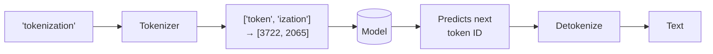
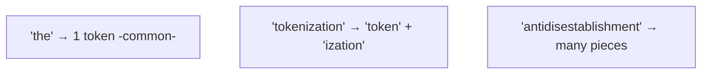
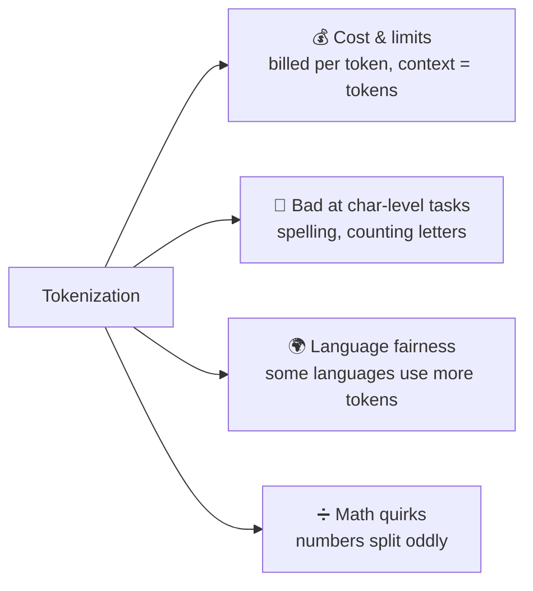

# 🔡 Tokenization

> **One-liner:** Models don't read text — they read **tokens**, integer IDs for chunks of
> text (words, sub-words, characters). Tokenization is the step that converts your text
> into those IDs and back. It quietly explains a *lot* of LLM behavior and cost.

---

## 🧩 Why sub-words? (BPE and friends)

A vocabulary can't hold every word. **Byte-Pair Encoding (BPE)** and similar algorithms
learn a vocabulary of frequent sub-word pieces: common words become one token, rare words
split into parts.

| Algorithm | Used by (family) |
|-----------|------------------|
| **BPE / byte-level BPE** | GPT-style models |
| **WordPiece** | BERT-style models |
| **SentencePiece / Unigram** | Many multilingual models |

---

## 💡 Why it matters in practice

- **Cost & context windows are measured in tokens**, not words (~1 token ≈ 4 chars / ¾ of a word in English).
- **"How many r's in strawberry?"** is hard partly *because* the model sees tokens, not letters.
- **Non-English text** often costs more tokens for the same meaning.
- **Numbers** can tokenize inconsistently, contributing to arithmetic errors.

---

## 🔧 Special tokens

Beyond text, tokenizers add **control tokens** that structure the input:

| Token (concept) | Role |
|-----------------|------|
| Beginning/End of sequence | Mark boundaries |
| Chat role markers | Separate system / user / assistant turns |
| Padding | Fill batches to equal length |
| Tool / function markers | Delimit tool calls in agentic models |

---

## 🗺️ Where it shows up

- **Estimating cost & fitting the [context window](../context-engineering/)** before a call.
- **Chunking for [RAG](../rag/chunking.md)** — chunk sizes are in tokens.
- **Debugging weird outputs** — spelling, counting, and formatting bugs often trace back to tokenization.

➡️ Tokens go into a model built on the **[transformer](../transformers/)** architecture.
